# Description
Trained the model on potholes Image dataset to an F1 Score of 0.966

# Instructions to run

1. put the `yolo_v3_pothole_training.ipynb` in google drive 
2. Connect to an instance (preferably with GPU) 
3. Run the code to generate output images with detected potholes in YoloV3/output file

# Sample Images with object detection

| Image 1 | Image 2 | Image 3 |
|---------|---------|---------|
| 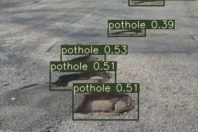 | 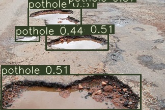 | 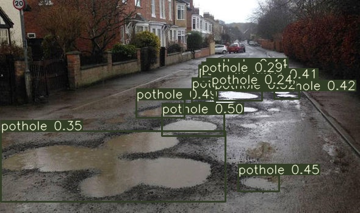 |

| Image 4 | Image 5 | Image 6 |
|---------|---------|---------|
| 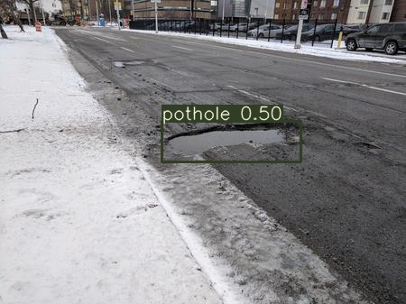 | 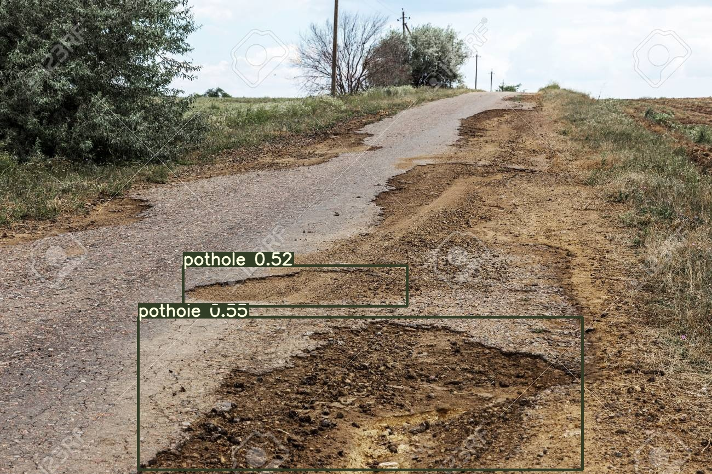 | 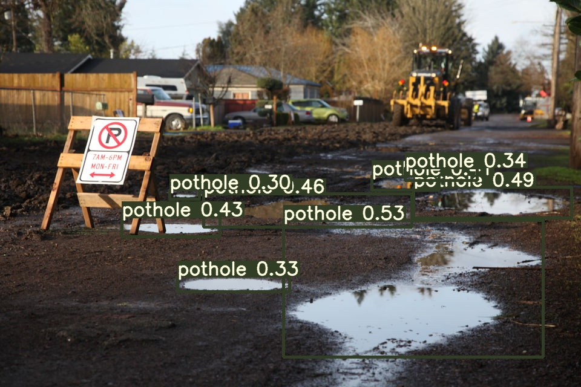 |

| Image 7 | Image 8 | Image 9 |
|---------|---------|---------|
| 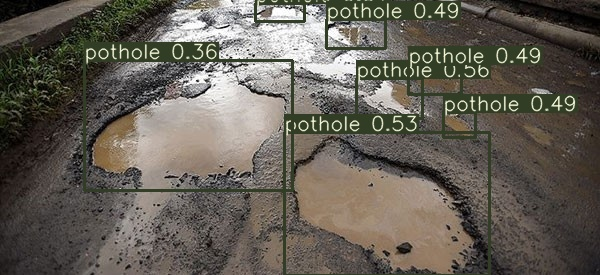 | 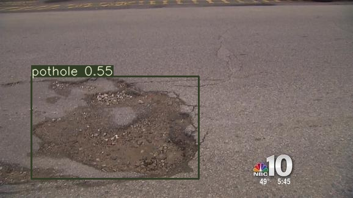 | 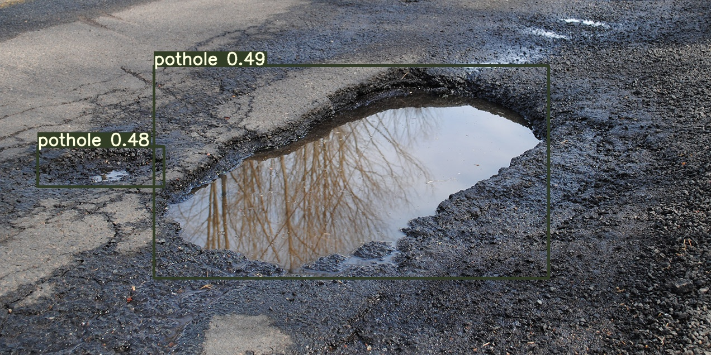 |
| Image 10 | Image 11 | Image 12 |
|---------|---------|---------|
| 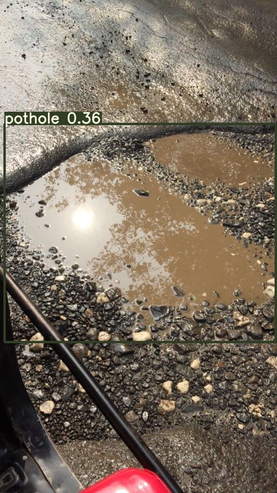 | 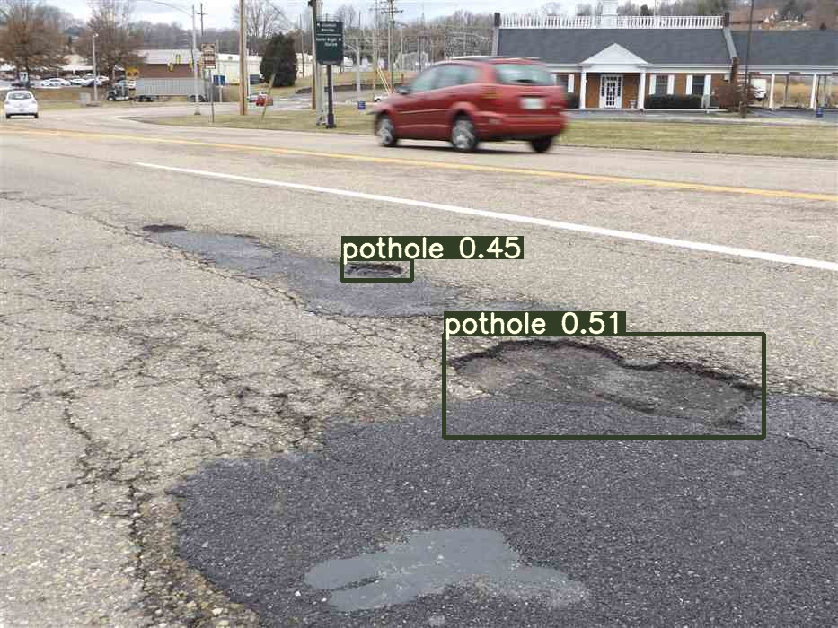 | 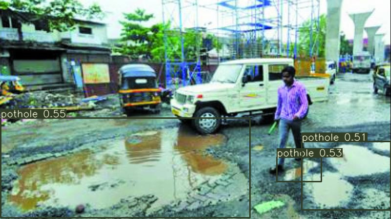 |

# Training Log

Namespace(epochs=500, batch_size=10, accumulate=4, cfg='cfg/yolov3-custom.cfg', data='data/customdata/custom.data', multi_scale=False, img_size=[512], rect=False, resume=False, nosave=True, notest=False, evolve=False, bucket='', cache_images=True, weights='weights/yolov3-spp-ultralytics.pt', name='', device='', adam=False, single_cls=False)
Using CUDA device0 _CudaDeviceProperties(name='Tesla T4', total_memory=15102MB)

               Class    Images   Targets         P         R   mAP@0.5        F1: 100% 21/21 [00:10<00:00,  1.99it/s]
                 all       202       768         0         0  0.000457         0

     Epoch   gpu_mem      GIoU       obj       cls     total   targets  img_size
     1/499     7.04G       6.9      4.43         0      11.3         8       512: 100% 21/21 [00:15<00:00,  1.36it/s]
               Class    Images   Targets         P         R   mAP@0.5        F1: 100% 21/21 [00:03<00:00,  5.37it/s]
                 all       202       768         0         0  0.000414         0

     Epoch   gpu_mem      GIoU       obj       cls     total   targets  img_size
     2/499     7.28G      5.83      5.88         0      11.7        48       512: 100% 21/21 [00:15<00:00,  1.36it/s]
               Class    Images   Targets         P         R   mAP@0.5        F1: 100% 21/21 [00:03<00:00,  5.54it/s]
                 all       202       768         0         0   0.00626         0

     Epoch   gpu_mem      GIoU       obj       cls     total   targets  img_size
     3/499     7.28G      5.01      5.41         0      10.4        18       512: 100% 21/21 [00:15<00:00,  1.33it/s]
               Class    Images   Targets         P         R   mAP@0.5        F1: 100% 21/21 [00:03<00:00,  5.37it/s]
                 all       202       768         1    0.0013    0.0825    0.0026

     Epoch   gpu_mem      GIoU       obj       cls     total   targets  img_size
     4/499     7.28G       4.4      4.54         0      8.94        16       512: 100% 21/21 [00:15<00:00,  1.33it/s]
               Class    Images   Targets         P         R   mAP@0.5        F1: 100% 21/21 [00:04<00:00,  5.14it/s]
                 all       202       768     0.321     0.157     0.133     0.211

     Epoch   gpu_mem      GIoU       obj       cls     total   targets  img_size
     5/499     7.28G      3.95      3.04         0      6.98         3       512: 100% 21/21 [00:16<00:00,  1.30it/s]
               Class    Images   Targets         P         R   mAP@0.5        F1: 100% 21/21 [00:04<00:00,  5.04it/s]
                 all       202       768     0.238     0.408     0.197     0.301

     Epoch   gpu_mem      GIoU       obj       cls     total   targets  img_size
     6/499     7.28G      4.42      2.48         0       6.9        11       512: 100% 21/21 [00:16<00:00,  1.31it/s]
               Class    Images   Targets         P         R   mAP@0.5        F1: 100% 21/21 [00:04<00:00,  4.95it/s]
                 all       202       768     0.193     0.513     0.205      0.28

     Epoch   gpu_mem      GIoU       obj       cls     total   targets  img_size
     7/499     7.28G         4      1.72         0      5.72        26       512: 100% 21/21 [00:16<00:00,  1.28it/s]
               Class    Images   Targets         P         R   mAP@0.5        F1: 100% 21/21 [00:04<00:00,  4.91it/s]
                 all       202       768     0.243     0.616     0.361     0.348

     Epoch   gpu_mem      GIoU       obj       cls     total   targets  img_size
     8/499     7.28G      3.77      1.68         0      5.45         7       512: 100% 21/21 [00:16<00:00,  1.29it/s]
               Class    Images   Targets         P         R   mAP@0.5        F1: 100% 21/21 [00:04<00:00,  4.54it/s]
                 all       202       768     0.308      0.68     0.469     0.424

     Epoch   gpu_mem      GIoU       obj       cls     total   targets  img_size
     9/499     7.28G       3.7      1.55         0      5.25        20       512: 100% 21/21 [00:16<00:00,  1.28it/s]
               Class    Images   Targets         P         R   mAP@0.5        F1: 100% 21/21 [00:04<00:00,  4.56it/s]
                 all       202       768     0.328     0.676     0.406     0.442

     Epoch   gpu_mem      GIoU       obj       cls     total   targets  img_size
    10/499     7.28G      3.57      1.36         0      4.93         5       512: 100% 21/21 [00:16<00:00,  1.28it/s]
               Class    Images   Targets         P         R   mAP@0.5        F1: 100% 21/21 [00:04<00:00,  4.67it/s]
                 all       202       768     0.435     0.684     0.576     0.531

     Epoch   gpu_mem      GIoU       obj       cls     total   targets  img_size
    11/499     7.28G      3.76       1.4         0      5.15        15       512: 100% 21/21 [00:16<00:00,  1.27it/s]
               Class    Images   Targets         P         R   mAP@0.5        F1: 100% 21/21 [00:04<00:00,  4.83it/s]
                 all       202       768    0.0808     0.546    0.0647     0.141

     Epoch   gpu_mem      GIoU       obj       cls     total   targets  img_size
    12/499     7.28G      3.46      1.33         0      4.79         3       512: 100% 21/21 [00:16<00:00,  1.28it/s]
               Class    Images   Targets         P         R   mAP@0.5        F1: 100% 21/21 [00:04<00:00,  4.59it/s]
                 all       202       768     0.365     0.424     0.267     0.393

     Epoch   gpu_mem      GIoU       obj       cls     total   targets  img_size
    13/499     7.28G      3.66       1.2         0      4.86        12       512: 100% 21/21 [00:16<00:00,  1.27it/s]
               Class    Images   Targets         P         R   mAP@0.5        F1: 100% 21/21 [00:04<00:00,  4.80it/s]
                 all       202       768     0.511     0.629     0.569     0.564

     Epoch   gpu_mem      GIoU       obj       cls     total   targets  img_size
    14/499     7.28G       3.5      1.21         0      4.71         7       512: 100% 21/21 [00:16<00:00,  1.28it/s]
               Class    Images   Targets         P         R   mAP@0.5        F1: 100% 21/21 [00:04<00:00,  4.41it/s]
                 all       202       768     0.663     0.637     0.648     0.649

     Epoch   gpu_mem      GIoU       obj       cls     total   targets  img_size
    15/499     7.28G      3.37      1.14         0      4.51         9       512: 100% 21/21 [00:16<00:00,  1.28it/s]
               Class    Images   Targets         P         R   mAP@0.5        F1: 100% 21/21 [00:04<00:00,  4.79it/s]
                 all       202       768     0.641     0.644     0.595     0.642

     Epoch   gpu_mem      GIoU       obj       cls     total   targets  img_size
    16/499     7.28G      3.32       1.1         0      4.42        12       512: 100% 21/21 [00:16<00:00,  1.28it/s]
               Class    Images   Targets         P         R   mAP@0.5        F1: 100% 21/21 [00:04<00:00,  4.52it/s]
                 all       202       768     0.711     0.624     0.679     0.665

     Epoch   gpu_mem      GIoU       obj       cls     total   targets  img_size
    17/499     7.28G      3.32      1.17         0      4.49        15       512: 100% 21/21 [00:16<00:00,  1.29it/s]
               Class    Images   Targets         P         R   mAP@0.5        F1: 100% 21/21 [00:04<00:00,  4.86it/s]
                 all       202       768     0.791     0.574     0.704     0.665

     Epoch   gpu_mem      GIoU       obj       cls     total   targets  img_size
    18/499     7.28G      3.11      1.09         0       4.2         3       512: 100% 21/21 [00:16<00:00,  1.27it/s]
               Class    Images   Targets         P         R   mAP@0.5        F1: 100% 21/21 [00:04<00:00,  4.67it/s]
                 all       202       768     0.656     0.583     0.658     0.618

     Epoch   gpu_mem      GIoU       obj       cls     total   targets  img_size
    19/499     7.28G      3.29      1.06         0      4.36         3       512: 100% 21/21 [00:16<00:00,  1.28it/s]
               Class    Images   Targets         P         R   mAP@0.5        F1: 100% 21/21 [00:04<00:00,  4.82it/s]
                 all       202       768     0.754     0.559     0.668     0.642

     Epoch   gpu_mem      GIoU       obj       cls     total   targets  img_size
    20/499     7.28G      3.29      1.22         0      4.51        15       512: 100% 21/21 [00:16<00:00,  1.28it/s]
               Class    Images   Targets         P         R   mAP@0.5        F1: 100% 21/21 [00:04<00:00,  4.89it/s]
                 all       202       768      0.62     0.486     0.485     0.545

     Epoch   gpu_mem      GIoU       obj       cls     total   targets  img_size
    21/499     7.28G      3.28      1.02         0       4.3         7       512: 100% 21/21 [00:16<00:00,  1.29it/s]
               Class    Images   Targets         P         R   mAP@0.5        F1: 100% 21/21 [00:04<00:00,  4.69it/s]
                 all       202       768      0.63     0.556     0.582     0.591

     Epoch   gpu_mem      GIoU       obj       cls     total   targets  img_size
    22/499     7.28G      2.85      1.12         0      3.97         3       512: 100% 21/21 [00:16<00:00,  1.27it/s]
               Class    Images   Targets         P         R   mAP@0.5        F1: 100% 21/21 [00:04<00:00,  4.48it/s]
                 all       202       768     0.709     0.669      0.72     0.689

     Epoch   gpu_mem      GIoU       obj       cls     total   targets  img_size
    23/499     7.28G      3.03      1.03         0      4.06        35       512:  81% 17/21 [00:13<00:03,  1.28it/s]
Model Bias Summary:    layer        regression        objectness    classification
                          89      -0.11+/-0.24      -9.17+/-1.28       0.02+/-0.01 
                         101      -0.03+/-0.26      -9.42+/-0.80       0.04+/-0.00 
                         113       0.08+/-0.28      -8.72+/-1.70      -0.00+/-0.01 
    23/499     7.28G      3.13      1.06         0      4.19        16       512: 100% 21/21 [00:16<00:00,  1.28it/s]
               Class    Images   Targets         P         R   mAP@0.5        F1: 100% 21/21 [00:04<00:00,  4.52it/s]
                 all       202       768     0.693     0.686      0.72     0.689

     Epoch   gpu_mem      GIoU       obj       cls     total   targets  img_size
    24/499     7.28G      3.06      1.12         0      4.17        26       512: 100% 21/21 [00:16<00:00,  1.28it/s]
               Class    Images   Targets         P         R   mAP@0.5        F1: 100% 21/21 [00:04<00:00,  4.92it/s]
                 all       202       768     0.804     0.634     0.785     0.709

     Epoch   gpu_mem      GIoU       obj       cls     total   targets  img_size
    25/499     7.28G      2.96       1.1         0      4.06        15       512: 100% 21/21 [00:16<00:00,  1.28it/s]
               Class    Images   Targets         P         R   mAP@0.5        F1: 100% 21/21 [00:04<00:00,  4.52it/s]
                 all       202       768     0.752     0.651      0.75     0.698

     Epoch   gpu_mem      GIoU       obj       cls     total   targets  img_size
    26/499     7.28G      2.88      1.03         0      3.91         6       512: 100% 21/21 [00:16<00:00,  1.28it/s]
               Class    Images   Targets         P         R   mAP@0.5        F1: 100% 21/21 [00:04<00:00,  4.92it/s]
                 all       202       768     0.815     0.671     0.791     0.736

     Epoch   gpu_mem      GIoU       obj       cls     total   targets  img_size
    27/499     7.28G      2.77      1.06         0      3.83        17       512: 100% 21/21 [00:16<00:00,  1.28it/s]
               Class    Images   Targets         P         R   mAP@0.5        F1: 100% 21/21 [00:04<00:00,  4.76it/s]
                 all       202       768     0.881     0.629     0.798     0.734

     Epoch   gpu_mem      GIoU       obj       cls     total   targets  img_size
    28/499     7.28G      2.81         1         0      3.81         5       512: 100% 21/21 [00:16<00:00,  1.28it/s]
               Class    Images   Targets         P         R   mAP@0.5        F1: 100% 21/21 [00:04<00:00,  4.81it/s]
                 all       202       768     0.851     0.612     0.772     0.712

     Epoch   gpu_mem      GIoU       obj       cls     total   targets  img_size
    29/499     7.28G      2.82      1.02         0      3.84        12       512: 100% 21/21 [00:16<00:00,  1.26it/s]
               Class    Images   Targets         P         R   mAP@0.5        F1: 100% 21/21 [00:04<00:00,  4.89it/s]
                 all       202       768     0.778     0.751     0.795     0.764

     Epoch   gpu_mem      GIoU       obj       cls     total   targets  img_size
    30/499     7.28G      2.75     0.978         0      3.72         2       512: 100% 21/21 [00:16<00:00,  1.29it/s]
               Class    Images   Targets         P         R   mAP@0.5        F1: 100% 21/21 [00:04<00:00,  4.69it/s]
                 all       202       768     0.727     0.778     0.774     0.752

     Epoch   gpu_mem      GIoU       obj       cls     total   targets  img_size
    31/499     7.28G      2.65     0.984         0      3.64         9       512: 100% 21/21 [00:16<00:00,  1.27it/s]
               Class    Images   Targets         P         R   mAP@0.5        F1: 100% 21/21 [00:04<00:00,  4.88it/s]
                 all       202       768     0.699     0.794     0.798     0.744

     Epoch   gpu_mem      GIoU       obj       cls     total   targets  img_size
    32/499     7.28G      2.53     0.909         0      3.44         5       512: 100% 21/21 [00:16<00:00,  1.28it/s]
               Class    Images   Targets         P         R   mAP@0.5        F1: 100% 21/21 [00:04<00:00,  4.63it/s]
                 all       202       768     0.849     0.641     0.793      0.73

     Epoch   gpu_mem      GIoU       obj       cls     total   targets  img_size
    33/499     7.28G      2.51      1.01         0      3.52        10       512: 100% 21/21 [00:16<00:00,  1.27it/s]
               Class    Images   Targets         P         R   mAP@0.5        F1: 100% 21/21 [00:04<00:00,  4.94it/s]
                 all       202       768     0.835       0.6     0.754     0.698

     Epoch   gpu_mem      GIoU       obj       cls     total   targets  img_size
    34/499     7.28G      2.55     0.991         0      3.54        12       512: 100% 21/21 [00:16<00:00,  1.29it/s]
               Class    Images   Targets         P         R   mAP@0.5        F1: 100% 21/21 [00:04<00:00,  4.58it/s]
                 all       202       768     0.762     0.807     0.833     0.784

     Epoch   gpu_mem      GIoU       obj       cls     total   targets  img_size
    35/499     7.28G      2.57     0.911         0      3.48        19       512: 100% 21/21 [00:16<00:00,  1.29it/s]
               Class    Images   Targets         P         R   mAP@0.5        F1: 100% 21/21 [00:04<00:00,  4.93it/s]
                 all       202       768     0.751     0.787     0.812     0.769

     Epoch   gpu_mem      GIoU       obj       cls     total   targets  img_size
    36/499     7.28G      2.55      0.93         0      3.48         8       512: 100% 21/21 [00:16<00:00,  1.26it/s]
               Class    Images   Targets         P         R   mAP@0.5        F1: 100% 21/21 [00:04<00:00,  4.60it/s]
                 all       202       768     0.869     0.669     0.825     0.756

     Epoch   gpu_mem      GIoU       obj       cls     total   targets  img_size
    37/499     7.28G      2.49     0.927         0      3.42        20       512: 100% 21/21 [00:16<00:00,  1.28it/s]
               Class    Images   Targets         P         R   mAP@0.5        F1: 100% 21/21 [00:04<00:00,  5.00it/s]
                 all       202       768     0.854      0.73     0.847     0.787

     Epoch   gpu_mem      GIoU       obj       cls     total   targets  img_size
    38/499     7.28G       2.4     0.886         0      3.29         6       512: 100% 21/21 [00:16<00:00,  1.28it/s]
               Class    Images   Targets         P         R   mAP@0.5        F1: 100% 21/21 [00:04<00:00,  4.56it/s]
                 all       202       768     0.873     0.755     0.871      0.81

     Epoch   gpu_mem      GIoU       obj       cls     total   targets  img_size
    39/499     7.28G      2.41     0.837         0      3.24         9       512: 100% 21/21 [00:16<00:00,  1.28it/s]
               Class    Images   Targets         P         R   mAP@0.5        F1: 100% 21/21 [00:04<00:00,  4.98it/s]
                 all       202       768     0.915     0.694     0.844     0.789

     Epoch   gpu_mem      GIoU       obj       cls     total   targets  img_size
    40/499     7.28G      2.41      0.92         0      3.33         5       512: 100% 21/21 [00:16<00:00,  1.27it/s]
               Class    Images   Targets         P         R   mAP@0.5        F1: 100% 21/21 [00:04<00:00,  4.77it/s]
                 all       202       768     0.903     0.736     0.855     0.811

     Epoch   gpu_mem      GIoU       obj       cls     total   targets  img_size
    41/499     7.28G      2.37     0.869         0      3.23        16       512: 100% 21/21 [00:16<00:00,  1.28it/s]
               Class    Images   Targets         P         R   mAP@0.5        F1: 100% 21/21 [00:04<00:00,  4.88it/s]
                 all       202       768     0.862      0.76     0.851     0.808

     Epoch   gpu_mem      GIoU       obj       cls     total   targets  img_size
    42/499     7.28G       2.4     0.849         0      3.25        10       512: 100% 21/21 [00:16<00:00,  1.26it/s]
               Class    Images   Targets         P         R   mAP@0.5        F1: 100% 21/21 [00:04<00:00,  4.94it/s]
                 all       202       768     0.844     0.762     0.856     0.801

     Epoch   gpu_mem      GIoU       obj       cls     total   targets  img_size
    43/499     7.28G      2.33     0.823         0      3.15        47       512: 100% 21/21 [00:16<00:00,  1.28it/s]
               Class    Images   Targets         P         R   mAP@0.5        F1: 100% 21/21 [00:04<00:00,  4.81it/s]
                 all       202       768     0.834     0.749     0.826     0.789

     Epoch   gpu_mem      GIoU       obj       cls     total   targets  img_size
    44/499     7.28G      2.17      0.85         0      3.02        11       512: 100% 21/21 [00:16<00:00,  1.26it/s]
               Class    Images   Targets         P         R   mAP@0.5        F1: 100% 21/21 [00:04<00:00,  4.94it/s]
                 all       202       768     0.866     0.777     0.864     0.819

     Epoch   gpu_mem      GIoU       obj       cls     total   targets  img_size
    45/499     7.28G      2.24     0.878         0      3.12        20       512: 100% 21/21 [00:16<00:00,  1.28it/s]
               Class    Images   Targets         P         R   mAP@0.5        F1: 100% 21/21 [00:04<00:00,  4.62it/s]
                 all       202       768      0.82     0.809     0.873     0.815

     Epoch   gpu_mem      GIoU       obj       cls     total   targets  img_size
    46/499     7.28G      2.16     0.781         0      2.94        10       512: 100% 21/21 [00:16<00:00,  1.26it/s]
               Class    Images   Targets         P         R   mAP@0.5        F1: 100% 21/21 [00:04<00:00,  4.94it/s]
                 all       202       768     0.806      0.85     0.883     0.827

     Epoch   gpu_mem      GIoU       obj       cls     total   targets  img_size
    47/499     7.28G      2.23     0.854         0      3.09        10       512: 100% 21/21 [00:16<00:00,  1.28it/s]
               Class    Images   Targets         P         R   mAP@0.5        F1: 100% 21/21 [00:04<00:00,  4.52it/s]
                 all       202       768     0.868     0.764     0.872     0.813

     Epoch   gpu_mem      GIoU       obj       cls     total   targets  img_size
    48/499     7.28G      2.21     0.766         0      2.98         5       512: 100% 21/21 [00:16<00:00,  1.28it/s]
               Class    Images   Targets         P         R   mAP@0.5        F1: 100% 21/21 [00:04<00:00,  4.89it/s]
                 all       202       768     0.827     0.742     0.835     0.782

     Epoch   gpu_mem      GIoU       obj       cls     total   targets  img_size
    49/499     7.28G      2.16     0.762         0      2.92        16       512: 100% 21/21 [00:16<00:00,  1.27it/s]
               Class    Images   Targets         P         R   mAP@0.5        F1: 100% 21/21 [00:04<00:00,  4.59it/s]
                 all       202       768      0.86     0.771     0.873     0.813

     Epoch   gpu_mem      GIoU       obj       cls     total   targets  img_size
    50/499     7.28G      2.12     0.761         0      2.89        20       512: 100% 21/21 [00:16<00:00,  1.29it/s]
               Class    Images   Targets         P         R   mAP@0.5        F1: 100% 21/21 [00:04<00:00,  4.91it/s]
                 all       202       768     0.893     0.719     0.873     0.797

     Epoch   gpu_mem      GIoU       obj       cls     total   targets  img_size
    51/499     7.28G      2.03      0.82         0      2.85         6       512: 100% 21/21 [00:16<00:00,  1.28it/s]
               Class    Images   Targets         P         R   mAP@0.5        F1: 100% 21/21 [00:04<00:00,  4.75it/s]
                 all       202       768     0.856     0.781     0.877     0.817

     Epoch   gpu_mem      GIoU       obj       cls     total   targets  img_size
    52/499     7.28G      1.98     0.663         0      2.64         5       512: 100% 21/21 [00:16<00:00,  1.28it/s]
               Class    Images   Targets         P         R   mAP@0.5        F1: 100% 21/21 [00:04<00:00,  4.84it/s]
                 all       202       768     0.879     0.792     0.893     0.833

     Epoch   gpu_mem      GIoU       obj       cls     total   targets  img_size
    53/499     7.28G      2.06     0.726         0      2.79         7       512: 100% 21/21 [00:16<00:00,  1.27it/s]
               Class    Images   Targets         P         R   mAP@0.5        F1: 100% 21/21 [00:04<00:00,  4.93it/s]
                 all       202       768      0.94     0.736     0.893     0.825

     Epoch   gpu_mem      GIoU       obj       cls     total   targets  img_size
    54/499     7.28G      2.06     0.777         0      2.84         9       512: 100% 21/21 [00:16<00:00,  1.29it/s]
               Class    Images   Targets         P         R   mAP@0.5        F1: 100% 21/21 [00:04<00:00,  4.72it/s]
                 all       202       768     0.907     0.777     0.904     0.837

     Epoch   gpu_mem      GIoU       obj       cls     total   targets  img_size
    55/499     7.28G      2.09     0.751         0      2.84         7       512: 100% 21/21 [00:16<00:00,  1.27it/s]
               Class    Images   Targets         P         R   mAP@0.5        F1: 100% 21/21 [00:04<00:00,  4.88it/s]
                 all       202       768      0.86     0.819     0.902     0.839

     Epoch   gpu_mem      GIoU       obj       cls     total   targets  img_size
    56/499     7.28G         2     0.761         0      2.76        27       512: 100% 21/21 [00:16<00:00,  1.27it/s]
               Class    Images   Targets         P         R   mAP@0.5        F1: 100% 21/21 [00:04<00:00,  4.61it/s]
                 all       202       768      0.91     0.801     0.907     0.852

     Epoch   gpu_mem      GIoU       obj       cls     total   targets  img_size
    57/499     7.28G      2.06       0.7         0      2.76        27       512: 100% 21/21 [00:16<00:00,  1.28it/s]
               Class    Images   Targets         P         R   mAP@0.5        F1: 100% 21/21 [00:04<00:00,  4.96it/s]
                 all       202       768     0.901     0.767     0.894     0.829

     Epoch   gpu_mem      GIoU       obj       cls     total   targets  img_size
    58/499     7.28G      2.04     0.775         0      2.82        25       512: 100% 21/21 [00:16<00:00,  1.28it/s]
               Class    Images   Targets         P         R   mAP@0.5        F1: 100% 21/21 [00:04<00:00,  4.48it/s]
                 all       202       768     0.916     0.769     0.902     0.836

     Epoch   gpu_mem      GIoU       obj       cls     total   targets  img_size
    59/499     7.28G      1.97     0.686         0      2.65        10       512: 100% 21/21 [00:16<00:00,  1.28it/s]
               Class    Images   Targets         P         R   mAP@0.5        F1: 100% 21/21 [00:04<00:00,  4.94it/s]
                 all       202       768     0.882     0.815     0.901     0.847

     Epoch   gpu_mem      GIoU       obj       cls     total   targets  img_size
    60/499     7.28G      2.07     0.717         0      2.78        19       512: 100% 21/21 [00:16<00:00,  1.28it/s]
               Class    Images   Targets         P         R   mAP@0.5        F1: 100% 21/21 [00:04<00:00,  4.66it/s]
                 all       202       768     0.757     0.865     0.865     0.807

     Epoch   gpu_mem      GIoU       obj       cls     total   targets  img_size
    61/499     7.28G      1.98     0.673         0      2.65         6       512: 100% 21/21 [00:16<00:00,  1.28it/s]
               Class    Images   Targets         P         R   mAP@0.5        F1: 100% 21/21 [00:04<00:00,  4.94it/s]
                 all       202       768     0.874     0.787     0.891     0.828

     Epoch   gpu_mem      GIoU       obj       cls     total   targets  img_size
    62/499     7.28G      1.91     0.642         0      2.55         8       512: 100% 21/21 [00:16<00:00,  1.27it/s]
               Class    Images   Targets         P         R   mAP@0.5        F1: 100% 21/21 [00:04<00:00,  4.37it/s]
                 all       202       768     0.913     0.736     0.891     0.815

     Epoch   gpu_mem      GIoU       obj       cls     total   targets  img_size
    63/499     7.28G      1.81     0.706         0      2.52         6       512: 100% 21/21 [00:16<00:00,  1.28it/s]
               Class    Images   Targets         P         R   mAP@0.5        F1: 100% 21/21 [00:04<00:00,  4.96it/s]
                 all       202       768     0.874     0.802      0.89     0.837

     Epoch   gpu_mem      GIoU       obj       cls     total   targets  img_size
    64/499     7.28G      1.89     0.731         0      2.62        33       512: 100% 21/21 [00:16<00:00,  1.27it/s]
               Class    Images   Targets         P         R   mAP@0.5        F1: 100% 21/21 [00:04<00:00,  4.72it/s]
                 all       202       768     0.867     0.813     0.899     0.839

     Epoch   gpu_mem      GIoU       obj       cls     total   targets  img_size
    65/499     7.28G      2.03     0.718         0      2.75         5       512: 100% 21/21 [00:16<00:00,  1.28it/s]
               Class    Images   Targets         P         R   mAP@0.5        F1: 100% 21/21 [00:04<00:00,  4.86it/s]
                 all       202       768     0.922     0.699     0.886     0.795

     Epoch   gpu_mem      GIoU       obj       cls     total   targets  img_size
    66/499     7.28G      1.91     0.742         0      2.65        17       512: 100% 21/21 [00:16<00:00,  1.26it/s]
               Class    Images   Targets         P         R   mAP@0.5        F1: 100% 21/21 [00:04<00:00,  4.96it/s]
                 all       202       768     0.907      0.75     0.891     0.821

     Epoch   gpu_mem      GIoU       obj       cls     total   targets  img_size
    67/499     7.28G      1.93     0.717         0      2.65        12       512: 100% 21/21 [00:16<00:00,  1.28it/s]
               Class    Images   Targets         P         R   mAP@0.5        F1: 100% 21/21 [00:04<00:00,  4.71it/s]
                 all       202       768     0.901      0.82     0.911     0.859

     Epoch   gpu_mem      GIoU       obj       cls     total   targets  img_size
    68/499     7.28G      1.97     0.643         0      2.61        10       512: 100% 21/21 [00:16<00:00,  1.26it/s]
               Class    Images   Targets         P         R   mAP@0.5        F1: 100% 21/21 [00:04<00:00,  4.90it/s]
                 all       202       768     0.856     0.848     0.904     0.852

     Epoch   gpu_mem      GIoU       obj       cls     total   targets  img_size
    69/499     7.28G      1.88     0.687         0      2.57         8       512: 100% 21/21 [00:16<00:00,  1.28it/s]
               Class    Images   Targets         P         R   mAP@0.5        F1: 100% 21/21 [00:04<00:00,  4.56it/s]
                 all       202       768     0.908     0.807     0.908     0.854

     Epoch   gpu_mem      GIoU       obj       cls     total   targets  img_size
    70/499     7.28G      1.91     0.704         0      2.62        16       512: 100% 21/21 [00:16<00:00,  1.28it/s]
               Class    Images   Targets         P         R   mAP@0.5        F1: 100% 21/21 [00:04<00:00,  4.97it/s]
                 all       202       768     0.945     0.762     0.898     0.844

     Epoch   gpu_mem      GIoU       obj       cls     total   targets  img_size
    71/499     7.28G      1.83     0.672         0       2.5        12       512: 100% 21/21 [00:16<00:00,  1.28it/s]
               Class    Images   Targets         P         R   mAP@0.5        F1: 100% 21/21 [00:04<00:00,  4.55it/s]
                 all       202       768     0.904     0.806     0.908     0.852

     Epoch   gpu_mem      GIoU       obj       cls     total   targets  img_size
    72/499     7.28G      1.74     0.657         0      2.39         9       512: 100% 21/21 [00:16<00:00,  1.28it/s]
               Class    Images   Targets         P         R   mAP@0.5        F1: 100% 21/21 [00:04<00:00,  4.94it/s]
                 all       202       768     0.874     0.842     0.915     0.858

     Epoch   gpu_mem      GIoU       obj       cls     total   targets  img_size
    73/499     7.28G      1.85     0.682         0      2.54        15       512: 100% 21/21 [00:16<00:00,  1.27it/s]
               Class    Images   Targets         P         R   mAP@0.5        F1: 100% 21/21 [00:04<00:00,  4.65it/s]
                 all       202       768     0.891     0.812     0.912      0.85

     Epoch   gpu_mem      GIoU       obj       cls     total   targets  img_size
    74/499     7.28G      1.77     0.681         0      2.45        14       512: 100% 21/21 [00:16<00:00,  1.28it/s]
               Class    Images   Targets         P         R   mAP@0.5        F1: 100% 21/21 [00:04<00:00,  4.96it/s]
                 all       202       768     0.932     0.746     0.905     0.829

     Epoch   gpu_mem      GIoU       obj       cls     total   targets  img_size
    75/499     7.28G      1.72     0.678         0       2.4         9       512: 100% 21/21 [00:16<00:00,  1.28it/s]
               Class    Images   Targets         P         R   mAP@0.5        F1: 100% 21/21 [00:04<00:00,  4.76it/s]
                 all       202       768     0.901     0.792     0.913     0.843

     Epoch   gpu_mem      GIoU       obj       cls     total   targets  img_size
    76/499     7.28G      1.71     0.607         0      2.32        18       512: 100% 21/21 [00:16<00:00,  1.28it/s]
               Class    Images   Targets         P         R   mAP@0.5        F1: 100% 21/21 [00:04<00:00,  4.91it/s]
                 all       202       768     0.894     0.836     0.922     0.864

     Epoch   gpu_mem      GIoU       obj       cls     total   targets  img_size
    77/499     7.28G      1.78     0.644         0      2.43        19       512: 100% 21/21 [00:16<00:00,  1.25it/s]
               Class    Images   Targets         P         R   mAP@0.5        F1: 100% 21/21 [00:04<00:00,  4.94it/s]
                 all       202       768      0.89     0.865      0.93     0.877

     Epoch   gpu_mem      GIoU       obj       cls     total   targets  img_size
    78/499     7.28G      1.77     0.721         0      2.49        10       512: 100% 21/21 [00:16<00:00,  1.28it/s]
               Class    Images   Targets         P         R   mAP@0.5        F1: 100% 21/21 [00:04<00:00,  4.71it/s]
                 all       202       768     0.883     0.874     0.931     0.879

     Epoch   gpu_mem      GIoU       obj       cls     total   targets  img_size
    79/499     7.28G      1.83     0.634         0      2.47         7       512: 100% 21/21 [00:16<00:00,  1.28it/s]
               Class    Images   Targets         P         R   mAP@0.5        F1: 100% 21/21 [00:04<00:00,  4.99it/s]
                 all       202       768     0.894     0.845     0.929     0.869

     Epoch   gpu_mem      GIoU       obj       cls     total   targets  img_size
    80/499     7.28G      1.82      0.68         0       2.5        13       512: 100% 21/21 [00:16<00:00,  1.29it/s]
               Class    Images   Targets         P         R   mAP@0.5        F1: 100% 21/21 [00:04<00:00,  4.65it/s]
                 all       202       768     0.926     0.844     0.934     0.883

     Epoch   gpu_mem      GIoU       obj       cls     total   targets  img_size
    81/499     7.28G      1.81     0.709         0      2.52        16       512: 100% 21/21 [00:16<00:00,  1.28it/s]
               Class    Images   Targets         P         R   mAP@0.5        F1: 100% 21/21 [00:04<00:00,  4.96it/s]
                 all       202       768     0.899     0.859     0.931     0.879

     Epoch   gpu_mem      GIoU       obj       cls     total   targets  img_size
    82/499     7.28G      1.76     0.659         0      2.42         6       512: 100% 21/21 [00:16<00:00,  1.28it/s]
               Class    Images   Targets         P         R   mAP@0.5        F1: 100% 21/21 [00:04<00:00,  4.60it/s]
                 all       202       768     0.879     0.852     0.922     0.865

     Epoch   gpu_mem      GIoU       obj       cls     total   targets  img_size
    83/499     7.28G       1.7     0.572         0      2.27         6       512: 100% 21/21 [00:16<00:00,  1.28it/s]
               Class    Images   Targets         P         R   mAP@0.5        F1: 100% 21/21 [00:04<00:00,  5.00it/s]
                 all       202       768     0.904     0.824     0.921     0.862

     Epoch   gpu_mem      GIoU       obj       cls     total   targets  img_size
    84/499     7.28G      1.68     0.631         0      2.31         7       512: 100% 21/21 [00:16<00:00,  1.28it/s]
               Class    Images   Targets         P         R   mAP@0.5        F1: 100% 21/21 [00:04<00:00,  4.63it/s]
                 all       202       768       0.9     0.829     0.924     0.863

     Epoch   gpu_mem      GIoU       obj       cls     total   targets  img_size
    85/499     7.28G      1.73     0.682         0      2.41        23       512: 100% 21/21 [00:16<00:00,  1.28it/s]
               Class    Images   Targets         P         R   mAP@0.5        F1: 100% 21/21 [00:04<00:00,  5.00it/s]
                 all       202       768     0.915     0.801     0.924     0.854

     Epoch   gpu_mem      GIoU       obj       cls     total   targets  img_size
    86/499     7.28G      1.67      0.61         0      2.28         8       512: 100% 21/21 [00:16<00:00,  1.27it/s]
               Class    Images   Targets         P         R   mAP@0.5        F1: 100% 21/21 [00:04<00:00,  4.78it/s]
                 all       202       768     0.906     0.815     0.926     0.858

     Epoch   gpu_mem      GIoU       obj       cls     total   targets  img_size
    87/499     7.28G       1.6     0.573         0      2.18         3       512: 100% 21/21 [00:16<00:00,  1.27it/s]
               Class    Images   Targets         P         R   mAP@0.5        F1: 100% 21/21 [00:04<00:00,  4.96it/s]
                 all       202       768     0.924     0.836      0.94     0.878

     Epoch   gpu_mem      GIoU       obj       cls     total   targets  img_size
    88/499     7.28G      1.72     0.586         0       2.3         7       512: 100% 21/21 [00:16<00:00,  1.26it/s]
               Class    Images   Targets         P         R   mAP@0.5        F1: 100% 21/21 [00:04<00:00,  4.93it/s]
                 all       202       768     0.903     0.827      0.93     0.863

     Epoch   gpu_mem      GIoU       obj       cls     total   targets  img_size
    89/499     7.28G      1.67     0.603         0      2.27        10       512: 100% 21/21 [00:16<00:00,  1.28it/s]
               Class    Images   Targets         P         R   mAP@0.5        F1: 100% 21/21 [00:04<00:00,  4.89it/s]
                 all       202       768     0.919     0.822      0.93     0.867

     Epoch   gpu_mem      GIoU       obj       cls     total   targets  img_size
    90/499     7.28G      1.69     0.652         0      2.34        19       512: 100% 21/21 [00:16<00:00,  1.27it/s]
               Class    Images   Targets         P         R   mAP@0.5        F1: 100% 21/21 [00:04<00:00,  4.94it/s]
                 all       202       768     0.873     0.866     0.935     0.869

     Epoch   gpu_mem      GIoU       obj       cls     total   targets  img_size
    91/499     7.28G      1.63     0.666         0      2.29        20       512: 100% 21/21 [00:16<00:00,  1.28it/s]
               Class    Images   Targets         P         R   mAP@0.5        F1: 100% 21/21 [00:04<00:00,  4.70it/s]
                 all       202       768     0.891     0.874     0.945     0.882

     Epoch   gpu_mem      GIoU       obj       cls     total   targets  img_size
    92/499     7.28G      1.66     0.627         0      2.28         7       512: 100% 21/21 [00:16<00:00,  1.26it/s]
               Class    Images   Targets         P         R   mAP@0.5        F1: 100% 21/21 [00:04<00:00,  4.97it/s]
                 all       202       768     0.884     0.887     0.942     0.885

     Epoch   gpu_mem      GIoU       obj       cls     total   targets  img_size
    93/499     7.28G      1.55     0.583         0      2.14         7       512: 100% 21/21 [00:16<00:00,  1.28it/s]
               Class    Images   Targets         P         R   mAP@0.5        F1: 100% 21/21 [00:04<00:00,  4.59it/s]
                 all       202       768     0.893      0.87     0.934     0.881

     Epoch   gpu_mem      GIoU       obj       cls     total   targets  img_size
    94/499     7.28G      1.67     0.637         0      2.31         6       512: 100% 21/21 [00:16<00:00,  1.29it/s]
               Class    Images   Targets         P         R   mAP@0.5        F1: 100% 21/21 [00:04<00:00,  4.96it/s]
                 all       202       768     0.922     0.826      0.93     0.871

     Epoch   gpu_mem      GIoU       obj       cls     total   targets  img_size
    95/499     7.28G      1.68      0.64         0      2.32        16       512: 100% 21/21 [00:16<00:00,  1.28it/s]
               Class    Images   Targets         P         R   mAP@0.5        F1: 100% 21/21 [00:04<00:00,  4.56it/s]
                 all       202       768     0.877     0.882     0.935     0.879

     Epoch   gpu_mem      GIoU       obj       cls     total   targets  img_size
    96/499     7.28G      1.69     0.621         0      2.31        13       512: 100% 21/21 [00:16<00:00,  1.28it/s]
               Class    Images   Targets         P         R   mAP@0.5        F1: 100% 21/21 [00:04<00:00,  4.93it/s]
                 all       202       768     0.849     0.897     0.925     0.873

     Epoch   gpu_mem      GIoU       obj       cls     total   targets  img_size
    97/499     7.28G      1.58     0.599         0      2.18        12       512: 100% 21/21 [00:16<00:00,  1.27it/s]
               Class    Images   Targets         P         R   mAP@0.5        F1: 100% 21/21 [00:04<00:00,  4.71it/s]
                 all       202       768     0.876     0.867     0.931     0.871

     Epoch   gpu_mem      GIoU       obj       cls     total   targets  img_size
    98/499     7.28G      1.66     0.576         0      2.23         7       512: 100% 21/21 [00:16<00:00,  1.28it/s]
               Class    Images   Targets         P         R   mAP@0.5        F1: 100% 21/21 [00:04<00:00,  5.00it/s]
                 all       202       768     0.918     0.839     0.935     0.877

     Epoch   gpu_mem      GIoU       obj       cls     total   targets  img_size
    99/499     7.28G      1.45     0.586         0      2.04         4       512: 100% 21/21 [00:16<00:00,  1.26it/s]
               Class    Images   Targets         P         R   mAP@0.5        F1: 100% 21/21 [00:04<00:00,  4.85it/s]
                 all       202       768     0.916     0.862     0.941     0.888

     Epoch   gpu_mem      GIoU       obj       cls     total   targets  img_size
   100/499     7.28G      1.49     0.585         0      2.08         5       512: 100% 21/21 [00:16<00:00,  1.28it/s]
               Class    Images   Targets         P         R   mAP@0.5        F1: 100% 21/21 [00:04<00:00,  4.86it/s]
                 all       202       768       0.9     0.875     0.932     0.888

     Epoch   gpu_mem      GIoU       obj       cls     total   targets  img_size
   101/499     7.28G      1.45     0.546         0         2         6       512: 100% 21/21 [00:16<00:00,  1.27it/s]
               Class    Images   Targets         P         R   mAP@0.5        F1: 100% 21/21 [00:04<00:00,  4.98it/s]
                 all       202       768     0.893      0.88     0.936     0.886

     Epoch   gpu_mem      GIoU       obj       cls     total   targets  img_size
   102/499     7.28G      1.55     0.592         0      2.14        12       512: 100% 21/21 [00:16<00:00,  1.29it/s]
               Class    Images   Targets         P         R   mAP@0.5        F1: 100% 21/21 [00:04<00:00,  4.78it/s]
                 all       202       768     0.874     0.891     0.937     0.882

     Epoch   gpu_mem      GIoU       obj       cls     total   targets  img_size
   103/499     7.28G      1.55     0.547         0       2.1        12       512: 100% 21/21 [00:16<00:00,  1.27it/s]
               Class    Images   Targets         P         R   mAP@0.5        F1: 100% 21/21 [00:04<00:00,  4.99it/s]
                 all       202       768     0.882     0.904      0.94     0.893

     Epoch   gpu_mem      GIoU       obj       cls     total   targets  img_size
   104/499     7.28G      1.57     0.605         0      2.17        39       512: 100% 21/21 [00:16<00:00,  1.28it/s]
               Class    Images   Targets         P         R   mAP@0.5        F1: 100% 21/21 [00:04<00:00,  4.60it/s]
                 all       202       768     0.886     0.888      0.94     0.887

     Epoch   gpu_mem      GIoU       obj       cls     total   targets  img_size
   105/499     7.28G      1.48     0.595         0      2.07         6       512: 100% 21/21 [00:16<00:00,  1.28it/s]
               Class    Images   Targets         P         R   mAP@0.5        F1: 100% 21/21 [00:04<00:00,  4.99it/s]
                 all       202       768     0.899      0.87     0.933     0.884

     Epoch   gpu_mem      GIoU       obj       cls     total   targets  img_size
   106/499     7.28G      1.41      0.58         0      1.99         5       512: 100% 21/21 [00:16<00:00,  1.28it/s]
               Class    Images   Targets         P         R   mAP@0.5        F1: 100% 21/21 [00:04<00:00,  4.56it/s]
                 all       202       768     0.915     0.863     0.944     0.888

     Epoch   gpu_mem      GIoU       obj       cls     total   targets  img_size
   107/499     7.28G      1.55     0.574         0      2.12         7       512: 100% 21/21 [00:16<00:00,  1.28it/s]
               Class    Images   Targets         P         R   mAP@0.5        F1: 100% 21/21 [00:04<00:00,  4.98it/s]
                 all       202       768     0.901     0.864     0.939     0.882

     Epoch   gpu_mem      GIoU       obj       cls     total   targets  img_size
   108/499     7.28G      1.55     0.606         0      2.15         6       512: 100% 21/21 [00:16<00:00,  1.28it/s]
               Class    Images   Targets         P         R   mAP@0.5        F1: 100% 21/21 [00:04<00:00,  4.73it/s]
                 all       202       768     0.925     0.873     0.949     0.899

     Epoch   gpu_mem      GIoU       obj       cls     total   targets  img_size
   109/499     7.28G      1.57     0.593         0      2.17        14       512: 100% 21/21 [00:16<00:00,  1.28it/s]
               Class    Images   Targets         P         R   mAP@0.5        F1: 100% 21/21 [00:04<00:00,  4.96it/s]
                 all       202       768     0.911     0.867     0.947     0.888

     Epoch   gpu_mem      GIoU       obj       cls     total   targets  img_size
   110/499     7.28G      1.42     0.566         0      1.98         5       512: 100% 21/21 [00:16<00:00,  1.27it/s]
               Class    Images   Targets         P         R   mAP@0.5        F1: 100% 21/21 [00:04<00:00,  4.82it/s]
                 all       202       768     0.882     0.883     0.941     0.882

     Epoch   gpu_mem      GIoU       obj       cls     total   targets  img_size
   111/499     7.28G      1.51     0.557         0      2.06        12       512: 100% 21/21 [00:16<00:00,  1.28it/s]
               Class    Images   Targets         P         R   mAP@0.5        F1: 100% 21/21 [00:04<00:00,  4.94it/s]
                 all       202       768     0.903     0.874     0.939     0.888

     Epoch   gpu_mem      GIoU       obj       cls     total   targets  img_size
   112/499     7.28G      1.56     0.553         0      2.11        25       512: 100% 21/21 [00:16<00:00,  1.27it/s]
               Class    Images   Targets         P         R   mAP@0.5        F1: 100% 21/21 [00:04<00:00,  5.02it/s]
                 all       202       768     0.928     0.866     0.949     0.896

     Epoch   gpu_mem      GIoU       obj       cls     total   targets  img_size
   113/499     7.28G      1.44      0.57         0      2.01        13       512: 100% 21/21 [00:16<00:00,  1.28it/s]
               Class    Images   Targets         P         R   mAP@0.5        F1: 100% 21/21 [00:04<00:00,  4.80it/s]
                 all       202       768     0.913     0.885     0.953     0.898

     Epoch   gpu_mem      GIoU       obj       cls     total   targets  img_size
   114/499     7.28G       1.5     0.553         0      2.05         4       512: 100% 21/21 [00:16<00:00,  1.26it/s]
               Class    Images   Targets         P         R   mAP@0.5        F1: 100% 21/21 [00:04<00:00,  4.98it/s]
                 all       202       768     0.906     0.902     0.952     0.904

     Epoch   gpu_mem      GIoU       obj       cls     total   targets  img_size
   115/499     7.28G      1.53     0.556         0      2.09        10       512: 100% 21/21 [00:16<00:00,  1.28it/s]
               Class    Images   Targets         P         R   mAP@0.5        F1: 100% 21/21 [00:04<00:00,  4.72it/s]
                 all       202       768     0.909     0.902     0.955     0.906

     Epoch   gpu_mem      GIoU       obj       cls     total   targets  img_size
   116/499     7.28G      1.53     0.549         0      2.08        13       512: 100% 21/21 [00:16<00:00,  1.26it/s]
               Class    Images   Targets         P         R   mAP@0.5        F1: 100% 21/21 [00:04<00:00,  4.72it/s]
                 all       202       768      0.92     0.888     0.957     0.904

     Epoch   gpu_mem      GIoU       obj       cls     total   targets  img_size
   117/499     7.28G      1.48     0.594         0      2.07        10       512: 100% 21/21 [00:16<00:00,  1.28it/s]
               Class    Images   Targets         P         R   mAP@0.5        F1: 100% 21/21 [00:04<00:00,  4.68it/s]
                 all       202       768     0.902     0.902     0.959     0.902

     Epoch   gpu_mem      GIoU       obj       cls     total   targets  img_size
   118/499     7.28G       1.4     0.571         0      1.97        56       512: 100% 21/21 [00:16<00:00,  1.28it/s]
               Class    Images   Targets         P         R   mAP@0.5        F1: 100% 21/21 [00:04<00:00,  4.98it/s]
                 all       202       768     0.906     0.901     0.956     0.904

     Epoch   gpu_mem      GIoU       obj       cls     total   targets  img_size
   119/499     7.28G      1.49      0.57         0      2.06        22       512: 100% 21/21 [00:16<00:00,  1.27it/s]
               Class    Images   Targets         P         R   mAP@0.5        F1: 100% 21/21 [00:04<00:00,  4.68it/s]
                 all       202       768      0.88     0.911     0.951     0.896

     Epoch   gpu_mem      GIoU       obj       cls     total   targets  img_size
   120/499     7.28G       1.5     0.677         0      2.18        10       512: 100% 21/21 [00:16<00:00,  1.28it/s]
               Class    Images   Targets         P         R   mAP@0.5        F1: 100% 21/21 [00:04<00:00,  5.01it/s]
                 all       202       768     0.919     0.875     0.948     0.897

     Epoch   gpu_mem      GIoU       obj       cls     total   targets  img_size
   121/499     7.28G      1.44     0.504         0      1.95         3       512: 100% 21/21 [00:16<00:00,  1.28it/s]
               Class    Images   Targets         P         R   mAP@0.5        F1: 100% 21/21 [00:04<00:00,  4.79it/s]
                 all       202       768     0.911     0.891     0.958     0.901

     Epoch   gpu_mem      GIoU       obj       cls     total   targets  img_size
   122/499     7.28G      1.36     0.543         0      1.91        12       512: 100% 21/21 [00:16<00:00,  1.28it/s]
               Class    Images   Targets         P         R   mAP@0.5        F1: 100% 21/21 [00:04<00:00,  4.93it/s]
                 all       202       768     0.878     0.924     0.959       0.9

     Epoch   gpu_mem      GIoU       obj       cls     total   targets  img_size
   123/499     7.28G      1.47     0.543         0      2.01         6       512: 100% 21/21 [00:16<00:00,  1.26it/s]
               Class    Images   Targets         P         R   mAP@0.5        F1: 100% 21/21 [00:04<00:00,  4.99it/s]
                 all       202       768     0.888     0.913     0.955       0.9

     Epoch   gpu_mem      GIoU       obj       cls     total   targets  img_size
   124/499     7.28G      1.48     0.553         0      2.04         9       512: 100% 21/21 [00:16<00:00,  1.27it/s]
               Class    Images   Targets         P         R   mAP@0.5        F1: 100% 21/21 [00:04<00:00,  4.80it/s]
                 all       202       768     0.912     0.891     0.954     0.901

     Epoch   gpu_mem      GIoU       obj       cls     total   targets  img_size
   125/499     7.28G      1.55     0.555         0       2.1        12       512: 100% 21/21 [00:16<00:00,  1.26it/s]
               Class    Images   Targets         P         R   mAP@0.5        F1: 100% 21/21 [00:04<00:00,  4.98it/s]
                 all       202       768     0.932     0.881     0.948     0.906

     Epoch   gpu_mem      GIoU       obj       cls     total   targets  img_size
   126/499     7.28G      1.45     0.526         0      1.98         7       512: 100% 21/21 [00:16<00:00,  1.28it/s]
               Class    Images   Targets         P         R   mAP@0.5        F1: 100% 21/21 [00:04<00:00,  4.71it/s]
                 all       202       768     0.931      0.89     0.952      0.91

     Epoch   gpu_mem      GIoU       obj       cls     total   targets  img_size
   127/499     7.28G      1.38     0.542         0      1.93         4       512: 100% 21/21 [00:16<00:00,  1.27it/s]
               Class    Images   Targets         P         R   mAP@0.5        F1: 100% 21/21 [00:04<00:00,  4.99it/s]
                 all       202       768     0.912     0.909     0.953      0.91

     Epoch   gpu_mem      GIoU       obj       cls     total   targets  img_size
   128/499     7.28G      1.37     0.565         0      1.93         8       512: 100% 21/21 [00:16<00:00,  1.28it/s]
               Class    Images   Targets         P         R   mAP@0.5        F1: 100% 21/21 [00:04<00:00,  4.64it/s]
                 all       202       768     0.892      0.91     0.954     0.901

     Epoch   gpu_mem      GIoU       obj       cls     total   targets  img_size
   129/499     7.28G      1.38     0.524         0       1.9        18       512: 100% 21/21 [00:16<00:00,  1.28it/s]
               Class    Images   Targets         P         R   mAP@0.5        F1: 100% 21/21 [00:04<00:00,  4.97it/s]
                 all       202       768     0.895      0.91     0.957     0.903

     Epoch   gpu_mem      GIoU       obj       cls     total   targets  img_size
   130/499     7.28G      1.37     0.507         0      1.87        13       512: 100% 21/21 [00:16<00:00,  1.27it/s]
               Class    Images   Targets         P         R   mAP@0.5        F1: 100% 21/21 [00:04<00:00,  4.59it/s]
                 all       202       768     0.915      0.87     0.953     0.892

     Epoch   gpu_mem      GIoU       obj       cls     total   targets  img_size
   131/499     7.28G      1.43     0.608         0      2.04        28       512: 100% 21/21 [00:16<00:00,  1.28it/s]
               Class    Images   Targets         P         R   mAP@0.5        F1: 100% 21/21 [00:04<00:00,  5.01it/s]
                 all       202       768      0.91     0.894     0.954     0.902

     Epoch   gpu_mem      GIoU       obj       cls     total   targets  img_size
   132/499     7.28G      1.43     0.558         0      1.99        15       512: 100% 21/21 [00:16<00:00,  1.27it/s]
               Class    Images   Targets         P         R   mAP@0.5        F1: 100% 21/21 [00:04<00:00,  4.64it/s]
                 all       202       768     0.918     0.907      0.96     0.912

     Epoch   gpu_mem      GIoU       obj       cls     total   targets  img_size
   133/499     7.28G      1.36     0.516         0      1.87         8       512: 100% 21/21 [00:16<00:00,  1.27it/s]
               Class    Images   Targets         P         R   mAP@0.5        F1: 100% 21/21 [00:04<00:00,  4.96it/s]
                 all       202       768     0.924     0.898      0.96     0.911

     Epoch   gpu_mem      GIoU       obj       cls     total   targets  img_size
   134/499     7.28G      1.34     0.507         0      1.85         6       512: 100% 21/21 [00:16<00:00,  1.28it/s]
               Class    Images   Targets         P         R   mAP@0.5        F1: 100% 21/21 [00:04<00:00,  4.82it/s]
                 all       202       768     0.921     0.892      0.96     0.906

     Epoch   gpu_mem      GIoU       obj       cls     total   targets  img_size
   135/499     7.28G      1.34     0.512         0      1.85         4       512: 100% 21/21 [00:16<00:00,  1.28it/s]
               Class    Images   Targets         P         R   mAP@0.5        F1: 100% 21/21 [00:04<00:00,  4.94it/s]
                 all       202       768      0.94     0.889      0.96     0.914

     Epoch   gpu_mem      GIoU       obj       cls     total   targets  img_size
   136/499     7.28G      1.41     0.526         0      1.93         6       512: 100% 21/21 [00:16<00:00,  1.25it/s]
               Class    Images   Targets         P         R   mAP@0.5        F1: 100% 21/21 [00:04<00:00,  4.96it/s]
                 all       202       768     0.699     0.873     0.869     0.776

     Epoch   gpu_mem      GIoU       obj       cls     total   targets  img_size
   137/499     7.28G      1.45     0.489         0      1.94         8       512: 100% 21/21 [00:16<00:00,  1.27it/s]
               Class    Images   Targets         P         R   mAP@0.5        F1: 100% 21/21 [00:04<00:00,  4.84it/s]
                 all       202       768     0.823     0.913     0.942     0.866

     Epoch   gpu_mem      GIoU       obj       cls     total   targets  img_size
   138/499     7.28G      1.39     0.527         0      1.91        11       512: 100% 21/21 [00:16<00:00,  1.26it/s]
               Class    Images   Targets         P         R   mAP@0.5        F1: 100% 21/21 [00:04<00:00,  4.99it/s]
                 all       202       768     0.859     0.928      0.95     0.892

     Epoch   gpu_mem      GIoU       obj       cls     total   targets  img_size
   139/499     7.28G      1.45     0.588         0      2.03         7       512: 100% 21/21 [00:16<00:00,  1.28it/s]
               Class    Images   Targets         P         R   mAP@0.5        F1: 100% 21/21 [00:04<00:00,  4.77it/s]
                 all       202       768     0.877     0.919     0.954     0.897

     Epoch   gpu_mem      GIoU       obj       cls     total   targets  img_size
   140/499     7.28G      1.48     0.539         0      2.02         4       512: 100% 21/21 [00:16<00:00,  1.27it/s]
               Class    Images   Targets         P         R   mAP@0.5        F1: 100% 21/21 [00:04<00:00,  4.97it/s]
                 all       202       768     0.905     0.896     0.951       0.9

     Epoch   gpu_mem      GIoU       obj       cls     total   targets  img_size
   141/499     7.28G      1.37     0.502         0      1.87        14       512: 100% 21/21 [00:16<00:00,  1.28it/s]
               Class    Images   Targets         P         R   mAP@0.5        F1: 100% 21/21 [00:04<00:00,  4.61it/s]
                 all       202       768     0.916     0.906     0.954     0.911

     Epoch   gpu_mem      GIoU       obj       cls     total   targets  img_size
   142/499     7.28G      1.31     0.546         0      1.86         8       512: 100% 21/21 [00:16<00:00,  1.28it/s]
               Class    Images   Targets         P         R   mAP@0.5        F1: 100% 21/21 [00:04<00:00,  4.95it/s]
                 all       202       768     0.913     0.902     0.957     0.907

     Epoch   gpu_mem      GIoU       obj       cls     total   targets  img_size
   143/499     7.28G      1.41     0.508         0      1.92         6       512: 100% 21/21 [00:16<00:00,  1.28it/s]
               Class    Images   Targets         P         R   mAP@0.5        F1: 100% 21/21 [00:04<00:00,  4.40it/s]
                 all       202       768     0.913     0.892     0.954     0.903

     Epoch   gpu_mem      GIoU       obj       cls     total   targets  img_size
   144/499     7.28G      1.39     0.531         0      1.92        12       512: 100% 21/21 [00:16<00:00,  1.25it/s]
               Class    Images   Targets         P         R   mAP@0.5        F1: 100% 21/21 [00:04<00:00,  4.99it/s]
                 all       202       768     0.917       0.9     0.957     0.908

     Epoch   gpu_mem      GIoU       obj       cls     total   targets  img_size
   145/499     7.28G      1.32     0.547         0      1.87        25       512: 100% 21/21 [00:16<00:00,  1.27it/s]
               Class    Images   Targets         P         R   mAP@0.5        F1: 100% 21/21 [00:04<00:00,  4.65it/s]
                 all       202       768     0.898     0.922      0.96      0.91

     Epoch   gpu_mem      GIoU       obj       cls     total   targets  img_size
   146/499     7.28G      1.33     0.623         0      1.96        55       512: 100% 21/21 [00:16<00:00,  1.28it/s]
               Class    Images   Targets         P         R   mAP@0.5        F1: 100% 21/21 [00:04<00:00,  5.01it/s]
                 all       202       768     0.923     0.913     0.959     0.918

     Epoch   gpu_mem      GIoU       obj       cls     total   targets  img_size
   147/499     7.28G       1.3     0.516         0      1.82         4       512: 100% 21/21 [00:16<00:00,  1.28it/s]
               Class    Images   Targets         P         R   mAP@0.5        F1: 100% 21/21 [00:04<00:00,  4.82it/s]
                 all       202       768     0.868     0.923     0.954     0.894

     Epoch   gpu_mem      GIoU       obj       cls     total   targets  img_size
   148/499     7.28G       1.3     0.547         0      1.85         7       512: 100% 21/21 [00:16<00:00,  1.28it/s]
               Class    Images   Targets         P         R   mAP@0.5        F1: 100% 21/21 [00:04<00:00,  4.94it/s]
                 all       202       768     0.907     0.893     0.953       0.9

     Epoch   gpu_mem      GIoU       obj       cls     total   targets  img_size
   149/499     7.28G      1.23     0.564         0      1.79        13       512: 100% 21/21 [00:16<00:00,  1.27it/s]
               Class    Images   Targets         P         R   mAP@0.5        F1: 100% 21/21 [00:04<00:00,  4.97it/s]
                 all       202       768     0.899     0.902     0.959     0.901

     Epoch   gpu_mem      GIoU       obj       cls     total   targets  img_size
   150/499     7.28G      1.28     0.548         0      1.83        32       512: 100% 21/21 [00:16<00:00,  1.28it/s]
               Class    Images   Targets         P         R   mAP@0.5        F1: 100% 21/21 [00:04<00:00,  4.93it/s]
                 all       202       768       0.9     0.903     0.958     0.902

     Epoch   gpu_mem      GIoU       obj       cls     total   targets  img_size
   151/499     7.28G      1.36     0.539         0       1.9         5       512: 100% 21/21 [00:16<00:00,  1.26it/s]
               Class    Images   Targets         P         R   mAP@0.5        F1: 100% 21/21 [00:04<00:00,  5.00it/s]
                 all       202       768     0.922     0.898     0.961      0.91

     Epoch   gpu_mem      GIoU       obj       cls     total   targets  img_size
   152/499     7.28G      1.38     0.546         0      1.92        15       512: 100% 21/21 [00:16<00:00,  1.28it/s]
               Class    Images   Targets         P         R   mAP@0.5        F1: 100% 21/21 [00:04<00:00,  4.74it/s]
                 all       202       768     0.943     0.845     0.957     0.891

     Epoch   gpu_mem      GIoU       obj       cls     total   targets  img_size
   153/499     7.28G      1.31     0.494         0       1.8        17       512: 100% 21/21 [00:16<00:00,  1.26it/s]
               Class    Images   Targets         P         R   mAP@0.5        F1: 100% 21/21 [00:04<00:00,  5.01it/s]
                 all       202       768     0.922     0.867     0.956     0.894

     Epoch   gpu_mem      GIoU       obj       cls     total   targets  img_size
   154/499     7.28G      1.27     0.521         0       1.8         7       512: 100% 21/21 [00:16<00:00,  1.28it/s]
               Class    Images   Targets         P         R   mAP@0.5        F1: 100% 21/21 [00:04<00:00,  4.71it/s]
                 all       202       768     0.905     0.903     0.954     0.904

     Epoch   gpu_mem      GIoU       obj       cls     total   targets  img_size
   155/499     7.28G      1.23      0.46         0      1.69         4       512: 100% 21/21 [00:16<00:00,  1.28it/s]
               Class    Images   Targets         P         R   mAP@0.5        F1: 100% 21/21 [00:04<00:00,  4.99it/s]
                 all       202       768     0.908     0.902     0.958     0.905

     Epoch   gpu_mem      GIoU       obj       cls     total   targets  img_size
   156/499     7.28G      1.26     0.554         0      1.81        15       512: 100% 21/21 [00:16<00:00,  1.27it/s]
               Class    Images   Targets         P         R   mAP@0.5        F1: 100% 21/21 [00:04<00:00,  4.59it/s]
                 all       202       768     0.903     0.918     0.961      0.91

     Epoch   gpu_mem      GIoU       obj       cls     total   targets  img_size
   157/499     7.28G      1.28     0.476         0      1.76         7       512: 100% 21/21 [00:16<00:00,  1.28it/s]
               Class    Images   Targets         P         R   mAP@0.5        F1: 100% 21/21 [00:04<00:00,  4.86it/s]
                 all       202       768     0.901     0.915     0.963     0.908

     Epoch   gpu_mem      GIoU       obj       cls     total   targets  img_size
   158/499     7.28G      1.28     0.518         0       1.8        14       512: 100% 21/21 [00:16<00:00,  1.27it/s]
               Class    Images   Targets         P         R   mAP@0.5        F1: 100% 21/21 [00:04<00:00,  4.65it/s]
                 all       202       768     0.868     0.926     0.956     0.896

     Epoch   gpu_mem      GIoU       obj       cls     total   targets  img_size
   159/499     7.28G      1.28     0.521         0       1.8         5       512: 100% 21/21 [00:16<00:00,  1.28it/s]
               Class    Images   Targets         P         R   mAP@0.5        F1: 100% 21/21 [00:04<00:00,  5.01it/s]
                 all       202       768     0.869     0.934     0.961       0.9

     Epoch   gpu_mem      GIoU       obj       cls     total   targets  img_size
   160/499     7.28G      1.26     0.494         0      1.76         6       512: 100% 21/21 [00:16<00:00,  1.28it/s]
               Class    Images   Targets         P         R   mAP@0.5        F1: 100% 21/21 [00:04<00:00,  4.82it/s]
                 all       202       768     0.901     0.923     0.963     0.912

     Epoch   gpu_mem      GIoU       obj       cls     total   targets  img_size
   161/499     7.28G       1.2     0.479         0      1.68        10       512: 100% 21/21 [00:16<00:00,  1.27it/s]
               Class    Images   Targets         P         R   mAP@0.5        F1: 100% 21/21 [00:04<00:00,  4.93it/s]
                 all       202       768     0.924     0.921     0.967     0.923

     Epoch   gpu_mem      GIoU       obj       cls     total   targets  img_size
   162/499     7.28G      1.28     0.445         0      1.72         4       512: 100% 21/21 [00:16<00:00,  1.27it/s]
               Class    Images   Targets         P         R   mAP@0.5        F1: 100% 21/21 [00:04<00:00,  5.03it/s]
                 all       202       768     0.935      0.91     0.965     0.922

     Epoch   gpu_mem      GIoU       obj       cls     total   targets  img_size
   163/499     7.28G      1.25     0.496         0      1.75        28       512: 100% 21/21 [00:16<00:00,  1.28it/s]
               Class    Images   Targets         P         R   mAP@0.5        F1: 100% 21/21 [00:04<00:00,  4.88it/s]
                 all       202       768     0.929     0.904     0.969     0.916

     Epoch   gpu_mem      GIoU       obj       cls     total   targets  img_size
   164/499     7.28G      1.17     0.494         0      1.67         9       512: 100% 21/21 [00:16<00:00,  1.26it/s]
               Class    Images   Targets         P         R   mAP@0.5        F1: 100% 21/21 [00:04<00:00,  4.99it/s]
                 all       202       768     0.932     0.917      0.97     0.924

     Epoch   gpu_mem      GIoU       obj       cls     total   targets  img_size
   165/499     7.28G      1.28     0.533         0      1.81        16       512: 100% 21/21 [00:16<00:00,  1.28it/s]
               Class    Images   Targets         P         R   mAP@0.5        F1: 100% 21/21 [00:04<00:00,  4.76it/s]
                 all       202       768     0.891     0.944     0.965     0.917

     Epoch   gpu_mem      GIoU       obj       cls     total   targets  img_size
   166/499     7.28G      1.17     0.496         0      1.67        29       512: 100% 21/21 [00:16<00:00,  1.27it/s]
               Class    Images   Targets         P         R   mAP@0.5        F1: 100% 21/21 [00:04<00:00,  5.03it/s]
                 all       202       768     0.895     0.939     0.962     0.916

     Epoch   gpu_mem      GIoU       obj       cls     total   targets  img_size
   167/499     7.28G       1.2     0.475         0      1.67        11       512: 100% 21/21 [00:16<00:00,  1.28it/s]
               Class    Images   Targets         P         R   mAP@0.5        F1: 100% 21/21 [00:04<00:00,  4.61it/s]
                 all       202       768     0.908     0.936     0.963     0.922

     Epoch   gpu_mem      GIoU       obj       cls     total   targets  img_size
   168/499     7.28G      1.21     0.458         0      1.67         8       512: 100% 21/21 [00:16<00:00,  1.28it/s]
               Class    Images   Targets         P         R   mAP@0.5        F1: 100% 21/21 [00:04<00:00,  4.97it/s]
                 all       202       768     0.928     0.919     0.966     0.923

     Epoch   gpu_mem      GIoU       obj       cls     total   targets  img_size
   169/499     7.28G      1.25     0.475         0      1.73         5       512: 100% 21/21 [00:16<00:00,  1.28it/s]
               Class    Images   Targets         P         R   mAP@0.5        F1: 100% 21/21 [00:04<00:00,  4.60it/s]
                 all       202       768     0.948      0.91     0.969     0.929

     Epoch   gpu_mem      GIoU       obj       cls     total   targets  img_size
   170/499     7.28G      1.21     0.468         0      1.68        10       512: 100% 21/21 [00:16<00:00,  1.28it/s]
               Class    Images   Targets         P         R   mAP@0.5        F1: 100% 21/21 [00:04<00:00,  5.03it/s]
                 all       202       768     0.939     0.904     0.967     0.921

     Epoch   gpu_mem      GIoU       obj       cls     total   targets  img_size
   171/499     7.28G      1.16     0.459         0      1.61        13       512: 100% 21/21 [00:16<00:00,  1.26it/s]
               Class    Images   Targets         P         R   mAP@0.5        F1: 100% 21/21 [00:04<00:00,  4.72it/s]
                 all       202       768     0.938     0.902     0.965      0.92

     Epoch   gpu_mem      GIoU       obj       cls     total   targets  img_size
   172/499     7.28G      1.14      0.45         0      1.59         6       512: 100% 21/21 [00:16<00:00,  1.28it/s]
               Class    Images   Targets         P         R   mAP@0.5        F1: 100% 21/21 [00:04<00:00,  5.04it/s]
                 all       202       768     0.939     0.927     0.969     0.933

     Epoch   gpu_mem      GIoU       obj       cls     total   targets  img_size
   173/499     7.28G      1.23     0.477         0       1.7        22       512: 100% 21/21 [00:16<00:00,  1.27it/s]
               Class    Images   Targets         P         R   mAP@0.5        F1: 100% 21/21 [00:04<00:00,  4.83it/s]
                 all       202       768     0.944     0.926     0.972     0.935

     Epoch   gpu_mem      GIoU       obj       cls     total   targets  img_size
   174/499     7.28G      1.22     0.477         0      1.69         4       512: 100% 21/21 [00:16<00:00,  1.28it/s]
               Class    Images   Targets         P         R   mAP@0.5        F1: 100% 21/21 [00:04<00:00,  4.94it/s]
                 all       202       768     0.942     0.926     0.971     0.934

     Epoch   gpu_mem      GIoU       obj       cls     total   targets  img_size
   175/499     7.28G      1.14     0.446         0      1.59         5       512: 100% 21/21 [00:16<00:00,  1.26it/s]
               Class    Images   Targets         P         R   mAP@0.5        F1: 100% 21/21 [00:04<00:00,  4.99it/s]
                 all       202       768     0.943     0.918     0.967      0.93

     Epoch   gpu_mem      GIoU       obj       cls     total   targets  img_size
   176/499     7.28G      1.15     0.435         0      1.58         7       512: 100% 21/21 [00:16<00:00,  1.27it/s]
               Class    Images   Targets         P         R   mAP@0.5        F1: 100% 21/21 [00:04<00:00,  4.87it/s]
                 all       202       768     0.951     0.906      0.97     0.928

     Epoch   gpu_mem      GIoU       obj       cls     total   targets  img_size
   177/499     7.28G      1.15      0.45         0      1.61        27       512: 100% 21/21 [00:16<00:00,  1.27it/s]
               Class    Images   Targets         P         R   mAP@0.5        F1: 100% 21/21 [00:04<00:00,  5.01it/s]
                 all       202       768     0.936     0.928     0.969     0.932

     Epoch   gpu_mem      GIoU       obj       cls     total   targets  img_size
   178/499     7.28G      1.18     0.445         0      1.62         7       512: 100% 21/21 [00:16<00:00,  1.28it/s]
               Class    Images   Targets         P         R   mAP@0.5        F1: 100% 21/21 [00:04<00:00,  4.77it/s]
                 all       202       768     0.928     0.929     0.968     0.929

     Epoch   gpu_mem      GIoU       obj       cls     total   targets  img_size
   179/499     7.28G      1.14     0.437         0      1.58        10       512: 100% 21/21 [00:16<00:00,  1.27it/s]
               Class    Images   Targets         P         R   mAP@0.5        F1: 100% 21/21 [00:04<00:00,  5.00it/s]
                 all       202       768     0.913     0.916     0.956     0.915

     Epoch   gpu_mem      GIoU       obj       cls     total   targets  img_size
   180/499     7.28G      1.07     0.486         0      1.55         3       512: 100% 21/21 [00:16<00:00,  1.28it/s]
               Class    Images   Targets         P         R   mAP@0.5        F1: 100% 21/21 [00:04<00:00,  4.67it/s]
                 all       202       768     0.941     0.888     0.959     0.913

     Epoch   gpu_mem      GIoU       obj       cls     total   targets  img_size
   181/499     7.28G      1.18     0.475         0      1.66        10       512: 100% 21/21 [00:16<00:00,  1.28it/s]
               Class    Images   Targets         P         R   mAP@0.5        F1: 100% 21/21 [00:04<00:00,  5.00it/s]
                 all       202       768     0.939     0.922     0.967      0.93

     Epoch   gpu_mem      GIoU       obj       cls     total   targets  img_size
   182/499     7.28G      1.21      0.43         0      1.64         5       512: 100% 21/21 [00:16<00:00,  1.28it/s]
               Class    Images   Targets         P         R   mAP@0.5        F1: 100% 21/21 [00:04<00:00,  4.61it/s]
                 all       202       768     0.929     0.931     0.966      0.93

     Epoch   gpu_mem      GIoU       obj       cls     total   targets  img_size
   183/499     7.28G      1.18     0.425         0       1.6        19       512: 100% 21/21 [00:16<00:00,  1.28it/s]
               Class    Images   Targets         P         R   mAP@0.5        F1: 100% 21/21 [00:04<00:00,  5.00it/s]
                 all       202       768     0.943     0.902     0.964     0.922

     Epoch   gpu_mem      GIoU       obj       cls     total   targets  img_size
   184/499     7.28G      1.18     0.468         0      1.65        21       512: 100% 21/21 [00:16<00:00,  1.28it/s]
               Class    Images   Targets         P         R   mAP@0.5        F1: 100% 21/21 [00:04<00:00,  4.65it/s]
                 all       202       768     0.927     0.927      0.97     0.927

     Epoch   gpu_mem      GIoU       obj       cls     total   targets  img_size
   185/499     7.28G      1.14     0.448         0      1.59         4       512: 100% 21/21 [00:16<00:00,  1.26it/s]
               Class    Images   Targets         P         R   mAP@0.5        F1: 100% 21/21 [00:04<00:00,  5.02it/s]
                 all       202       768     0.924      0.94     0.973     0.932

     Epoch   gpu_mem      GIoU       obj       cls     total   targets  img_size
   186/499     7.28G      1.13     0.462         0      1.59         7       512: 100% 21/21 [00:16<00:00,  1.27it/s]
               Class    Images   Targets         P         R   mAP@0.5        F1: 100% 21/21 [00:04<00:00,  4.78it/s]
                 all       202       768     0.945     0.927      0.97     0.936

     Epoch   gpu_mem      GIoU       obj       cls     total   targets  img_size
   187/499     7.28G      1.19     0.449         0      1.63         3       512: 100% 21/21 [00:16<00:00,  1.28it/s]
               Class    Images   Targets         P         R   mAP@0.5        F1: 100% 21/21 [00:04<00:00,  4.98it/s]
                 all       202       768     0.954     0.895     0.969     0.924

     Epoch   gpu_mem      GIoU       obj       cls     total   targets  img_size
   188/499     7.28G      1.09     0.464         0      1.56         4       512: 100% 21/21 [00:16<00:00,  1.26it/s]
               Class    Images   Targets         P         R   mAP@0.5        F1: 100% 21/21 [00:04<00:00,  4.95it/s]
                 all       202       768     0.928     0.908     0.963     0.918

     Epoch   gpu_mem      GIoU       obj       cls     total   targets  img_size
   189/499     7.28G      1.25     0.526         0      1.77        35       512: 100% 21/21 [00:16<00:00,  1.28it/s]
               Class    Images   Targets         P         R   mAP@0.5        F1: 100% 21/21 [00:04<00:00,  4.84it/s]
                 all       202       768     0.916     0.915     0.959     0.916

     Epoch   gpu_mem      GIoU       obj       cls     total   targets  img_size
   190/499     7.28G      1.16     0.479         0      1.64         6       512: 100% 21/21 [00:16<00:00,  1.26it/s]
               Class    Images   Targets         P         R   mAP@0.5        F1: 100% 21/21 [00:04<00:00,  4.98it/s]
                 all       202       768     0.898     0.931     0.965     0.914

     Epoch   gpu_mem      GIoU       obj       cls     total   targets  img_size
   191/499     7.28G      1.11     0.435         0      1.54         4       512: 100% 21/21 [00:16<00:00,  1.28it/s]
               Class    Images   Targets         P         R   mAP@0.5        F1: 100% 21/21 [00:04<00:00,  4.81it/s]
                 all       202       768      0.89     0.928     0.964     0.909

     Epoch   gpu_mem      GIoU       obj       cls     total   targets  img_size
   192/499     7.28G      1.14     0.511         0      1.65         4       512: 100% 21/21 [00:16<00:00,  1.26it/s]
               Class    Images   Targets         P         R   mAP@0.5        F1: 100% 21/21 [00:04<00:00,  4.95it/s]
                 all       202       768     0.887     0.927      0.96     0.906

     Epoch   gpu_mem      GIoU       obj       cls     total   targets  img_size
   193/499     7.28G      1.12     0.455         0      1.58         7       512: 100% 21/21 [00:16<00:00,  1.28it/s]
               Class    Images   Targets         P         R   mAP@0.5        F1: 100% 21/21 [00:04<00:00,  4.64it/s]
                 all       202       768     0.901     0.924     0.966     0.913

     Epoch   gpu_mem      GIoU       obj       cls     total   targets  img_size
   194/499     7.28G      1.09     0.421         0      1.51        20       512: 100% 21/21 [00:16<00:00,  1.27it/s]
               Class    Images   Targets         P         R   mAP@0.5        F1: 100% 21/21 [00:04<00:00,  4.99it/s]
                 all       202       768     0.919     0.941     0.976      0.93

     Epoch   gpu_mem      GIoU       obj       cls     total   targets  img_size
   195/499     7.28G      1.14     0.466         0      1.61        19       512: 100% 21/21 [00:16<00:00,  1.28it/s]
               Class    Images   Targets         P         R   mAP@0.5        F1: 100% 21/21 [00:04<00:00,  4.63it/s]
                 all       202       768     0.919     0.936      0.97     0.927

     Epoch   gpu_mem      GIoU       obj       cls     total   targets  img_size
   196/499     7.28G      1.14     0.442         0      1.59         8       512: 100% 21/21 [00:16<00:00,  1.28it/s]
               Class    Images   Targets         P         R   mAP@0.5        F1: 100% 21/21 [00:04<00:00,  5.01it/s]
                 all       202       768     0.929     0.917     0.969     0.923

     Epoch   gpu_mem      GIoU       obj       cls     total   targets  img_size
   197/499     7.28G      1.07     0.435         0      1.51        11       512: 100% 21/21 [00:16<00:00,  1.27it/s]
               Class    Images   Targets         P         R   mAP@0.5        F1: 100% 21/21 [00:04<00:00,  4.69it/s]
                 all       202       768     0.925     0.914     0.967     0.919

     Epoch   gpu_mem      GIoU       obj       cls     total   targets  img_size
   198/499     7.28G      1.09     0.449         0      1.54        20       512: 100% 21/21 [00:16<00:00,  1.27it/s]
               Class    Images   Targets         P         R   mAP@0.5        F1: 100% 21/21 [00:04<00:00,  4.66it/s]
                 all       202       768      0.92     0.925     0.967     0.923

     Epoch   gpu_mem      GIoU       obj       cls     total   targets  img_size
   199/499     7.28G      1.08     0.418         0       1.5         5       512: 100% 21/21 [00:16<00:00,  1.27it/s]
               Class    Images   Targets         P         R   mAP@0.5        F1: 100% 21/21 [00:04<00:00,  4.74it/s]
                 all       202       768     0.926     0.924     0.967     0.925

     Epoch   gpu_mem      GIoU       obj       cls     total   targets  img_size
   200/499     7.28G      1.11      0.43         0      1.54        10       512: 100% 21/21 [00:16<00:00,  1.28it/s]
               Class    Images   Targets         P         R   mAP@0.5        F1: 100% 21/21 [00:04<00:00,  5.00it/s]
                 all       202       768      0.93     0.909     0.964     0.919

     Epoch   gpu_mem      GIoU       obj       cls     total   targets  img_size
   201/499     7.28G      1.15     0.448         0      1.59        22       512: 100% 21/21 [00:16<00:00,  1.26it/s]
               Class    Images   Targets         P         R   mAP@0.5        F1: 100% 21/21 [00:04<00:00,  4.99it/s]
                 all       202       768     0.939       0.9     0.967     0.919

     Epoch   gpu_mem      GIoU       obj       cls     total   targets  img_size
   202/499     7.28G      1.11     0.438         0      1.54        18       512: 100% 21/21 [00:16<00:00,  1.27it/s]
               Class    Images   Targets         P         R   mAP@0.5        F1: 100% 21/21 [00:04<00:00,  4.84it/s]
                 all       202       768     0.919     0.917     0.973     0.918

     Epoch   gpu_mem      GIoU       obj       cls     total   targets  img_size
   203/499     7.28G      1.07     0.467         0      1.54         9       512: 100% 21/21 [00:16<00:00,  1.26it/s]
               Class    Images   Targets         P         R   mAP@0.5        F1: 100% 21/21 [00:04<00:00,  4.96it/s]
                 all       202       768     0.916     0.927     0.971     0.922

     Epoch   gpu_mem      GIoU       obj       cls     total   targets  img_size
   204/499     7.28G      1.01     0.462         0      1.47         4       512: 100% 21/21 [00:16<00:00,  1.28it/s]
               Class    Images   Targets         P         R   mAP@0.5        F1: 100% 21/21 [00:04<00:00,  4.74it/s]
                 all       202       768     0.912     0.936     0.976     0.924

     Epoch   gpu_mem      GIoU       obj       cls     total   targets  img_size
   205/499     7.28G      1.08      0.42         0       1.5        16       512: 100% 21/21 [00:16<00:00,  1.27it/s]
               Class    Images   Targets         P         R   mAP@0.5        F1: 100% 21/21 [00:04<00:00,  5.02it/s]
                 all       202       768     0.925      0.93     0.972     0.927

     Epoch   gpu_mem      GIoU       obj       cls     total   targets  img_size
   206/499     7.28G      1.06     0.425         0      1.48         9       512: 100% 21/21 [00:16<00:00,  1.27it/s]
               Class    Images   Targets         P         R   mAP@0.5        F1: 100% 21/21 [00:04<00:00,  4.67it/s]
                 all       202       768     0.939     0.928     0.971     0.933

     Epoch   gpu_mem      GIoU       obj       cls     total   targets  img_size
   207/499     7.28G      1.06     0.431         0      1.49        11       512: 100% 21/21 [00:16<00:00,  1.27it/s]
               Class    Images   Targets         P         R   mAP@0.5        F1: 100% 21/21 [00:04<00:00,  5.01it/s]
                 all       202       768     0.936     0.935     0.976     0.935

     Epoch   gpu_mem      GIoU       obj       cls     total   targets  img_size
   208/499     7.28G      1.06     0.409         0      1.47         4       512: 100% 21/21 [00:16<00:00,  1.27it/s]
               Class    Images   Targets         P         R   mAP@0.5        F1: 100% 21/21 [00:04<00:00,  4.65it/s]
                 all       202       768      0.92     0.936     0.975     0.928

     Epoch   gpu_mem      GIoU       obj       cls     total   targets  img_size
   209/499     7.28G      1.14     0.404         0      1.54         7       512: 100% 21/21 [00:16<00:00,  1.28it/s]
               Class    Images   Targets         P         R   mAP@0.5        F1: 100% 21/21 [00:04<00:00,  5.03it/s]
                 all       202       768     0.934     0.923     0.971     0.928

     Epoch   gpu_mem      GIoU       obj       cls     total   targets  img_size
   210/499     7.28G      1.04     0.434         0      1.48        12       512: 100% 21/21 [00:16<00:00,  1.28it/s]
               Class    Images   Targets         P         R   mAP@0.5        F1: 100% 21/21 [00:04<00:00,  4.69it/s]
                 all       202       768     0.925     0.926     0.974     0.925

     Epoch   gpu_mem      GIoU       obj       cls     total   targets  img_size
   211/499     7.28G      1.08     0.444         0      1.53        14       512: 100% 21/21 [00:16<00:00,  1.27it/s]
               Class    Images   Targets         P         R   mAP@0.5        F1: 100% 21/21 [00:04<00:00,  5.01it/s]
                 all       202       768     0.924     0.929     0.974     0.926

     Epoch   gpu_mem      GIoU       obj       cls     total   targets  img_size
   212/499     7.28G      1.04      0.39         0      1.43         6       512: 100% 21/21 [00:16<00:00,  1.26it/s]
               Class    Images   Targets         P         R   mAP@0.5        F1: 100% 21/21 [00:04<00:00,  4.72it/s]
                 all       202       768     0.936     0.913     0.971     0.924

     Epoch   gpu_mem      GIoU       obj       cls     total   targets  img_size
   213/499     7.28G     0.976      0.43         0      1.41        10       512: 100% 21/21 [00:16<00:00,  1.27it/s]
               Class    Images   Targets         P         R   mAP@0.5        F1: 100% 21/21 [00:04<00:00,  4.91it/s]
                 all       202       768     0.926     0.943     0.972     0.934

     Epoch   gpu_mem      GIoU       obj       cls     total   targets  img_size
   214/499     7.28G      1.03     0.373         0       1.4         6       512: 100% 21/21 [00:16<00:00,  1.26it/s]
               Class    Images   Targets         P         R   mAP@0.5        F1: 100% 21/21 [00:04<00:00,  5.05it/s]
                 all       202       768     0.931     0.942     0.974     0.936

     Epoch   gpu_mem      GIoU       obj       cls     total   targets  img_size
   215/499     7.28G      1.01     0.399         0      1.41         7       512: 100% 21/21 [00:16<00:00,  1.28it/s]
               Class    Images   Targets         P         R   mAP@0.5        F1: 100% 21/21 [00:04<00:00,  4.90it/s]
                 all       202       768     0.926     0.941     0.973     0.934

     Epoch   gpu_mem      GIoU       obj       cls     total   targets  img_size
   216/499     7.28G         1     0.425         0      1.43         9       512: 100% 21/21 [00:16<00:00,  1.26it/s]
               Class    Images   Targets         P         R   mAP@0.5        F1: 100% 21/21 [00:04<00:00,  4.96it/s]
                 all       202       768     0.917     0.951     0.969     0.933

     Epoch   gpu_mem      GIoU       obj       cls     total   targets  img_size
   217/499     7.28G      1.04      0.39         0      1.43        25       512: 100% 21/21 [00:16<00:00,  1.27it/s]
               Class    Images   Targets         P         R   mAP@0.5        F1: 100% 21/21 [00:04<00:00,  4.72it/s]
                 all       202       768     0.927     0.948      0.97     0.937

     Epoch   gpu_mem      GIoU       obj       cls     total   targets  img_size
   218/499     7.28G      1.01     0.394         0      1.41        10       512: 100% 21/21 [00:16<00:00,  1.27it/s]
               Class    Images   Targets         P         R   mAP@0.5        F1: 100% 21/21 [00:04<00:00,  5.02it/s]
                 all       202       768     0.937     0.935      0.97     0.936

     Epoch   gpu_mem      GIoU       obj       cls     total   targets  img_size
   219/499     7.28G      1.04     0.388         0      1.43        18       512: 100% 21/21 [00:16<00:00,  1.27it/s]
               Class    Images   Targets         P         R   mAP@0.5        F1: 100% 21/21 [00:04<00:00,  4.64it/s]
                 all       202       768     0.932     0.941     0.972     0.936

     Epoch   gpu_mem      GIoU       obj       cls     total   targets  img_size
   220/499     7.28G      1.01     0.397         0      1.41         3       512: 100% 21/21 [00:16<00:00,  1.27it/s]
               Class    Images   Targets         P         R   mAP@0.5        F1: 100% 21/21 [00:04<00:00,  5.00it/s]
                 all       202       768     0.924     0.949     0.973     0.936

     Epoch   gpu_mem      GIoU       obj       cls     total   targets  img_size
   221/499     7.28G      1.07     0.425         0      1.49        14       512: 100% 21/21 [00:16<00:00,  1.28it/s]
               Class    Images   Targets         P         R   mAP@0.5        F1: 100% 21/21 [00:04<00:00,  4.65it/s]
                 all       202       768     0.919     0.949     0.971     0.934

     Epoch   gpu_mem      GIoU       obj       cls     total   targets  img_size
   222/499     7.28G      1.05     0.398         0      1.44         3       512: 100% 21/21 [00:16<00:00,  1.29it/s]
               Class    Images   Targets         P         R   mAP@0.5        F1: 100% 21/21 [00:04<00:00,  5.01it/s]
                 all       202       768     0.937     0.934     0.971     0.935

     Epoch   gpu_mem      GIoU       obj       cls     total   targets  img_size
   223/499     7.28G     0.998     0.425         0      1.42        17       512: 100% 21/21 [00:16<00:00,  1.27it/s]
               Class    Images   Targets         P         R   mAP@0.5        F1: 100% 21/21 [00:04<00:00,  4.73it/s]
                 all       202       768     0.932     0.943     0.972     0.937

     Epoch   gpu_mem      GIoU       obj       cls     total   targets  img_size
   224/499     7.28G     0.987     0.378         0      1.36        15       512: 100% 21/21 [00:16<00:00,  1.27it/s]
               Class    Images   Targets         P         R   mAP@0.5        F1: 100% 21/21 [00:04<00:00,  5.02it/s]
                 all       202       768     0.916     0.952     0.975     0.934

     Epoch   gpu_mem      GIoU       obj       cls     total   targets  img_size
   225/499     7.28G     0.986     0.386         0      1.37        18       512: 100% 21/21 [00:16<00:00,  1.27it/s]
               Class    Images   Targets         P         R   mAP@0.5        F1: 100% 21/21 [00:04<00:00,  4.91it/s]
                 all       202       768     0.937     0.938     0.975     0.937

     Epoch   gpu_mem      GIoU       obj       cls     total   targets  img_size
   226/499     7.28G     0.966     0.361         0      1.33        12       512: 100% 21/21 [00:16<00:00,  1.27it/s]
               Class    Images   Targets         P         R   mAP@0.5        F1: 100% 21/21 [00:04<00:00,  5.01it/s]
                 all       202       768     0.944     0.936     0.974      0.94

     Epoch   gpu_mem      GIoU       obj       cls     total   targets  img_size
   227/499     7.28G      0.95     0.396         0      1.35         4       512: 100% 21/21 [00:16<00:00,  1.26it/s]
               Class    Images   Targets         P         R   mAP@0.5        F1: 100% 21/21 [00:04<00:00,  4.93it/s]
                 all       202       768     0.946      0.94     0.978     0.943

     Epoch   gpu_mem      GIoU       obj       cls     total   targets  img_size
   228/499     7.28G      1.01     0.412         0      1.42         8       512: 100% 21/21 [00:16<00:00,  1.28it/s]
               Class    Images   Targets         P         R   mAP@0.5        F1: 100% 21/21 [00:04<00:00,  4.96it/s]
                 all       202       768     0.938     0.942     0.975      0.94

     Epoch   gpu_mem      GIoU       obj       cls     total   targets  img_size
   229/499     7.28G     0.942     0.417         0      1.36         9       512: 100% 21/21 [00:16<00:00,  1.26it/s]
               Class    Images   Targets         P         R   mAP@0.5        F1: 100% 21/21 [00:04<00:00,  4.99it/s]
                 all       202       768      0.94     0.946     0.976     0.943

     Epoch   gpu_mem      GIoU       obj       cls     total   targets  img_size
   230/499     7.28G      1.04     0.404         0      1.44        10       512: 100% 21/21 [00:16<00:00,  1.29it/s]
               Class    Images   Targets         P         R   mAP@0.5        F1: 100% 21/21 [00:04<00:00,  4.84it/s]
                 all       202       768     0.949     0.939      0.98     0.944

     Epoch   gpu_mem      GIoU       obj       cls     total   targets  img_size
   231/499     7.28G      0.97     0.402         0      1.37        10       512: 100% 21/21 [00:16<00:00,  1.26it/s]
               Class    Images   Targets         P         R   mAP@0.5        F1: 100% 21/21 [00:04<00:00,  5.02it/s]
                 all       202       768     0.956      0.94     0.981     0.948

     Epoch   gpu_mem      GIoU       obj       cls     total   targets  img_size
   232/499     7.28G         1     0.448         0      1.45        14       512: 100% 21/21 [00:16<00:00,  1.27it/s]
               Class    Images   Targets         P         R   mAP@0.5        F1: 100% 21/21 [00:04<00:00,  4.65it/s]
                 all       202       768      0.95     0.948     0.981     0.949

     Epoch   gpu_mem      GIoU       obj       cls     total   targets  img_size
   233/499     7.28G      0.99     0.403         0      1.39         8       512: 100% 21/21 [00:16<00:00,  1.27it/s]
               Class    Images   Targets         P         R   mAP@0.5        F1: 100% 21/21 [00:04<00:00,  5.01it/s]
                 all       202       768     0.951     0.943      0.98     0.947

     Epoch   gpu_mem      GIoU       obj       cls     total   targets  img_size
   234/499     7.28G     0.965     0.372         0      1.34         8       512: 100% 21/21 [00:16<00:00,  1.28it/s]
               Class    Images   Targets         P         R   mAP@0.5        F1: 100% 21/21 [00:04<00:00,  4.64it/s]
                 all       202       768     0.955     0.933     0.979     0.944

     Epoch   gpu_mem      GIoU       obj       cls     total   targets  img_size
   235/499     7.28G     0.913     0.356         0      1.27         5       512: 100% 21/21 [00:16<00:00,  1.28it/s]
               Class    Images   Targets         P         R   mAP@0.5        F1: 100% 21/21 [00:04<00:00,  5.05it/s]
                 all       202       768     0.952     0.941      0.98     0.947

     Epoch   gpu_mem      GIoU       obj       cls     total   targets  img_size
   236/499     7.28G     0.935     0.357         0      1.29         4       512: 100% 21/21 [00:16<00:00,  1.27it/s]
               Class    Images   Targets         P         R   mAP@0.5        F1: 100% 21/21 [00:04<00:00,  4.68it/s]
                 all       202       768     0.938     0.947      0.98     0.942

     Epoch   gpu_mem      GIoU       obj       cls     total   targets  img_size
   237/499     7.28G     0.964     0.408         0      1.37         8       512: 100% 21/21 [00:16<00:00,  1.27it/s]
               Class    Images   Targets         P         R   mAP@0.5        F1: 100% 21/21 [00:04<00:00,  5.03it/s]
                 all       202       768     0.947     0.947     0.982     0.947

     Epoch   gpu_mem      GIoU       obj       cls     total   targets  img_size
   238/499     7.28G     0.952     0.385         0      1.34        19       512: 100% 21/21 [00:16<00:00,  1.28it/s]
               Class    Images   Targets         P         R   mAP@0.5        F1: 100% 21/21 [00:04<00:00,  4.75it/s]
                 all       202       768     0.936     0.948     0.979     0.942

     Epoch   gpu_mem      GIoU       obj       cls     total   targets  img_size
   239/499     7.28G     0.915      0.38         0      1.29         4       512: 100% 21/21 [00:16<00:00,  1.28it/s]
               Class    Images   Targets         P         R   mAP@0.5        F1: 100% 21/21 [00:04<00:00,  4.73it/s]
                 all       202       768     0.946     0.942     0.974     0.944

     Epoch   gpu_mem      GIoU       obj       cls     total   targets  img_size
   240/499     7.28G     0.967     0.429         0       1.4        20       512: 100% 21/21 [00:16<00:00,  1.25it/s]
               Class    Images   Targets         P         R   mAP@0.5        F1: 100% 21/21 [00:04<00:00,  4.87it/s]
                 all       202       768     0.945     0.947     0.976     0.946

     Epoch   gpu_mem      GIoU       obj       cls     total   targets  img_size
   241/499     7.28G     0.932     0.387         0      1.32         5       512: 100% 21/21 [00:16<00:00,  1.28it/s]
               Class    Images   Targets         P         R   mAP@0.5        F1: 100% 21/21 [00:04<00:00,  5.03it/s]
                 all       202       768     0.953     0.941     0.981     0.947

     Epoch   gpu_mem      GIoU       obj       cls     total   targets  img_size
   242/499     7.28G      0.98     0.362         0      1.34        22       512: 100% 21/21 [00:16<00:00,  1.26it/s]
               Class    Images   Targets         P         R   mAP@0.5        F1: 100% 21/21 [00:04<00:00,  4.89it/s]
                 all       202       768     0.943     0.947     0.976     0.945

     Epoch   gpu_mem      GIoU       obj       cls     total   targets  img_size
   243/499     7.28G     0.916     0.388         0       1.3        11       512: 100% 21/21 [00:16<00:00,  1.28it/s]
               Class    Images   Targets         P         R   mAP@0.5        F1: 100% 21/21 [00:04<00:00,  4.93it/s]
                 all       202       768      0.93     0.952     0.981     0.941

     Epoch   gpu_mem      GIoU       obj       cls     total   targets  img_size
   244/499     7.28G     0.904     0.408         0      1.31         8       512: 100% 21/21 [00:16<00:00,  1.26it/s]
               Class    Images   Targets         P         R   mAP@0.5        F1: 100% 21/21 [00:04<00:00,  5.01it/s]
                 all       202       768     0.924     0.952      0.98     0.938

     Epoch   gpu_mem      GIoU       obj       cls     total   targets  img_size
   245/499     7.28G     0.957     0.373         0      1.33         8       512: 100% 21/21 [00:16<00:00,  1.27it/s]
               Class    Images   Targets         P         R   mAP@0.5        F1: 100% 21/21 [00:04<00:00,  4.78it/s]
                 all       202       768     0.938     0.951     0.981     0.945

     Epoch   gpu_mem      GIoU       obj       cls     total   targets  img_size
   246/499     7.28G     0.998     0.414         0      1.41        43       512: 100% 21/21 [00:16<00:00,  1.27it/s]
               Class    Images   Targets         P         R   mAP@0.5        F1: 100% 21/21 [00:04<00:00,  5.02it/s]
                 all       202       768     0.938     0.948     0.982     0.943

     Epoch   gpu_mem      GIoU       obj       cls     total   targets  img_size
   247/499     7.28G     0.878     0.398         0      1.28         3       512: 100% 21/21 [00:16<00:00,  1.28it/s]
               Class    Images   Targets         P         R   mAP@0.5        F1: 100% 21/21 [00:04<00:00,  4.76it/s]
                 all       202       768     0.927     0.952     0.981     0.939

     Epoch   gpu_mem      GIoU       obj       cls     total   targets  img_size
   248/499     7.28G      0.92     0.383         0       1.3         5       512: 100% 21/21 [00:16<00:00,  1.26it/s]
               Class    Images   Targets         P         R   mAP@0.5        F1: 100% 21/21 [00:04<00:00,  4.98it/s]
                 all       202       768     0.937      0.95     0.979     0.944

     Epoch   gpu_mem      GIoU       obj       cls     total   targets  img_size
   249/499     7.28G     0.923     0.398         0      1.32         7       512: 100% 21/21 [00:16<00:00,  1.28it/s]
               Class    Images   Targets         P         R   mAP@0.5        F1: 100% 21/21 [00:04<00:00,  4.69it/s]
                 all       202       768     0.931     0.953      0.98     0.942

     Epoch   gpu_mem      GIoU       obj       cls     total   targets  img_size
   250/499     7.28G     0.909     0.397         0      1.31        16       512: 100% 21/21 [00:16<00:00,  1.27it/s]
               Class    Images   Targets         P         R   mAP@0.5        F1: 100% 21/21 [00:04<00:00,  5.00it/s]
                 all       202       768     0.927     0.958     0.979     0.942

     Epoch   gpu_mem      GIoU       obj       cls     total   targets  img_size
   251/499     7.28G     0.902     0.399         0       1.3        15       512: 100% 21/21 [00:16<00:00,  1.27it/s]
               Class    Images   Targets         P         R   mAP@0.5        F1: 100% 21/21 [00:04<00:00,  4.60it/s]
                 all       202       768     0.923     0.961     0.981     0.941

     Epoch   gpu_mem      GIoU       obj       cls     total   targets  img_size
   252/499     7.28G     0.891     0.386         0      1.28        12       512: 100% 21/21 [00:16<00:00,  1.27it/s]
               Class    Images   Targets         P         R   mAP@0.5        F1: 100% 21/21 [00:04<00:00,  4.93it/s]
                 all       202       768     0.923     0.956     0.982     0.939

     Epoch   gpu_mem      GIoU       obj       cls     total   targets  img_size
   253/499     7.28G      0.89     0.396         0      1.29        17       512: 100% 21/21 [00:16<00:00,  1.27it/s]
               Class    Images   Targets         P         R   mAP@0.5        F1: 100% 21/21 [00:04<00:00,  4.65it/s]
                 all       202       768      0.95     0.941     0.981     0.946

     Epoch   gpu_mem      GIoU       obj       cls     total   targets  img_size
   254/499     7.28G     0.874     0.405         0      1.28         4       512: 100% 21/21 [00:16<00:00,  1.27it/s]
               Class    Images   Targets         P         R   mAP@0.5        F1: 100% 21/21 [00:04<00:00,  5.03it/s]
                 all       202       768      0.94     0.953     0.978     0.947

     Epoch   gpu_mem      GIoU       obj       cls     total   targets  img_size
   255/499     7.28G     0.955     0.383         0      1.34        13       512: 100% 21/21 [00:16<00:00,  1.27it/s]
               Class    Images   Targets         P         R   mAP@0.5        F1: 100% 21/21 [00:04<00:00,  4.73it/s]
                 all       202       768     0.932     0.961      0.98     0.946

     Epoch   gpu_mem      GIoU       obj       cls     total   targets  img_size
   256/499     7.28G      1.09     0.615         0      1.71         6       512: 100% 21/21 [00:16<00:00,  1.27it/s]
               Class    Images   Targets         P         R   mAP@0.5        F1: 100% 21/21 [00:04<00:00,  5.09it/s]
                 all       202       768     0.973     0.189     0.425     0.317

     Epoch   gpu_mem      GIoU       obj       cls     total   targets  img_size
   257/499     7.28G      1.18      0.58         0      1.76         9       512: 100% 21/21 [00:16<00:00,  1.27it/s]
               Class    Images   Targets         P         R   mAP@0.5        F1: 100% 21/21 [00:04<00:00,  4.78it/s]
                 all       202       768     0.864     0.654     0.781     0.744

     Epoch   gpu_mem      GIoU       obj       cls     total   targets  img_size
   258/499     7.28G       1.2     0.569         0      1.77        15       512: 100% 21/21 [00:16<00:00,  1.28it/s]
               Class    Images   Targets         P         R   mAP@0.5        F1: 100% 21/21 [00:04<00:00,  4.95it/s]
                 all       202       768     0.836     0.847     0.888     0.841

     Epoch   gpu_mem      GIoU       obj       cls     total   targets  img_size
   259/499     7.28G      1.11       0.5         0      1.61         8       512: 100% 21/21 [00:16<00:00,  1.26it/s]
               Class    Images   Targets         P         R   mAP@0.5        F1: 100% 21/21 [00:04<00:00,  4.83it/s]
                 all       202       768     0.848      0.82     0.886     0.834

     Epoch   gpu_mem      GIoU       obj       cls     total   targets  img_size
   260/499     7.28G       1.1     0.541         0      1.65         6       512: 100% 21/21 [00:16<00:00,  1.28it/s]
               Class    Images   Targets         P         R   mAP@0.5        F1: 100% 21/21 [00:04<00:00,  4.89it/s]
                 all       202       768     0.858     0.794      0.88     0.825

     Epoch   gpu_mem      GIoU       obj       cls     total   targets  img_size
   261/499     7.28G      1.07     0.449         0      1.52        24       512: 100% 21/21 [00:16<00:00,  1.27it/s]
               Class    Images   Targets         P         R   mAP@0.5        F1: 100% 21/21 [00:04<00:00,  5.02it/s]
                 all       202       768     0.868     0.882     0.926     0.875

     Epoch   gpu_mem      GIoU       obj       cls     total   targets  img_size
   262/499     7.28G      1.02     0.491         0      1.51         8       512: 100% 21/21 [00:16<00:00,  1.27it/s]
               Class    Images   Targets         P         R   mAP@0.5        F1: 100% 21/21 [00:04<00:00,  4.75it/s]
                 all       202       768      0.86     0.924      0.95     0.891

     Epoch   gpu_mem      GIoU       obj       cls     total   targets  img_size
   263/499     7.28G      1.01     0.448         0      1.46        13       512: 100% 21/21 [00:16<00:00,  1.26it/s]
               Class    Images   Targets         P         R   mAP@0.5        F1: 100% 21/21 [00:04<00:00,  4.98it/s]
                 all       202       768     0.903     0.934     0.961     0.918

     Epoch   gpu_mem      GIoU       obj       cls     total   targets  img_size
   264/499     7.28G      1.04     0.445         0      1.48        16       512: 100% 21/21 [00:16<00:00,  1.27it/s]
               Class    Images   Targets         P         R   mAP@0.5        F1: 100% 21/21 [00:04<00:00,  4.79it/s]
                 all       202       768     0.928     0.938     0.965     0.933

     Epoch   gpu_mem      GIoU       obj       cls     total   targets  img_size
   265/499     7.28G     0.996     0.465         0      1.46        19       512: 100% 21/21 [00:16<00:00,  1.26it/s]
               Class    Images   Targets         P         R   mAP@0.5        F1: 100% 21/21 [00:04<00:00,  5.06it/s]
                 all       202       768     0.921     0.945     0.965     0.933

     Epoch   gpu_mem      GIoU       obj       cls     total   targets  img_size
   266/499     7.28G     0.942     0.423         0      1.37         9       512: 100% 21/21 [00:16<00:00,  1.27it/s]
               Class    Images   Targets         P         R   mAP@0.5        F1: 100% 21/21 [00:04<00:00,  4.68it/s]
                 all       202       768     0.915     0.944     0.964     0.929

     Epoch   gpu_mem      GIoU       obj       cls     total   targets  img_size
   267/499     7.28G     0.937     0.411         0      1.35        13       512: 100% 21/21 [00:16<00:00,  1.28it/s]
               Class    Images   Targets         P         R   mAP@0.5        F1: 100% 21/21 [00:04<00:00,  5.03it/s]
                 all       202       768     0.898     0.951     0.964     0.924

     Epoch   gpu_mem      GIoU       obj       cls     total   targets  img_size
   268/499     7.28G     0.921     0.409         0      1.33         9       512: 100% 21/21 [00:16<00:00,  1.27it/s]
               Class    Images   Targets         P         R   mAP@0.5        F1: 100% 21/21 [00:04<00:00,  4.63it/s]
                 all       202       768     0.912     0.943     0.967     0.927

     Epoch   gpu_mem      GIoU       obj       cls     total   targets  img_size
   269/499     7.28G     0.927     0.433         0      1.36        19       512: 100% 21/21 [00:16<00:00,  1.27it/s]
               Class    Images   Targets         P         R   mAP@0.5        F1: 100% 21/21 [00:04<00:00,  5.03it/s]
                 all       202       768     0.916     0.952     0.969     0.934

     Epoch   gpu_mem      GIoU       obj       cls     total   targets  img_size
   270/499     7.28G     0.927     0.454         0      1.38        12       512: 100% 21/21 [00:16<00:00,  1.28it/s]
               Class    Images   Targets         P         R   mAP@0.5        F1: 100% 21/21 [00:04<00:00,  4.77it/s]
                 all       202       768     0.922     0.958     0.973      0.94

     Epoch   gpu_mem      GIoU       obj       cls     total   targets  img_size
   271/499     7.28G     0.863     0.386         0      1.25        10       512: 100% 21/21 [00:16<00:00,  1.28it/s]
               Class    Images   Targets         P         R   mAP@0.5        F1: 100% 21/21 [00:04<00:00,  5.03it/s]
                 all       202       768     0.921     0.946     0.972     0.934

     Epoch   gpu_mem      GIoU       obj       cls     total   targets  img_size
   272/499     7.28G     0.915     0.383         0       1.3         9       512: 100% 21/21 [00:16<00:00,  1.28it/s]
               Class    Images   Targets         P         R   mAP@0.5        F1: 100% 21/21 [00:04<00:00,  4.79it/s]
                 all       202       768     0.911     0.951     0.972     0.931

     Epoch   gpu_mem      GIoU       obj       cls     total   targets  img_size
   273/499     7.28G     0.912     0.392         0       1.3         9       512: 100% 21/21 [00:16<00:00,  1.28it/s]
               Class    Images   Targets         P         R   mAP@0.5        F1: 100% 21/21 [00:04<00:00,  4.98it/s]
                 all       202       768     0.915     0.947      0.97      0.93

     Epoch   gpu_mem      GIoU       obj       cls     total   targets  img_size
   274/499     7.28G     0.876     0.429         0       1.3        42       512: 100% 21/21 [00:16<00:00,  1.26it/s]
               Class    Images   Targets         P         R   mAP@0.5        F1: 100% 21/21 [00:04<00:00,  4.98it/s]
                 all       202       768     0.904     0.951     0.969     0.926

     Epoch   gpu_mem      GIoU       obj       cls     total   targets  img_size
   275/499     7.28G     0.895     0.409         0       1.3        13       512: 100% 21/21 [00:16<00:00,  1.28it/s]
               Class    Images   Targets         P         R   mAP@0.5        F1: 100% 21/21 [00:04<00:00,  4.91it/s]
                 all       202       768     0.874     0.962      0.97     0.916

     Epoch   gpu_mem      GIoU       obj       cls     total   targets  img_size
   276/499     7.28G     0.884     0.393         0      1.28        12       512: 100% 21/21 [00:16<00:00,  1.26it/s]
               Class    Images   Targets         P         R   mAP@0.5        F1: 100% 21/21 [00:04<00:00,  5.00it/s]
                 all       202       768     0.886     0.957     0.969      0.92

     Epoch   gpu_mem      GIoU       obj       cls     total   targets  img_size
   277/499     7.28G      0.88      0.37         0      1.25         7       512: 100% 21/21 [00:16<00:00,  1.28it/s]
               Class    Images   Targets         P         R   mAP@0.5        F1: 100% 21/21 [00:04<00:00,  4.78it/s]
                 all       202       768     0.891     0.951     0.971      0.92

     Epoch   gpu_mem      GIoU       obj       cls     total   targets  img_size
   278/499     7.28G     0.886     0.419         0       1.3         5       512: 100% 21/21 [00:16<00:00,  1.26it/s]
               Class    Images   Targets         P         R   mAP@0.5        F1: 100% 21/21 [00:04<00:00,  5.02it/s]
                 all       202       768     0.911     0.941     0.971     0.926

     Epoch   gpu_mem      GIoU       obj       cls     total   targets  img_size
   279/499     7.28G     0.939     0.381         0      1.32         6       512: 100% 21/21 [00:16<00:00,  1.27it/s]
               Class    Images   Targets         P         R   mAP@0.5        F1: 100% 21/21 [00:04<00:00,  4.61it/s]
                 all       202       768     0.918     0.943     0.973      0.93

     Epoch   gpu_mem      GIoU       obj       cls     total   targets  img_size
   280/499     7.28G     0.887     0.382         0      1.27        17       512: 100% 21/21 [00:16<00:00,  1.28it/s]
               Class    Images   Targets         P         R   mAP@0.5        F1: 100% 21/21 [00:04<00:00,  4.69it/s]
                 all       202       768     0.924     0.952     0.978     0.938

     Epoch   gpu_mem      GIoU       obj       cls     total   targets  img_size
   281/499     7.28G     0.877     0.397         0      1.27         6       512: 100% 21/21 [00:16<00:00,  1.27it/s]
               Class    Images   Targets         P         R   mAP@0.5        F1: 100% 21/21 [00:04<00:00,  4.66it/s]
                 all       202       768     0.923     0.956     0.979     0.939

     Epoch   gpu_mem      GIoU       obj       cls     total   targets  img_size
   282/499     7.28G     0.857     0.396         0      1.25         5       512: 100% 21/21 [00:16<00:00,  1.27it/s]
               Class    Images   Targets         P         R   mAP@0.5        F1: 100% 21/21 [00:04<00:00,  5.00it/s]
                 all       202       768     0.938     0.952     0.976     0.945

     Epoch   gpu_mem      GIoU       obj       cls     total   targets  img_size
   283/499     7.28G     0.917     0.456         0      1.37        21       512: 100% 21/21 [00:16<00:00,  1.28it/s]
               Class    Images   Targets         P         R   mAP@0.5        F1: 100% 21/21 [00:04<00:00,  4.74it/s]
                 all       202       768     0.933     0.944     0.975     0.938

     Epoch   gpu_mem      GIoU       obj       cls     total   targets  img_size
   284/499     7.28G     0.895     0.414         0      1.31        10       512: 100% 21/21 [00:16<00:00,  1.28it/s]
               Class    Images   Targets         P         R   mAP@0.5        F1: 100% 21/21 [00:04<00:00,  5.03it/s]
                 all       202       768     0.926      0.95     0.977     0.938

     Epoch   gpu_mem      GIoU       obj       cls     total   targets  img_size
   285/499     7.28G     0.842     0.364         0      1.21         7       512: 100% 21/21 [00:16<00:00,  1.27it/s]
               Class    Images   Targets         P         R   mAP@0.5        F1: 100% 21/21 [00:04<00:00,  4.76it/s]
                 all       202       768     0.917     0.954     0.974     0.935

     Epoch   gpu_mem      GIoU       obj       cls     total   targets  img_size
   286/499     7.28G     0.828     0.371         0       1.2        30       512: 100% 21/21 [00:16<00:00,  1.27it/s]
               Class    Images   Targets         P         R   mAP@0.5        F1: 100% 21/21 [00:04<00:00,  4.97it/s]
                 all       202       768     0.914     0.947     0.973      0.93

     Epoch   gpu_mem      GIoU       obj       cls     total   targets  img_size
   287/499     7.28G     0.854     0.347         0       1.2         4       512: 100% 21/21 [00:16<00:00,  1.27it/s]
               Class    Images   Targets         P         R   mAP@0.5        F1: 100% 21/21 [00:04<00:00,  5.06it/s]
                 all       202       768      0.91     0.951     0.975      0.93

     Epoch   gpu_mem      GIoU       obj       cls     total   targets  img_size
   288/499     7.28G     0.841      0.37         0      1.21         6       512: 100% 21/21 [00:16<00:00,  1.27it/s]
               Class    Images   Targets         P         R   mAP@0.5        F1: 100% 21/21 [00:04<00:00,  4.88it/s]
                 all       202       768     0.923     0.951     0.978     0.937

     Epoch   gpu_mem      GIoU       obj       cls     total   targets  img_size
   289/499     7.28G     0.825     0.358         0      1.18        16       512: 100% 21/21 [00:16<00:00,  1.26it/s]
               Class    Images   Targets         P         R   mAP@0.5        F1: 100% 21/21 [00:04<00:00,  5.02it/s]
                 all       202       768     0.934     0.946     0.976      0.94

     Epoch   gpu_mem      GIoU       obj       cls     total   targets  img_size
   290/499     7.28G     0.818     0.427         0      1.25        12       512: 100% 21/21 [00:16<00:00,  1.27it/s]
               Class    Images   Targets         P         R   mAP@0.5        F1: 100% 21/21 [00:04<00:00,  4.81it/s]
                 all       202       768     0.934      0.94     0.976     0.937

     Epoch   gpu_mem      GIoU       obj       cls     total   targets  img_size
   291/499     7.28G     0.816     0.359         0      1.17        14       512: 100% 21/21 [00:16<00:00,  1.26it/s]
               Class    Images   Targets         P         R   mAP@0.5        F1: 100% 21/21 [00:04<00:00,  5.00it/s]
                 all       202       768     0.931     0.947     0.975     0.939

     Epoch   gpu_mem      GIoU       obj       cls     total   targets  img_size
   292/499     7.28G     0.813     0.342         0      1.15        21       512: 100% 21/21 [00:16<00:00,  1.27it/s]
               Class    Images   Targets         P         R   mAP@0.5        F1: 100% 21/21 [00:04<00:00,  4.71it/s]
                 all       202       768     0.933     0.953     0.979     0.943

     Epoch   gpu_mem      GIoU       obj       cls     total   targets  img_size
   293/499     7.28G     0.816      0.37         0      1.19        15       512: 100% 21/21 [00:16<00:00,  1.26it/s]
               Class    Images   Targets         P         R   mAP@0.5        F1: 100% 21/21 [00:04<00:00,  5.00it/s]
                 all       202       768     0.942     0.951     0.977     0.946

     Epoch   gpu_mem      GIoU       obj       cls     total   targets  img_size
   294/499     7.28G     0.824     0.339         0      1.16         6       512: 100% 21/21 [00:16<00:00,  1.27it/s]
               Class    Images   Targets         P         R   mAP@0.5        F1: 100% 21/21 [00:04<00:00,  4.60it/s]
                 all       202       768     0.941     0.947     0.978     0.944

     Epoch   gpu_mem      GIoU       obj       cls     total   targets  img_size
   295/499     7.28G     0.813     0.354         0      1.17        23       512: 100% 21/21 [00:16<00:00,  1.28it/s]
               Class    Images   Targets         P         R   mAP@0.5        F1: 100% 21/21 [00:04<00:00,  5.00it/s]
                 all       202       768     0.945     0.948     0.979     0.946

     Epoch   gpu_mem      GIoU       obj       cls     total   targets  img_size
   296/499     7.28G     0.813     0.355         0      1.17        17       512: 100% 21/21 [00:16<00:00,  1.27it/s]
               Class    Images   Targets         P         R   mAP@0.5        F1: 100% 21/21 [00:04<00:00,  4.67it/s]
                 all       202       768     0.944     0.945      0.98     0.944

     Epoch   gpu_mem      GIoU       obj       cls     total   targets  img_size
   297/499     7.28G     0.824     0.357         0      1.18         8       512: 100% 21/21 [00:16<00:00,  1.28it/s]
               Class    Images   Targets         P         R   mAP@0.5        F1: 100% 21/21 [00:04<00:00,  5.05it/s]
                 all       202       768      0.95     0.941     0.977     0.946

     Epoch   gpu_mem      GIoU       obj       cls     total   targets  img_size
   298/499     7.28G     0.769     0.354         0      1.12        10       512: 100% 21/21 [00:16<00:00,  1.27it/s]
               Class    Images   Targets         P         R   mAP@0.5        F1: 100% 21/21 [00:04<00:00,  4.76it/s]
                 all       202       768     0.944     0.944     0.974     0.944

     Epoch   gpu_mem      GIoU       obj       cls     total   targets  img_size
   299/499     7.28G     0.766     0.358         0      1.12        10       512: 100% 21/21 [00:16<00:00,  1.27it/s]
               Class    Images   Targets         P         R   mAP@0.5        F1: 100% 21/21 [00:04<00:00,  4.98it/s]
                 all       202       768     0.932     0.943     0.974     0.937

     Epoch   gpu_mem      GIoU       obj       cls     total   targets  img_size
   300/499     7.28G     0.769     0.328         0       1.1         7       512: 100% 21/21 [00:16<00:00,  1.27it/s]
               Class    Images   Targets         P         R   mAP@0.5        F1: 100% 21/21 [00:04<00:00,  4.88it/s]
                 all       202       768     0.938     0.938     0.971     0.938

     Epoch   gpu_mem      GIoU       obj       cls     total   targets  img_size
   301/499     7.28G       0.8     0.313         0      1.11        13       512: 100% 21/21 [00:16<00:00,  1.28it/s]
               Class    Images   Targets         P         R   mAP@0.5        F1: 100% 21/21 [00:04<00:00,  4.98it/s]
                 all       202       768     0.933     0.949     0.978     0.941

     Epoch   gpu_mem      GIoU       obj       cls     total   targets  img_size
   302/499     7.28G     0.763     0.345         0      1.11        35       512: 100% 21/21 [00:16<00:00,  1.26it/s]
               Class    Images   Targets         P         R   mAP@0.5        F1: 100% 21/21 [00:04<00:00,  5.04it/s]
                 all       202       768     0.932      0.96     0.981     0.945

     Epoch   gpu_mem      GIoU       obj       cls     total   targets  img_size
   303/499     7.28G     0.756     0.346         0       1.1         7       512: 100% 21/21 [00:16<00:00,  1.27it/s]
               Class    Images   Targets         P         R   mAP@0.5        F1: 100% 21/21 [00:04<00:00,  4.84it/s]
                 all       202       768     0.936      0.96      0.98     0.947

     Epoch   gpu_mem      GIoU       obj       cls     total   targets  img_size
   304/499     7.28G     0.772     0.376         0      1.15        31       512: 100% 21/21 [00:16<00:00,  1.25it/s]
               Class    Images   Targets         P         R   mAP@0.5        F1: 100% 21/21 [00:04<00:00,  5.00it/s]
                 all       202       768     0.948     0.955      0.98     0.951

     Epoch   gpu_mem      GIoU       obj       cls     total   targets  img_size
   305/499     7.28G     0.757     0.342         0       1.1         6       512: 100% 21/21 [00:16<00:00,  1.28it/s]
               Class    Images   Targets         P         R   mAP@0.5        F1: 100% 21/21 [00:04<00:00,  4.77it/s]
                 all       202       768     0.944     0.957     0.979      0.95

     Epoch   gpu_mem      GIoU       obj       cls     total   targets  img_size
   306/499     7.28G     0.761      0.32         0      1.08         8       512: 100% 21/21 [00:16<00:00,  1.27it/s]
               Class    Images   Targets         P         R   mAP@0.5        F1: 100% 21/21 [00:04<00:00,  5.04it/s]
                 all       202       768     0.935     0.957     0.978     0.946

     Epoch   gpu_mem      GIoU       obj       cls     total   targets  img_size
   307/499     7.28G      0.77     0.344         0      1.11         4       512: 100% 21/21 [00:16<00:00,  1.28it/s]
               Class    Images   Targets         P         R   mAP@0.5        F1: 100% 21/21 [00:04<00:00,  4.61it/s]
                 all       202       768     0.934     0.958     0.978     0.946

     Epoch   gpu_mem      GIoU       obj       cls     total   targets  img_size
   308/499     7.28G     0.785     0.308         0      1.09        17       512: 100% 21/21 [00:16<00:00,  1.26it/s]
               Class    Images   Targets         P         R   mAP@0.5        F1: 100% 21/21 [00:04<00:00,  5.03it/s]
                 all       202       768     0.938     0.948     0.977     0.943

     Epoch   gpu_mem      GIoU       obj       cls     total   targets  img_size
   309/499     7.28G     0.755     0.335         0      1.09        15       512: 100% 21/21 [00:16<00:00,  1.28it/s]
               Class    Images   Targets         P         R   mAP@0.5        F1: 100% 21/21 [00:04<00:00,  4.70it/s]
                 all       202       768     0.931     0.955     0.978     0.943

     Epoch   gpu_mem      GIoU       obj       cls     total   targets  img_size
   310/499     7.28G     0.755     0.318         0      1.07         4       512: 100% 21/21 [00:16<00:00,  1.27it/s]
               Class    Images   Targets         P         R   mAP@0.5        F1: 100% 21/21 [00:04<00:00,  5.00it/s]
                 all       202       768     0.929     0.952     0.977      0.94

     Epoch   gpu_mem      GIoU       obj       cls     total   targets  img_size
   311/499     7.28G     0.728     0.335         0      1.06         3       512: 100% 21/21 [00:16<00:00,  1.27it/s]
               Class    Images   Targets         P         R   mAP@0.5        F1: 100% 21/21 [00:04<00:00,  4.72it/s]
                 all       202       768      0.95     0.958     0.979     0.954

     Epoch   gpu_mem      GIoU       obj       cls     total   targets  img_size
   312/499     7.28G     0.746     0.359         0      1.11        16       512: 100% 21/21 [00:16<00:00,  1.27it/s]
               Class    Images   Targets         P         R   mAP@0.5        F1: 100% 21/21 [00:04<00:00,  5.04it/s]
                 all       202       768     0.942     0.951     0.975     0.946

     Epoch   gpu_mem      GIoU       obj       cls     total   targets  img_size
   313/499     7.28G     0.743     0.315         0      1.06         9       512: 100% 21/21 [00:16<00:00,  1.26it/s]
               Class    Images   Targets         P         R   mAP@0.5        F1: 100% 21/21 [00:04<00:00,  4.88it/s]
                 all       202       768     0.936      0.96     0.979     0.948

     Epoch   gpu_mem      GIoU       obj       cls     total   targets  img_size
   314/499     7.28G     0.736     0.314         0      1.05        16       512: 100% 21/21 [00:16<00:00,  1.28it/s]
               Class    Images   Targets         P         R   mAP@0.5        F1: 100% 21/21 [00:04<00:00,  4.92it/s]
                 all       202       768     0.947     0.957     0.981     0.952

     Epoch   gpu_mem      GIoU       obj       cls     total   targets  img_size
   315/499     7.28G     0.743     0.321         0      1.06         8       512: 100% 21/21 [00:16<00:00,  1.27it/s]
               Class    Images   Targets         P         R   mAP@0.5        F1: 100% 21/21 [00:04<00:00,  5.01it/s]
                 all       202       768     0.952     0.954     0.981     0.953

     Epoch   gpu_mem      GIoU       obj       cls     total   targets  img_size
   316/499     7.28G     0.736     0.308         0      1.04         4       512: 100% 21/21 [00:16<00:00,  1.27it/s]
               Class    Images   Targets         P         R   mAP@0.5        F1: 100% 21/21 [00:04<00:00,  4.84it/s]
                 all       202       768     0.946     0.956     0.979     0.951

     Epoch   gpu_mem      GIoU       obj       cls     total   targets  img_size
   317/499     7.28G     0.722     0.339         0      1.06        12       512: 100% 21/21 [00:16<00:00,  1.26it/s]
               Class    Images   Targets         P         R   mAP@0.5        F1: 100% 21/21 [00:04<00:00,  5.02it/s]
                 all       202       768     0.947     0.961     0.981     0.954

     Epoch   gpu_mem      GIoU       obj       cls     total   targets  img_size
   318/499     7.28G     0.727     0.348         0      1.07        17       512: 100% 21/21 [00:16<00:00,  1.28it/s]
               Class    Images   Targets         P         R   mAP@0.5        F1: 100% 21/21 [00:04<00:00,  4.76it/s]
                 all       202       768     0.951      0.96     0.982     0.955

     Epoch   gpu_mem      GIoU       obj       cls     total   targets  img_size
   319/499     7.28G     0.731      0.31         0      1.04        10       512: 100% 21/21 [00:16<00:00,  1.26it/s]
               Class    Images   Targets         P         R   mAP@0.5        F1: 100% 21/21 [00:04<00:00,  5.00it/s]
                 all       202       768     0.952     0.951     0.983     0.951

     Epoch   gpu_mem      GIoU       obj       cls     total   targets  img_size
   320/499     7.28G     0.682     0.349         0      1.03        15       512: 100% 21/21 [00:16<00:00,  1.27it/s]
               Class    Images   Targets         P         R   mAP@0.5        F1: 100% 21/21 [00:04<00:00,  4.69it/s]
                 all       202       768     0.948     0.947     0.981     0.947

     Epoch   gpu_mem      GIoU       obj       cls     total   targets  img_size
   321/499     7.28G      0.74     0.378         0      1.12        13       512: 100% 21/21 [00:16<00:00,  1.28it/s]
               Class    Images   Targets         P         R   mAP@0.5        F1: 100% 21/21 [00:04<00:00,  4.97it/s]
                 all       202       768     0.951     0.958     0.982     0.955

     Epoch   gpu_mem      GIoU       obj       cls     total   targets  img_size
   322/499     7.28G     0.742     0.329         0      1.07        14       512: 100% 21/21 [00:16<00:00,  1.24it/s]
               Class    Images   Targets         P         R   mAP@0.5        F1: 100% 21/21 [00:04<00:00,  4.60it/s]
                 all       202       768     0.947     0.962     0.982     0.954

     Epoch   gpu_mem      GIoU       obj       cls     total   targets  img_size
   323/499     7.28G     0.726     0.314         0      1.04         4       512: 100% 21/21 [00:16<00:00,  1.28it/s]
               Class    Images   Targets         P         R   mAP@0.5        F1: 100% 21/21 [00:04<00:00,  5.03it/s]
                 all       202       768     0.952      0.96     0.983     0.956

     Epoch   gpu_mem      GIoU       obj       cls     total   targets  img_size
   324/499     7.28G     0.776     0.354         0      1.13         6       512: 100% 21/21 [00:16<00:00,  1.27it/s]
               Class    Images   Targets         P         R   mAP@0.5        F1: 100% 21/21 [00:04<00:00,  4.70it/s]
                 all       202       768     0.959     0.958     0.981     0.959

     Epoch   gpu_mem      GIoU       obj       cls     total   targets  img_size
   325/499     7.28G     0.707     0.324         0      1.03         9       512: 100% 21/21 [00:16<00:00,  1.28it/s]
               Class    Images   Targets         P         R   mAP@0.5        F1: 100% 21/21 [00:04<00:00,  5.05it/s]
                 all       202       768      0.96     0.959      0.98     0.959

     Epoch   gpu_mem      GIoU       obj       cls     total   targets  img_size
   326/499     7.28G     0.697     0.296         0     0.993         4       512: 100% 21/21 [00:16<00:00,  1.28it/s]
               Class    Images   Targets         P         R   mAP@0.5        F1: 100% 21/21 [00:04<00:00,  4.80it/s]
                 all       202       768     0.957     0.964      0.98     0.961

     Epoch   gpu_mem      GIoU       obj       cls     total   targets  img_size
   327/499     7.28G     0.711     0.296         0      1.01         6       512: 100% 21/21 [00:16<00:00,  1.28it/s]
               Class    Images   Targets         P         R   mAP@0.5        F1: 100% 21/21 [00:04<00:00,  5.04it/s]
                 all       202       768     0.948     0.967     0.981     0.958

     Epoch   gpu_mem      GIoU       obj       cls     total   targets  img_size
   328/499     7.28G      0.68     0.313         0     0.993        13       512: 100% 21/21 [00:16<00:00,  1.27it/s]
               Class    Images   Targets         P         R   mAP@0.5        F1: 100% 21/21 [00:04<00:00,  4.85it/s]
                 all       202       768      0.95     0.967     0.984     0.959

     Epoch   gpu_mem      GIoU       obj       cls     total   targets  img_size
   329/499     7.28G     0.701     0.323         0      1.02         7       512: 100% 21/21 [00:16<00:00,  1.28it/s]
               Class    Images   Targets         P         R   mAP@0.5        F1: 100% 21/21 [00:04<00:00,  4.98it/s]
                 all       202       768     0.957     0.965     0.982     0.961

     Epoch   gpu_mem      GIoU       obj       cls     total   targets  img_size
   330/499     7.28G     0.699     0.298         0     0.997         7       512: 100% 21/21 [00:16<00:00,  1.26it/s]
               Class    Images   Targets         P         R   mAP@0.5        F1: 100% 21/21 [00:04<00:00,  4.91it/s]
                 all       202       768     0.953     0.962     0.982     0.958

     Epoch   gpu_mem      GIoU       obj       cls     total   targets  img_size
   331/499     7.28G     0.716     0.326         0      1.04         5       512: 100% 21/21 [00:16<00:00,  1.27it/s]
               Class    Images   Targets         P         R   mAP@0.5        F1: 100% 21/21 [00:04<00:00,  4.90it/s]
                 all       202       768     0.954      0.96     0.983     0.957

     Epoch   gpu_mem      GIoU       obj       cls     total   targets  img_size
   332/499     7.28G     0.759      0.31         0      1.07        11       512: 100% 21/21 [00:16<00:00,  1.25it/s]
               Class    Images   Targets         P         R   mAP@0.5        F1: 100% 21/21 [00:04<00:00,  4.98it/s]
                 all       202       768     0.959      0.96     0.984      0.96

     Epoch   gpu_mem      GIoU       obj       cls     total   targets  img_size
   333/499     7.28G       0.7     0.321         0      1.02         6       512: 100% 21/21 [00:16<00:00,  1.28it/s]
               Class    Images   Targets         P         R   mAP@0.5        F1: 100% 21/21 [00:04<00:00,  4.84it/s]
                 all       202       768     0.957      0.96     0.983     0.958

     Epoch   gpu_mem      GIoU       obj       cls     total   targets  img_size
   334/499     7.28G     0.735     0.316         0      1.05         9       512: 100% 21/21 [00:16<00:00,  1.27it/s]
               Class    Images   Targets         P         R   mAP@0.5        F1: 100% 21/21 [00:04<00:00,  5.02it/s]
                 all       202       768     0.953     0.962     0.984     0.958

     Epoch   gpu_mem      GIoU       obj       cls     total   targets  img_size
   335/499     7.28G     0.675     0.305         0      0.98         9       512: 100% 21/21 [00:16<00:00,  1.27it/s]
               Class    Images   Targets         P         R   mAP@0.5        F1: 100% 21/21 [00:04<00:00,  4.79it/s]
                 all       202       768     0.951     0.965     0.984     0.958

     Epoch   gpu_mem      GIoU       obj       cls     total   targets  img_size
   336/499     7.28G     0.686     0.327         0      1.01        18       512: 100% 21/21 [00:16<00:00,  1.25it/s]
               Class    Images   Targets         P         R   mAP@0.5        F1: 100% 21/21 [00:04<00:00,  4.95it/s]
                 all       202       768     0.959     0.965     0.984     0.962

     Epoch   gpu_mem      GIoU       obj       cls     total   targets  img_size
   337/499     7.28G      0.68     0.308         0     0.989         7       512: 100% 21/21 [00:16<00:00,  1.27it/s]
               Class    Images   Targets         P         R   mAP@0.5        F1: 100% 21/21 [00:04<00:00,  4.65it/s]
                 all       202       768     0.956     0.961     0.983     0.958

     Epoch   gpu_mem      GIoU       obj       cls     total   targets  img_size
   338/499     7.28G     0.677     0.302         0     0.979         8       512: 100% 21/21 [00:16<00:00,  1.27it/s]
               Class    Images   Targets         P         R   mAP@0.5        F1: 100% 21/21 [00:04<00:00,  5.00it/s]
                 all       202       768     0.959     0.957     0.982     0.958

     Epoch   gpu_mem      GIoU       obj       cls     total   targets  img_size
   339/499     7.28G     0.713     0.321         0      1.03         6       512: 100% 21/21 [00:16<00:00,  1.27it/s]
               Class    Images   Targets         P         R   mAP@0.5        F1: 100% 21/21 [00:04<00:00,  4.55it/s]
                 all       202       768     0.959     0.961     0.983      0.96

     Epoch   gpu_mem      GIoU       obj       cls     total   targets  img_size
   340/499     7.28G     0.689     0.298         0     0.986        12       512: 100% 21/21 [00:16<00:00,  1.27it/s]
               Class    Images   Targets         P         R   mAP@0.5        F1: 100% 21/21 [00:04<00:00,  5.03it/s]
                 all       202       768     0.951     0.961     0.983     0.956

     Epoch   gpu_mem      GIoU       obj       cls     total   targets  img_size
   341/499     7.28G     0.683     0.285         0     0.968        26       512: 100% 21/21 [00:16<00:00,  1.27it/s]
               Class    Images   Targets         P         R   mAP@0.5        F1: 100% 21/21 [00:04<00:00,  4.66it/s]
                 all       202       768     0.954     0.961      0.98     0.957

     Epoch   gpu_mem      GIoU       obj       cls     total   targets  img_size
   342/499     7.28G     0.663     0.279         0     0.941        26       512: 100% 21/21 [00:16<00:00,  1.28it/s]
               Class    Images   Targets         P         R   mAP@0.5        F1: 100% 21/21 [00:04<00:00,  5.03it/s]
                 all       202       768     0.952     0.961     0.982     0.957

     Epoch   gpu_mem      GIoU       obj       cls     total   targets  img_size
   343/499     7.28G     0.657      0.28         0     0.936        13       512: 100% 21/21 [00:16<00:00,  1.27it/s]
               Class    Images   Targets         P         R   mAP@0.5        F1: 100% 21/21 [00:04<00:00,  4.68it/s]
                 all       202       768     0.951     0.962     0.983     0.957

     Epoch   gpu_mem      GIoU       obj       cls     total   targets  img_size
   344/499     7.28G     0.664     0.308         0     0.972        13       512: 100% 21/21 [00:16<00:00,  1.27it/s]
               Class    Images   Targets         P         R   mAP@0.5        F1: 100% 21/21 [00:04<00:00,  5.02it/s]
                 all       202       768     0.948     0.965     0.985     0.956

     Epoch   gpu_mem      GIoU       obj       cls     total   targets  img_size
   345/499     7.28G     0.681       0.3         0     0.981         5       512: 100% 21/21 [00:16<00:00,  1.26it/s]
               Class    Images   Targets         P         R   mAP@0.5        F1: 100% 21/21 [00:04<00:00,  4.88it/s]
                 all       202       768      0.95     0.966     0.983     0.958

     Epoch   gpu_mem      GIoU       obj       cls     total   targets  img_size
   346/499     7.28G     0.658     0.288         0     0.947         5       512: 100% 21/21 [00:16<00:00,  1.28it/s]
               Class    Images   Targets         P         R   mAP@0.5        F1: 100% 21/21 [00:04<00:00,  4.91it/s]
                 all       202       768     0.949     0.969     0.983     0.959

     Epoch   gpu_mem      GIoU       obj       cls     total   targets  img_size
   347/499     7.28G     0.645       0.3         0     0.945        11       512: 100% 21/21 [00:16<00:00,  1.26it/s]
               Class    Images   Targets         P         R   mAP@0.5        F1: 100% 21/21 [00:04<00:00,  4.99it/s]
                 all       202       768     0.952     0.973     0.983     0.962

     Epoch   gpu_mem      GIoU       obj       cls     total   targets  img_size
   348/499     7.28G     0.625      0.29         0     0.915         8       512: 100% 21/21 [00:16<00:00,  1.27it/s]
               Class    Images   Targets         P         R   mAP@0.5        F1: 100% 21/21 [00:04<00:00,  4.78it/s]
                 all       202       768     0.957      0.97     0.984     0.963

     Epoch   gpu_mem      GIoU       obj       cls     total   targets  img_size
   349/499     7.28G     0.657     0.281         0     0.937        10       512: 100% 21/21 [00:16<00:00,  1.25it/s]
               Class    Images   Targets         P         R   mAP@0.5        F1: 100% 21/21 [00:04<00:00,  5.02it/s]
                 all       202       768     0.963     0.953     0.983     0.958

     Epoch   gpu_mem      GIoU       obj       cls     total   targets  img_size
   350/499     7.28G     0.655      0.29         0     0.945        13       512: 100% 21/21 [00:16<00:00,  1.27it/s]
               Class    Images   Targets         P         R   mAP@0.5        F1: 100% 21/21 [00:04<00:00,  4.71it/s]
                 all       202       768     0.965     0.954     0.983      0.96

     Epoch   gpu_mem      GIoU       obj       cls     total   targets  img_size
   351/499     7.28G     0.663     0.301         0     0.964        18       512: 100% 21/21 [00:16<00:00,  1.26it/s]
               Class    Images   Targets         P         R   mAP@0.5        F1: 100% 21/21 [00:04<00:00,  5.03it/s]
                 all       202       768     0.957     0.956     0.983     0.956

     Epoch   gpu_mem      GIoU       obj       cls     total   targets  img_size
   352/499     7.28G     0.645     0.277         0     0.922         5       512: 100% 21/21 [00:16<00:00,  1.27it/s]
               Class    Images   Targets         P         R   mAP@0.5        F1: 100% 21/21 [00:04<00:00,  4.61it/s]
                 all       202       768     0.953     0.965     0.983     0.959

     Epoch   gpu_mem      GIoU       obj       cls     total   targets  img_size
   353/499     7.28G     0.652     0.279         0     0.931        13       512: 100% 21/21 [00:16<00:00,  1.28it/s]
               Class    Images   Targets         P         R   mAP@0.5        F1: 100% 21/21 [00:04<00:00,  5.04it/s]
                 all       202       768      0.95     0.962     0.984     0.956

     Epoch   gpu_mem      GIoU       obj       cls     total   targets  img_size
   354/499     7.28G     0.632     0.285         0     0.917        27       512: 100% 21/21 [00:16<00:00,  1.27it/s]
               Class    Images   Targets         P         R   mAP@0.5        F1: 100% 21/21 [00:04<00:00,  4.71it/s]
                 all       202       768     0.952     0.964     0.985     0.957

     Epoch   gpu_mem      GIoU       obj       cls     total   targets  img_size
   355/499     7.28G     0.633     0.307         0      0.94         9       512: 100% 21/21 [00:16<00:00,  1.27it/s]
               Class    Images   Targets         P         R   mAP@0.5        F1: 100% 21/21 [00:04<00:00,  5.02it/s]
                 all       202       768     0.952     0.962     0.986     0.957

     Epoch   gpu_mem      GIoU       obj       cls     total   targets  img_size
   356/499     7.28G      0.63     0.296         0     0.926         9       512: 100% 21/21 [00:16<00:00,  1.27it/s]
               Class    Images   Targets         P         R   mAP@0.5        F1: 100% 21/21 [00:04<00:00,  4.73it/s]
                 all       202       768     0.956     0.967     0.986     0.962

     Epoch   gpu_mem      GIoU       obj       cls     total   targets  img_size
   357/499     7.28G     0.633     0.324         0     0.957         8       512: 100% 21/21 [00:16<00:00,  1.27it/s]
               Class    Images   Targets         P         R   mAP@0.5        F1: 100% 21/21 [00:04<00:00,  5.00it/s]
                 all       202       768     0.947     0.969     0.985     0.958

     Epoch   gpu_mem      GIoU       obj       cls     total   targets  img_size
   358/499     7.28G     0.658     0.271         0     0.929         7       512: 100% 21/21 [00:16<00:00,  1.26it/s]
               Class    Images   Targets         P         R   mAP@0.5        F1: 100% 21/21 [00:04<00:00,  4.87it/s]
                 all       202       768     0.937     0.965     0.984     0.951

     Epoch   gpu_mem      GIoU       obj       cls     total   targets  img_size
   359/499     7.28G     0.654     0.326         0     0.979        11       512: 100% 21/21 [00:16<00:00,  1.28it/s]
               Class    Images   Targets         P         R   mAP@0.5        F1: 100% 21/21 [00:04<00:00,  4.90it/s]
                 all       202       768      0.95     0.964     0.984     0.957

     Epoch   gpu_mem      GIoU       obj       cls     total   targets  img_size
   360/499     7.28G     0.629     0.289         0     0.918        10       512: 100% 21/21 [00:16<00:00,  1.25it/s]
               Class    Images   Targets         P         R   mAP@0.5        F1: 100% 21/21 [00:04<00:00,  5.02it/s]
                 all       202       768     0.957     0.962     0.984      0.96

     Epoch   gpu_mem      GIoU       obj       cls     total   targets  img_size
   361/499     7.28G     0.615     0.302         0     0.916         7       512: 100% 21/21 [00:16<00:00,  1.28it/s]
               Class    Images   Targets         P         R   mAP@0.5        F1: 100% 21/21 [00:04<00:00,  4.86it/s]
                 all       202       768     0.958     0.966     0.985     0.962

     Epoch   gpu_mem      GIoU       obj       cls     total   targets  img_size
   362/499     7.28G     0.616      0.28         0     0.896        16       512: 100% 21/21 [00:16<00:00,  1.26it/s]
               Class    Images   Targets         P         R   mAP@0.5        F1: 100% 21/21 [00:04<00:00,  4.75it/s]
                 all       202       768     0.959     0.965     0.986     0.962

     Epoch   gpu_mem      GIoU       obj       cls     total   targets  img_size
   363/499     7.28G     0.605     0.302         0     0.907        10       512: 100% 21/21 [00:16<00:00,  1.26it/s]
               Class    Images   Targets         P         R   mAP@0.5        F1: 100% 21/21 [00:04<00:00,  4.77it/s]
                 all       202       768     0.954      0.97     0.986     0.962

     Epoch   gpu_mem      GIoU       obj       cls     total   targets  img_size
   364/499     7.28G     0.625     0.317         0     0.942        11       512: 100% 21/21 [00:16<00:00,  1.26it/s]
               Class    Images   Targets         P         R   mAP@0.5        F1: 100% 21/21 [00:04<00:00,  5.06it/s]
                 all       202       768     0.946     0.966     0.986     0.956

     Epoch   gpu_mem      GIoU       obj       cls     total   targets  img_size
   365/499     7.28G     0.659     0.374         0      1.03        19       512: 100% 21/21 [00:16<00:00,  1.28it/s]
               Class    Images   Targets         P         R   mAP@0.5        F1: 100% 21/21 [00:04<00:00,  4.65it/s]
                 all       202       768     0.951     0.966     0.986     0.958

     Epoch   gpu_mem      GIoU       obj       cls     total   targets  img_size
   366/499     7.28G     0.622     0.301         0     0.923        10       512: 100% 21/21 [00:16<00:00,  1.28it/s]
               Class    Images   Targets         P         R   mAP@0.5        F1: 100% 21/21 [00:04<00:00,  4.99it/s]
                 all       202       768     0.956     0.958     0.982     0.957

     Epoch   gpu_mem      GIoU       obj       cls     total   targets  img_size
   367/499     7.28G     0.637     0.275         0     0.912         9       512: 100% 21/21 [00:16<00:00,  1.27it/s]
               Class    Images   Targets         P         R   mAP@0.5        F1: 100% 21/21 [00:04<00:00,  4.70it/s]
                 all       202       768     0.953     0.961     0.983     0.957

     Epoch   gpu_mem      GIoU       obj       cls     total   targets  img_size
   368/499     7.28G      0.62     0.295         0     0.915        15       512: 100% 21/21 [00:16<00:00,  1.27it/s]
               Class    Images   Targets         P         R   mAP@0.5        F1: 100% 21/21 [00:04<00:00,  5.03it/s]
                 all       202       768     0.952     0.965     0.984     0.958

     Epoch   gpu_mem      GIoU       obj       cls     total   targets  img_size
   369/499     7.28G     0.647     0.258         0     0.905         6       512: 100% 21/21 [00:16<00:00,  1.28it/s]
               Class    Images   Targets         P         R   mAP@0.5        F1: 100% 21/21 [00:04<00:00,  4.74it/s]
                 all       202       768     0.953     0.965     0.984     0.959

     Epoch   gpu_mem      GIoU       obj       cls     total   targets  img_size
   370/499     7.28G     0.619     0.281         0     0.901         8       512: 100% 21/21 [00:16<00:00,  1.27it/s]
               Class    Images   Targets         P         R   mAP@0.5        F1: 100% 21/21 [00:04<00:00,  5.03it/s]
                 all       202       768     0.956     0.964     0.984      0.96

     Epoch   gpu_mem      GIoU       obj       cls     total   targets  img_size
   371/499     7.28G     0.618     0.274         0     0.892         6       512: 100% 21/21 [00:16<00:00,  1.27it/s]
               Class    Images   Targets         P         R   mAP@0.5        F1: 100% 21/21 [00:04<00:00,  4.79it/s]
                 all       202       768     0.965     0.965     0.985     0.965

     Epoch   gpu_mem      GIoU       obj       cls     total   targets  img_size
   372/499     7.28G     0.587     0.298         0     0.885         8       512: 100% 21/21 [00:16<00:00,  1.28it/s]
               Class    Images   Targets         P         R   mAP@0.5        F1: 100% 21/21 [00:04<00:00,  4.97it/s]
                 all       202       768     0.964     0.967     0.985     0.966

     Epoch   gpu_mem      GIoU       obj       cls     total   targets  img_size
   373/499     7.28G     0.584      0.27         0     0.854         9       512: 100% 21/21 [00:16<00:00,  1.26it/s]
               Class    Images   Targets         P         R   mAP@0.5        F1: 100% 21/21 [00:04<00:00,  5.02it/s]
                 all       202       768     0.966     0.966     0.985     0.966

     Epoch   gpu_mem      GIoU       obj       cls     total   targets  img_size
   374/499     7.28G     0.605     0.273         0     0.878        17       512: 100% 21/21 [00:16<00:00,  1.28it/s]
               Class    Images   Targets         P         R   mAP@0.5        F1: 100% 21/21 [00:04<00:00,  4.95it/s]
                 all       202       768     0.956     0.967     0.986     0.962

     Epoch   gpu_mem      GIoU       obj       cls     total   targets  img_size
   375/499     7.28G     0.582     0.279         0     0.861         2       512: 100% 21/21 [00:16<00:00,  1.25it/s]
               Class    Images   Targets         P         R   mAP@0.5        F1: 100% 21/21 [00:04<00:00,  4.94it/s]
                 all       202       768     0.952     0.969     0.986      0.96

     Epoch   gpu_mem      GIoU       obj       cls     total   targets  img_size
   376/499     7.28G     0.584     0.303         0     0.886         7       512: 100% 21/21 [00:16<00:00,  1.27it/s]
               Class    Images   Targets         P         R   mAP@0.5        F1: 100% 21/21 [00:04<00:00,  4.54it/s]
                 all       202       768     0.949     0.971     0.985      0.96

     Epoch   gpu_mem      GIoU       obj       cls     total   targets  img_size
   377/499     7.28G     0.588     0.267         0     0.854         4       512: 100% 21/21 [00:16<00:00,  1.27it/s]
               Class    Images   Targets         P         R   mAP@0.5        F1: 100% 21/21 [00:04<00:00,  5.04it/s]
                 all       202       768     0.958     0.971     0.984     0.964

     Epoch   gpu_mem      GIoU       obj       cls     total   targets  img_size
   378/499     7.28G     0.624      0.29         0     0.914         5       512: 100% 21/21 [00:16<00:00,  1.28it/s]
               Class    Images   Targets         P         R   mAP@0.5        F1: 100% 21/21 [00:04<00:00,  4.75it/s]
                 all       202       768     0.965     0.967     0.985     0.966

     Epoch   gpu_mem      GIoU       obj       cls     total   targets  img_size
   379/499     7.28G      0.59     0.288         0     0.878        16       512: 100% 21/21 [00:16<00:00,  1.26it/s]
               Class    Images   Targets         P         R   mAP@0.5        F1: 100% 21/21 [00:04<00:00,  5.01it/s]
                 all       202       768     0.966     0.966     0.985     0.966

     Epoch   gpu_mem      GIoU       obj       cls     total   targets  img_size
   380/499     7.28G     0.581     0.272         0     0.853        17       512: 100% 21/21 [00:16<00:00,  1.27it/s]
               Class    Images   Targets         P         R   mAP@0.5        F1: 100% 21/21 [00:04<00:00,  4.67it/s]
                 all       202       768     0.961     0.967     0.984     0.964

     Epoch   gpu_mem      GIoU       obj       cls     total   targets  img_size
   381/499     7.28G     0.572     0.262         0     0.833        27       512: 100% 21/21 [00:16<00:00,  1.27it/s]
               Class    Images   Targets         P         R   mAP@0.5        F1: 100% 21/21 [00:04<00:00,  5.03it/s]
                 all       202       768     0.961     0.967     0.984     0.964

     Epoch   gpu_mem      GIoU       obj       cls     total   targets  img_size
   382/499     7.28G     0.572     0.249         0     0.821         4       512: 100% 21/21 [00:16<00:00,  1.28it/s]
               Class    Images   Targets         P         R   mAP@0.5        F1: 100% 21/21 [00:04<00:00,  4.59it/s]
                 all       202       768     0.962     0.967     0.985     0.965

     Epoch   gpu_mem      GIoU       obj       cls     total   targets  img_size
   383/499     7.28G     0.577     0.294         0     0.872        14       512: 100% 21/21 [00:16<00:00,  1.27it/s]
               Class    Images   Targets         P         R   mAP@0.5        F1: 100% 21/21 [00:04<00:00,  5.06it/s]
                 all       202       768     0.957      0.97     0.985     0.964

     Epoch   gpu_mem      GIoU       obj       cls     total   targets  img_size
   384/499     7.28G     0.569     0.244         0     0.813         5       512: 100% 21/21 [00:16<00:00,  1.27it/s]
               Class    Images   Targets         P         R   mAP@0.5        F1: 100% 21/21 [00:04<00:00,  4.65it/s]
                 all       202       768     0.962      0.97     0.986     0.966

     Epoch   gpu_mem      GIoU       obj       cls     total   targets  img_size
   385/499     7.28G     0.583     0.254         0     0.836         7       512: 100% 21/21 [00:16<00:00,  1.27it/s]
               Class    Images   Targets         P         R   mAP@0.5        F1: 100% 21/21 [00:04<00:00,  4.98it/s]
                 all       202       768     0.963     0.966     0.986     0.965

     Epoch   gpu_mem      GIoU       obj       cls     total   targets  img_size
   386/499     7.28G     0.586     0.293         0      0.88         3       512: 100% 21/21 [00:16<00:00,  1.28it/s]
               Class    Images   Targets         P         R   mAP@0.5        F1: 100% 21/21 [00:04<00:00,  4.71it/s]
                 all       202       768     0.969      0.97     0.987     0.969

     Epoch   gpu_mem      GIoU       obj       cls     total   targets  img_size
   387/499     7.28G     0.572     0.239         0     0.811         8       512: 100% 21/21 [00:16<00:00,  1.29it/s]
               Class    Images   Targets         P         R   mAP@0.5        F1: 100% 21/21 [00:04<00:00,  5.02it/s]
                 all       202       768     0.964     0.973     0.987     0.968

     Epoch   gpu_mem      GIoU       obj       cls     total   targets  img_size
   388/499     7.28G     0.568     0.264         0     0.832        16       512: 100% 21/21 [00:16<00:00,  1.27it/s]
               Class    Images   Targets         P         R   mAP@0.5        F1: 100% 21/21 [00:04<00:00,  4.76it/s]
                 all       202       768     0.961     0.971     0.986     0.966

     Epoch   gpu_mem      GIoU       obj       cls     total   targets  img_size
   389/499     7.28G     0.576     0.224         0       0.8        10       512: 100% 21/21 [00:16<00:00,  1.27it/s]
               Class    Images   Targets         P         R   mAP@0.5        F1: 100% 21/21 [00:04<00:00,  5.04it/s]
                 all       202       768     0.956     0.969     0.986     0.962

     Epoch   gpu_mem      GIoU       obj       cls     total   targets  img_size
   390/499     7.28G     0.585     0.264         0     0.849        10       512: 100% 21/21 [00:16<00:00,  1.26it/s]
               Class    Images   Targets         P         R   mAP@0.5        F1: 100% 21/21 [00:04<00:00,  4.82it/s]
                 all       202       768     0.964     0.965     0.986     0.964

     Epoch   gpu_mem      GIoU       obj       cls     total   targets  img_size
   391/499     7.28G     0.561     0.271         0     0.833        11       512: 100% 21/21 [00:16<00:00,  1.28it/s]
               Class    Images   Targets         P         R   mAP@0.5        F1: 100% 21/21 [00:04<00:00,  4.95it/s]
                 all       202       768     0.968     0.965     0.985     0.966

     Epoch   gpu_mem      GIoU       obj       cls     total   targets  img_size
   392/499     7.28G       0.6     0.237         0     0.837         4       512: 100% 21/21 [00:16<00:00,  1.26it/s]
               Class    Images   Targets         P         R   mAP@0.5        F1: 100% 21/21 [00:04<00:00,  5.00it/s]
                 all       202       768     0.969     0.966     0.986     0.967

     Epoch   gpu_mem      GIoU       obj       cls     total   targets  img_size
   393/499     7.28G     0.603     0.262         0     0.864        10       512: 100% 21/21 [00:16<00:00,  1.27it/s]
               Class    Images   Targets         P         R   mAP@0.5        F1: 100% 21/21 [00:04<00:00,  4.81it/s]
                 all       202       768     0.971     0.969     0.986      0.97

     Epoch   gpu_mem      GIoU       obj       cls     total   targets  img_size
   394/499     7.28G     0.576     0.294         0     0.871        12       512: 100% 21/21 [00:16<00:00,  1.26it/s]
               Class    Images   Targets         P         R   mAP@0.5        F1: 100% 21/21 [00:04<00:00,  5.01it/s]
                 all       202       768     0.968     0.967     0.986     0.968

     Epoch   gpu_mem      GIoU       obj       cls     total   targets  img_size
   395/499     7.28G     0.575     0.252         0     0.827         9       512: 100% 21/21 [00:16<00:00,  1.27it/s]
               Class    Images   Targets         P         R   mAP@0.5        F1: 100% 21/21 [00:04<00:00,  4.74it/s]
                 all       202       768     0.957      0.97     0.986     0.964

     Epoch   gpu_mem      GIoU       obj       cls     total   targets  img_size
   396/499     7.28G     0.561     0.278         0     0.839        18       512: 100% 21/21 [00:16<00:00,  1.27it/s]
               Class    Images   Targets         P         R   mAP@0.5        F1: 100% 21/21 [00:04<00:00,  5.04it/s]
                 all       202       768      0.96     0.964     0.985     0.962

     Epoch   gpu_mem      GIoU       obj       cls     total   targets  img_size
   397/499     7.28G     0.581     0.263         0     0.844        18       512: 100% 21/21 [00:16<00:00,  1.28it/s]
               Class    Images   Targets         P         R   mAP@0.5        F1: 100% 21/21 [00:04<00:00,  4.66it/s]
                 all       202       768     0.962     0.962     0.986     0.962

     Epoch   gpu_mem      GIoU       obj       cls     total   targets  img_size
   398/499     7.28G     0.552     0.334         0     0.886        13       512: 100% 21/21 [00:16<00:00,  1.27it/s]
               Class    Images   Targets         P         R   mAP@0.5        F1: 100% 21/21 [00:04<00:00,  5.05it/s]
                 all       202       768     0.963     0.962     0.986     0.963

     Epoch   gpu_mem      GIoU       obj       cls     total   targets  img_size
   399/499     7.28G     0.597     0.277         0     0.873        13       512: 100% 21/21 [00:16<00:00,  1.27it/s]
               Class    Images   Targets         P         R   mAP@0.5        F1: 100% 21/21 [00:04<00:00,  4.67it/s]
                 all       202       768     0.961     0.966     0.986     0.964

     Epoch   gpu_mem      GIoU       obj       cls     total   targets  img_size
   400/499     7.28G     0.554     0.264         0     0.819        25       512: 100% 21/21 [00:16<00:00,  1.27it/s]
               Class    Images   Targets         P         R   mAP@0.5        F1: 100% 21/21 [00:04<00:00,  5.02it/s]
                 all       202       768     0.965     0.969     0.986     0.967

     Epoch   gpu_mem      GIoU       obj       cls     total   targets  img_size
   401/499     7.28G     0.547     0.253         0     0.799        18       512: 100% 21/21 [00:16<00:00,  1.27it/s]
               Class    Images   Targets         P         R   mAP@0.5        F1: 100% 21/21 [00:04<00:00,  4.73it/s]
                 all       202       768     0.961     0.967     0.987     0.964

     Epoch   gpu_mem      GIoU       obj       cls     total   targets  img_size
   402/499     7.28G     0.527     0.247         0     0.773         4       512: 100% 21/21 [00:16<00:00,  1.28it/s]
               Class    Images   Targets         P         R   mAP@0.5        F1: 100% 21/21 [00:04<00:00,  4.98it/s]
                 all       202       768     0.957     0.968     0.987     0.963

     Epoch   gpu_mem      GIoU       obj       cls     total   targets  img_size
   403/499     7.28G     0.562     0.241         0     0.803        13       512: 100% 21/21 [00:16<00:00,  1.26it/s]
               Class    Images   Targets         P         R   mAP@0.5        F1: 100% 21/21 [00:04<00:00,  4.95it/s]
                 all       202       768     0.965     0.966     0.987     0.966

     Epoch   gpu_mem      GIoU       obj       cls     total   targets  img_size
   404/499     7.28G     0.543     0.243         0     0.786         4       512: 100% 21/21 [00:16<00:00,  1.27it/s]
               Class    Images   Targets         P         R   mAP@0.5        F1: 100% 21/21 [00:04<00:00,  4.90it/s]
                 all       202       768     0.969     0.966     0.987     0.967

     Epoch   gpu_mem      GIoU       obj       cls     total   targets  img_size
   405/499     7.28G     0.531     0.263         0     0.794         9       512: 100% 21/21 [00:16<00:00,  1.26it/s]
               Class    Images   Targets         P         R   mAP@0.5        F1: 100% 21/21 [00:04<00:00,  5.07it/s]
                 all       202       768     0.961     0.972     0.987     0.967

     Epoch   gpu_mem      GIoU       obj       cls     total   targets  img_size
   406/499     7.28G     0.563     0.237         0       0.8        16       512: 100% 21/21 [00:16<00:00,  1.28it/s]
               Class    Images   Targets         P         R   mAP@0.5        F1: 100% 21/21 [00:04<00:00,  4.81it/s]
                 all       202       768     0.957     0.973     0.986     0.965

     Epoch   gpu_mem      GIoU       obj       cls     total   targets  img_size
   407/499     7.28G     0.556     0.248         0     0.803        14       512: 100% 21/21 [00:16<00:00,  1.26it/s]
               Class    Images   Targets         P         R   mAP@0.5        F1: 100% 21/21 [00:04<00:00,  5.03it/s]
                 all       202       768     0.957     0.973     0.986     0.965

     Epoch   gpu_mem      GIoU       obj       cls     total   targets  img_size
   408/499     7.28G     0.519     0.257         0     0.776         4       512: 100% 21/21 [00:16<00:00,  1.27it/s]
               Class    Images   Targets         P         R   mAP@0.5        F1: 100% 21/21 [00:04<00:00,  4.69it/s]
                 all       202       768     0.959     0.971     0.987     0.965

     Epoch   gpu_mem      GIoU       obj       cls     total   targets  img_size
   409/499     7.28G     0.539     0.241         0      0.78        20       512: 100% 21/21 [00:16<00:00,  1.28it/s]
               Class    Images   Targets         P         R   mAP@0.5        F1: 100% 21/21 [00:04<00:00,  5.04it/s]
                 all       202       768     0.953     0.973     0.987     0.963

     Epoch   gpu_mem      GIoU       obj       cls     total   targets  img_size
   410/499     7.28G     0.539     0.214         0     0.753         7       512: 100% 21/21 [00:16<00:00,  1.28it/s]
               Class    Images   Targets         P         R   mAP@0.5        F1: 100% 21/21 [00:04<00:00,  4.62it/s]
                 all       202       768     0.953     0.969     0.987     0.961

     Epoch   gpu_mem      GIoU       obj       cls     total   targets  img_size
   411/499     7.28G     0.522      0.24         0     0.762         9       512: 100% 21/21 [00:16<00:00,  1.27it/s]
               Class    Images   Targets         P         R   mAP@0.5        F1: 100% 21/21 [00:04<00:00,  5.00it/s]
                 all       202       768     0.955     0.968     0.987     0.961

     Epoch   gpu_mem      GIoU       obj       cls     total   targets  img_size
   412/499     7.28G     0.525     0.227         0     0.751        20       512: 100% 21/21 [00:16<00:00,  1.27it/s]
               Class    Images   Targets         P         R   mAP@0.5        F1: 100% 21/21 [00:04<00:00,  4.74it/s]
                 all       202       768     0.957     0.965     0.986     0.961

     Epoch   gpu_mem      GIoU       obj       cls     total   targets  img_size
   413/499     7.28G      0.56      0.25         0      0.81        13       512: 100% 21/21 [00:16<00:00,  1.28it/s]
               Class    Images   Targets         P         R   mAP@0.5        F1: 100% 21/21 [00:04<00:00,  5.05it/s]
                 all       202       768     0.958     0.965     0.986     0.962

     Epoch   gpu_mem      GIoU       obj       cls     total   targets  img_size
   414/499     7.28G     0.534     0.223         0     0.757        23       512: 100% 21/21 [00:16<00:00,  1.27it/s]
               Class    Images   Targets         P         R   mAP@0.5        F1: 100% 21/21 [00:04<00:00,  4.71it/s]
                 all       202       768     0.963     0.964     0.986     0.963

     Epoch   gpu_mem      GIoU       obj       cls     total   targets  img_size
   415/499     7.28G     0.533     0.229         0     0.763         9       512: 100% 21/21 [00:16<00:00,  1.28it/s]
               Class    Images   Targets         P         R   mAP@0.5        F1: 100% 21/21 [00:04<00:00,  5.03it/s]
                 all       202       768     0.965     0.964     0.986     0.964

     Epoch   gpu_mem      GIoU       obj       cls     total   targets  img_size
   416/499     7.28G     0.583     0.266         0     0.848        16       512: 100% 21/21 [00:16<00:00,  1.26it/s]
               Class    Images   Targets         P         R   mAP@0.5        F1: 100% 21/21 [00:04<00:00,  4.93it/s]
                 all       202       768     0.967     0.964     0.986     0.965

     Epoch   gpu_mem      GIoU       obj       cls     total   targets  img_size
   417/499     7.28G     0.557     0.258         0     0.814         7       512: 100% 21/21 [00:16<00:00,  1.28it/s]
               Class    Images   Targets         P         R   mAP@0.5        F1: 100% 21/21 [00:04<00:00,  4.87it/s]
                 all       202       768     0.969     0.965     0.986     0.967

     Epoch   gpu_mem      GIoU       obj       cls     total   targets  img_size
   418/499     7.28G     0.549     0.266         0     0.814        13       512: 100% 21/21 [00:16<00:00,  1.25it/s]
               Class    Images   Targets         P         R   mAP@0.5        F1: 100% 21/21 [00:04<00:00,  4.79it/s]
                 all       202       768      0.97     0.965     0.986     0.968

     Epoch   gpu_mem      GIoU       obj       cls     total   targets  img_size
   419/499     7.28G     0.546      0.23         0     0.776         5       512: 100% 21/21 [00:16<00:00,  1.27it/s]
               Class    Images   Targets         P         R   mAP@0.5        F1: 100% 21/21 [00:04<00:00,  5.06it/s]
                 all       202       768     0.968     0.964     0.986     0.966

     Epoch   gpu_mem      GIoU       obj       cls     total   targets  img_size
   420/499     7.28G     0.527     0.259         0     0.787        11       512: 100% 21/21 [00:16<00:00,  1.27it/s]
               Class    Images   Targets         P         R   mAP@0.5        F1: 100% 21/21 [00:04<00:00,  4.87it/s]
                 all       202       768     0.965     0.961     0.985     0.963

     Epoch   gpu_mem      GIoU       obj       cls     total   targets  img_size
   421/499     7.28G     0.536     0.273         0     0.808        14       512: 100% 21/21 [00:16<00:00,  1.28it/s]
               Class    Images   Targets         P         R   mAP@0.5        F1: 100% 21/21 [00:04<00:00,  5.00it/s]
                 all       202       768      0.96     0.962     0.985     0.961

     Epoch   gpu_mem      GIoU       obj       cls     total   targets  img_size
   422/499     7.28G     0.562     0.219         0     0.781         7       512: 100% 21/21 [00:16<00:00,  1.26it/s]
               Class    Images   Targets         P         R   mAP@0.5        F1: 100% 21/21 [00:04<00:00,  5.07it/s]
                 all       202       768     0.944     0.969     0.981     0.956

     Epoch   gpu_mem      GIoU       obj       cls     total   targets  img_size
   423/499     7.28G     0.515     0.232         0     0.747         3       512: 100% 21/21 [00:16<00:00,  1.28it/s]
               Class    Images   Targets         P         R   mAP@0.5        F1: 100% 21/21 [00:04<00:00,  4.88it/s]
                 all       202       768     0.953     0.968     0.984      0.96

     Epoch   gpu_mem      GIoU       obj       cls     total   targets  img_size
   424/499     7.28G     0.519     0.256         0     0.775         9       512: 100% 21/21 [00:16<00:00,  1.26it/s]
               Class    Images   Targets         P         R   mAP@0.5        F1: 100% 21/21 [00:04<00:00,  5.02it/s]
                 all       202       768      0.96     0.967     0.985     0.964

     Epoch   gpu_mem      GIoU       obj       cls     total   targets  img_size
   425/499     7.28G     0.548     0.247         0     0.795         8       512: 100% 21/21 [00:16<00:00,  1.28it/s]
               Class    Images   Targets         P         R   mAP@0.5        F1: 100% 21/21 [00:04<00:00,  4.84it/s]
                 all       202       768     0.961      0.97     0.986     0.966

     Epoch   gpu_mem      GIoU       obj       cls     total   targets  img_size
   426/499     7.28G     0.514     0.281         0     0.795         8       512: 100% 21/21 [00:16<00:00,  1.27it/s]
               Class    Images   Targets         P         R   mAP@0.5        F1: 100% 21/21 [00:04<00:00,  5.03it/s]
                 all       202       768     0.965      0.97     0.985     0.967

     Epoch   gpu_mem      GIoU       obj       cls     total   targets  img_size
   427/499     7.28G     0.529     0.245         0     0.774        17       512: 100% 21/21 [00:16<00:00,  1.28it/s]
               Class    Images   Targets         P         R   mAP@0.5        F1: 100% 21/21 [00:04<00:00,  4.72it/s]
                 all       202       768     0.965     0.972     0.985     0.968

     Epoch   gpu_mem      GIoU       obj       cls     total   targets  img_size
   428/499     7.28G      0.53      0.32         0      0.85        12       512: 100% 21/21 [00:16<00:00,  1.27it/s]
               Class    Images   Targets         P         R   mAP@0.5        F1: 100% 21/21 [00:04<00:00,  5.02it/s]
                 all       202       768     0.964     0.969     0.985     0.966

     Epoch   gpu_mem      GIoU       obj       cls     total   targets  img_size
   429/499     7.28G     0.536     0.238         0     0.774         3       512: 100% 21/21 [00:16<00:00,  1.28it/s]
               Class    Images   Targets         P         R   mAP@0.5        F1: 100% 21/21 [00:04<00:00,  4.58it/s]
                 all       202       768      0.96     0.967     0.985     0.964

     Epoch   gpu_mem      GIoU       obj       cls     total   targets  img_size
   430/499     7.28G     0.517     0.244         0     0.761        19       512: 100% 21/21 [00:16<00:00,  1.27it/s]
               Class    Images   Targets         P         R   mAP@0.5        F1: 100% 21/21 [00:04<00:00,  5.03it/s]
                 all       202       768     0.964     0.965     0.986     0.964

     Epoch   gpu_mem      GIoU       obj       cls     total   targets  img_size
   431/499     7.28G     0.495     0.239         0     0.735         3       512: 100% 21/21 [00:16<00:00,  1.27it/s]
               Class    Images   Targets         P         R   mAP@0.5        F1: 100% 21/21 [00:04<00:00,  4.39it/s]
                 all       202       768     0.966     0.967     0.985     0.967

     Epoch   gpu_mem      GIoU       obj       cls     total   targets  img_size
   432/499     7.28G     0.515     0.234         0     0.749         8       512: 100% 21/21 [00:16<00:00,  1.27it/s]
               Class    Images   Targets         P         R   mAP@0.5        F1: 100% 21/21 [00:04<00:00,  5.05it/s]
                 all       202       768     0.962     0.969     0.986     0.965

     Epoch   gpu_mem      GIoU       obj       cls     total   targets  img_size
   433/499     7.28G     0.527     0.221         0     0.749         3       512: 100% 21/21 [00:16<00:00,  1.27it/s]
               Class    Images   Targets         P         R   mAP@0.5        F1: 100% 21/21 [00:04<00:00,  4.62it/s]
                 all       202       768      0.96     0.969     0.986     0.964

     Epoch   gpu_mem      GIoU       obj       cls     total   targets  img_size
   434/499     7.28G     0.543     0.273         0     0.816         9       512: 100% 21/21 [00:16<00:00,  1.27it/s]
               Class    Images   Targets         P         R   mAP@0.5        F1: 100% 21/21 [00:04<00:00,  5.05it/s]
                 all       202       768     0.958     0.969     0.986     0.963

     Epoch   gpu_mem      GIoU       obj       cls     total   targets  img_size
   435/499     7.28G     0.567     0.245         0     0.812        12       512: 100% 21/21 [00:16<00:00,  1.27it/s]
               Class    Images   Targets         P         R   mAP@0.5        F1: 100% 21/21 [00:04<00:00,  4.80it/s]
                 all       202       768     0.961      0.97     0.986     0.965

     Epoch   gpu_mem      GIoU       obj       cls     total   targets  img_size
   436/499     7.28G     0.516     0.232         0     0.747        31       512: 100% 21/21 [00:16<00:00,  1.27it/s]
               Class    Images   Targets         P         R   mAP@0.5        F1: 100% 21/21 [00:04<00:00,  5.02it/s]
                 all       202       768     0.967     0.967     0.986     0.967

     Epoch   gpu_mem      GIoU       obj       cls     total   targets  img_size
   437/499     7.28G     0.537     0.291         0     0.828        13       512: 100% 21/21 [00:16<00:00,  1.26it/s]
               Class    Images   Targets         P         R   mAP@0.5        F1: 100% 21/21 [00:04<00:00,  4.85it/s]
                 all       202       768     0.966      0.97     0.986     0.968

     Epoch   gpu_mem      GIoU       obj       cls     total   targets  img_size
   438/499     7.28G     0.531     0.228         0     0.759         7       512: 100% 21/21 [00:16<00:00,  1.28it/s]
               Class    Images   Targets         P         R   mAP@0.5        F1: 100% 21/21 [00:04<00:00,  4.94it/s]
                 all       202       768     0.969     0.967     0.986     0.968

     Epoch   gpu_mem      GIoU       obj       cls     total   targets  img_size
   439/499     7.28G     0.566     0.244         0      0.81         9       512: 100% 21/21 [00:16<00:00,  1.27it/s]
               Class    Images   Targets         P         R   mAP@0.5        F1: 100% 21/21 [00:04<00:00,  5.02it/s]
                 all       202       768     0.971      0.97     0.986     0.971

     Epoch   gpu_mem      GIoU       obj       cls     total   targets  img_size
   440/499     7.28G     0.531     0.265         0     0.796         9       512: 100% 21/21 [00:16<00:00,  1.27it/s]
               Class    Images   Targets         P         R   mAP@0.5        F1: 100% 21/21 [00:04<00:00,  4.87it/s]
                 all       202       768     0.968     0.971     0.986      0.97

     Epoch   gpu_mem      GIoU       obj       cls     total   targets  img_size
   441/499     7.28G     0.523     0.241         0     0.764         4       512: 100% 21/21 [00:16<00:00,  1.26it/s]
               Class    Images   Targets         P         R   mAP@0.5        F1: 100% 21/21 [00:04<00:00,  5.06it/s]
                 all       202       768     0.965     0.973     0.986     0.969

     Epoch   gpu_mem      GIoU       obj       cls     total   targets  img_size
   442/499     7.28G     0.505      0.27         0     0.775        18       512: 100% 21/21 [00:16<00:00,  1.27it/s]
               Class    Images   Targets         P         R   mAP@0.5        F1: 100% 21/21 [00:04<00:00,  4.71it/s]
                 all       202       768     0.963     0.973     0.986     0.968

     Epoch   gpu_mem      GIoU       obj       cls     total   targets  img_size
   443/499     7.28G     0.535     0.252         0     0.786        13       512: 100% 21/21 [00:16<00:00,  1.27it/s]
               Class    Images   Targets         P         R   mAP@0.5        F1: 100% 21/21 [00:04<00:00,  5.03it/s]
                 all       202       768     0.965     0.969     0.986     0.967

     Epoch   gpu_mem      GIoU       obj       cls     total   targets  img_size
   444/499     7.28G     0.511     0.221         0     0.733         6       512: 100% 21/21 [00:16<00:00,  1.27it/s]
               Class    Images   Targets         P         R   mAP@0.5        F1: 100% 21/21 [00:04<00:00,  4.72it/s]
                 all       202       768     0.964      0.97     0.986     0.967

     Epoch   gpu_mem      GIoU       obj       cls     total   targets  img_size
   445/499     7.28G     0.488     0.234         0     0.722        12       512: 100% 21/21 [00:16<00:00,  1.27it/s]
               Class    Images   Targets         P         R   mAP@0.5        F1: 100% 21/21 [00:04<00:00,  5.04it/s]
                 all       202       768     0.963     0.969     0.986     0.966

     Epoch   gpu_mem      GIoU       obj       cls     total   targets  img_size
   446/499     7.28G     0.532     0.247         0      0.78        21       512: 100% 21/21 [00:16<00:00,  1.28it/s]
               Class    Images   Targets         P         R   mAP@0.5        F1: 100% 21/21 [00:04<00:00,  4.71it/s]
                 all       202       768      0.96     0.969     0.986     0.964

     Epoch   gpu_mem      GIoU       obj       cls     total   targets  img_size
   447/499     7.28G     0.503     0.293         0     0.796        37       512: 100% 21/21 [00:16<00:00,  1.27it/s]
               Class    Images   Targets         P         R   mAP@0.5        F1: 100% 21/21 [00:04<00:00,  4.99it/s]
                 all       202       768     0.962     0.971     0.986     0.967

     Epoch   gpu_mem      GIoU       obj       cls     total   targets  img_size
   448/499     7.28G     0.535      0.25         0     0.785        13       512: 100% 21/21 [00:16<00:00,  1.27it/s]
               Class    Images   Targets         P         R   mAP@0.5        F1: 100% 21/21 [00:04<00:00,  4.65it/s]
                 all       202       768     0.959     0.967     0.985     0.963

     Epoch   gpu_mem      GIoU       obj       cls     total   targets  img_size
   449/499     7.28G     0.531     0.237         0     0.768         4       512: 100% 21/21 [00:16<00:00,  1.28it/s]
               Class    Images   Targets         P         R   mAP@0.5        F1: 100% 21/21 [00:04<00:00,  5.08it/s]
                 all       202       768      0.96     0.969     0.985     0.965

     Epoch   gpu_mem      GIoU       obj       cls     total   targets  img_size
   450/499     7.28G     0.508     0.301         0     0.808        23       512: 100% 21/21 [00:16<00:00,  1.28it/s]
               Class    Images   Targets         P         R   mAP@0.5        F1: 100% 21/21 [00:04<00:00,  4.63it/s]
                 all       202       768     0.964     0.969     0.986     0.966

     Epoch   gpu_mem      GIoU       obj       cls     total   targets  img_size
   451/499     7.28G      0.52     0.209         0     0.729         7       512: 100% 21/21 [00:16<00:00,  1.28it/s]
               Class    Images   Targets         P         R   mAP@0.5        F1: 100% 21/21 [00:04<00:00,  5.01it/s]
                 all       202       768     0.962     0.969     0.986     0.965

     Epoch   gpu_mem      GIoU       obj       cls     total   targets  img_size
   452/499     7.28G     0.505     0.239         0     0.744        12       512: 100% 21/21 [00:16<00:00,  1.27it/s]
               Class    Images   Targets         P         R   mAP@0.5        F1: 100% 21/21 [00:04<00:00,  4.71it/s]
                 all       202       768     0.959     0.969     0.986     0.964

     Epoch   gpu_mem      GIoU       obj       cls     total   targets  img_size
   453/499     7.28G     0.502     0.249         0     0.751        10       512: 100% 21/21 [00:16<00:00,  1.28it/s]
               Class    Images   Targets         P         R   mAP@0.5        F1: 100% 21/21 [00:04<00:00,  5.06it/s]
                 all       202       768      0.96     0.969     0.986     0.964

     Epoch   gpu_mem      GIoU       obj       cls     total   targets  img_size
   454/499     7.28G     0.551     0.284         0     0.835        36       512: 100% 21/21 [00:16<00:00,  1.27it/s]
               Class    Images   Targets         P         R   mAP@0.5        F1: 100% 21/21 [00:04<00:00,  4.86it/s]
                 all       202       768     0.962     0.967     0.986     0.964

     Epoch   gpu_mem      GIoU       obj       cls     total   targets  img_size
   455/499     7.28G     0.519     0.248         0     0.767        12       512: 100% 21/21 [00:16<00:00,  1.27it/s]
               Class    Images   Targets         P         R   mAP@0.5        F1: 100% 21/21 [00:04<00:00,  4.97it/s]
                 all       202       768     0.964     0.966     0.986     0.965

     Epoch   gpu_mem      GIoU       obj       cls     total   targets  img_size
   456/499     7.28G     0.516     0.248         0     0.764        17       512: 100% 21/21 [00:16<00:00,  1.26it/s]
               Class    Images   Targets         P         R   mAP@0.5        F1: 100% 21/21 [00:04<00:00,  5.06it/s]
                 all       202       768     0.965     0.968     0.986     0.966

     Epoch   gpu_mem      GIoU       obj       cls     total   targets  img_size
   457/499     7.28G     0.531     0.236         0     0.767        15       512: 100% 21/21 [00:16<00:00,  1.28it/s]
               Class    Images   Targets         P         R   mAP@0.5        F1: 100% 21/21 [00:04<00:00,  4.89it/s]
                 all       202       768     0.965     0.967     0.987     0.966

     Epoch   gpu_mem      GIoU       obj       cls     total   targets  img_size
   458/499     7.28G     0.517     0.222         0     0.739        14       512: 100% 21/21 [00:16<00:00,  1.26it/s]
               Class    Images   Targets         P         R   mAP@0.5        F1: 100% 21/21 [00:04<00:00,  5.03it/s]
                 all       202       768     0.968     0.971     0.987     0.969

     Epoch   gpu_mem      GIoU       obj       cls     total   targets  img_size
   459/499     7.28G     0.511     0.234         0     0.745         3       512: 100% 21/21 [00:16<00:00,  1.27it/s]
               Class    Images   Targets         P         R   mAP@0.5        F1: 100% 21/21 [00:04<00:00,  4.67it/s]
                 all       202       768     0.965     0.971     0.987     0.968

     Epoch   gpu_mem      GIoU       obj       cls     total   targets  img_size
   460/499     7.28G     0.559     0.221         0      0.78         4       512: 100% 21/21 [00:16<00:00,  1.27it/s]
               Class    Images   Targets         P         R   mAP@0.5        F1: 100% 21/21 [00:04<00:00,  5.04it/s]
                 all       202       768     0.964     0.969     0.987     0.967

     Epoch   gpu_mem      GIoU       obj       cls     total   targets  img_size
   461/499     7.28G     0.511     0.252         0     0.763        12       512: 100% 21/21 [00:16<00:00,  1.28it/s]
               Class    Images   Targets         P         R   mAP@0.5        F1: 100% 21/21 [00:04<00:00,  4.65it/s]
                 all       202       768     0.969      0.97     0.987     0.969

     Epoch   gpu_mem      GIoU       obj       cls     total   targets  img_size
   462/499     7.28G     0.491     0.212         0     0.703         5       512: 100% 21/21 [00:16<00:00,  1.27it/s]
               Class    Images   Targets         P         R   mAP@0.5        F1: 100% 21/21 [00:04<00:00,  5.05it/s]
                 all       202       768     0.966      0.97     0.987     0.968

     Epoch   gpu_mem      GIoU       obj       cls     total   targets  img_size
   463/499     7.28G       0.5     0.222         0     0.723         7       512: 100% 21/21 [00:16<00:00,  1.27it/s]
               Class    Images   Targets         P         R   mAP@0.5        F1: 100% 21/21 [00:04<00:00,  4.61it/s]
                 all       202       768     0.967     0.971     0.986     0.969

     Epoch   gpu_mem      GIoU       obj       cls     total   targets  img_size
   464/499     7.28G      0.52     0.236         0     0.756         4       512: 100% 21/21 [00:16<00:00,  1.27it/s]
               Class    Images   Targets         P         R   mAP@0.5        F1: 100% 21/21 [00:04<00:00,  5.05it/s]
                 all       202       768     0.967     0.971     0.986     0.969

     Epoch   gpu_mem      GIoU       obj       cls     total   targets  img_size
   465/499     7.28G     0.477     0.248         0     0.726        20       512: 100% 21/21 [00:16<00:00,  1.27it/s]
               Class    Images   Targets         P         R   mAP@0.5        F1: 100% 21/21 [00:04<00:00,  4.70it/s]
                 all       202       768     0.964      0.97     0.986     0.967

     Epoch   gpu_mem      GIoU       obj       cls     total   targets  img_size
   466/499     7.28G     0.491     0.214         0     0.706         8       512: 100% 21/21 [00:16<00:00,  1.28it/s]
               Class    Images   Targets         P         R   mAP@0.5        F1: 100% 21/21 [00:04<00:00,  5.02it/s]
                 all       202       768     0.961     0.969     0.986     0.965

     Epoch   gpu_mem      GIoU       obj       cls     total   targets  img_size
   467/499     7.28G     0.496      0.24         0     0.736        18       512: 100% 21/21 [00:16<00:00,  1.27it/s]
               Class    Images   Targets         P         R   mAP@0.5        F1: 100% 21/21 [00:04<00:00,  4.86it/s]
                 all       202       768     0.962     0.967     0.986     0.965

     Epoch   gpu_mem      GIoU       obj       cls     total   targets  img_size
   468/499     7.28G     0.491     0.241         0     0.732         5       512: 100% 21/21 [00:16<00:00,  1.27it/s]
               Class    Images   Targets         P         R   mAP@0.5        F1: 100% 21/21 [00:04<00:00,  4.93it/s]
                 all       202       768     0.961     0.968     0.986     0.965

     Epoch   gpu_mem      GIoU       obj       cls     total   targets  img_size
   469/499     7.28G     0.487     0.241         0     0.728        16       512: 100% 21/21 [00:16<00:00,  1.25it/s]
               Class    Images   Targets         P         R   mAP@0.5        F1: 100% 21/21 [00:04<00:00,  5.00it/s]
                 all       202       768      0.96     0.969     0.986     0.964

     Epoch   gpu_mem      GIoU       obj       cls     total   targets  img_size
   470/499     7.28G     0.501      0.24         0     0.741        26       512: 100% 21/21 [00:16<00:00,  1.28it/s]
               Class    Images   Targets         P         R   mAP@0.5        F1: 100% 21/21 [00:04<00:00,  4.92it/s]
                 all       202       768     0.964     0.967     0.986     0.966

     Epoch   gpu_mem      GIoU       obj       cls     total   targets  img_size
   471/499     7.28G     0.496      0.25         0     0.747         8       512: 100% 21/21 [00:16<00:00,  1.26it/s]
               Class    Images   Targets         P         R   mAP@0.5        F1: 100% 21/21 [00:04<00:00,  5.00it/s]
                 all       202       768     0.972     0.969     0.986      0.97

     Epoch   gpu_mem      GIoU       obj       cls     total   targets  img_size
   472/499     7.28G     0.492     0.227         0     0.718        12       512: 100% 21/21 [00:16<00:00,  1.27it/s]
               Class    Images   Targets         P         R   mAP@0.5        F1: 100% 21/21 [00:04<00:00,  4.83it/s]
                 all       202       768     0.968      0.97     0.986     0.969

     Epoch   gpu_mem      GIoU       obj       cls     total   targets  img_size
   473/499     7.28G     0.517     0.226         0     0.744        14       512: 100% 21/21 [00:16<00:00,  1.26it/s]
               Class    Images   Targets         P         R   mAP@0.5        F1: 100% 21/21 [00:04<00:00,  5.02it/s]
                 all       202       768     0.968      0.97     0.986     0.969

     Epoch   gpu_mem      GIoU       obj       cls     total   targets  img_size
   474/499     7.28G     0.487     0.229         0     0.716         6       512: 100% 21/21 [00:16<00:00,  1.27it/s]
               Class    Images   Targets         P         R   mAP@0.5        F1: 100% 21/21 [00:04<00:00,  4.70it/s]
                 all       202       768     0.966     0.971     0.986     0.969

     Epoch   gpu_mem      GIoU       obj       cls     total   targets  img_size
   475/499     7.28G     0.487     0.243         0      0.73        29       512: 100% 21/21 [00:16<00:00,  1.26it/s]
               Class    Images   Targets         P         R   mAP@0.5        F1: 100% 21/21 [00:04<00:00,  5.07it/s]
                 all       202       768     0.963     0.971     0.986     0.967

     Epoch   gpu_mem      GIoU       obj       cls     total   targets  img_size
   476/499     7.28G     0.509     0.237         0     0.745         8       512: 100% 21/21 [00:16<00:00,  1.27it/s]
               Class    Images   Targets         P         R   mAP@0.5        F1: 100% 21/21 [00:04<00:00,  4.67it/s]
                 all       202       768     0.967     0.971     0.986     0.969

     Epoch   gpu_mem      GIoU       obj       cls     total   targets  img_size
   477/499     7.28G     0.488     0.238         0     0.726        16       512: 100% 21/21 [00:16<00:00,  1.28it/s]
               Class    Images   Targets         P         R   mAP@0.5        F1: 100% 21/21 [00:04<00:00,  5.03it/s]
                 all       202       768     0.969     0.971     0.986      0.97

     Epoch   gpu_mem      GIoU       obj       cls     total   targets  img_size
   478/499     7.28G     0.497     0.231         0     0.728         8       512: 100% 21/21 [00:16<00:00,  1.27it/s]
               Class    Images   Targets         P         R   mAP@0.5        F1: 100% 21/21 [00:04<00:00,  4.61it/s]
                 all       202       768     0.969      0.97     0.987     0.969

     Epoch   gpu_mem      GIoU       obj       cls     total   targets  img_size
   479/499     7.28G      0.48     0.218         0     0.698        11       512: 100% 21/21 [00:16<00:00,  1.28it/s]
               Class    Images   Targets         P         R   mAP@0.5        F1: 100% 21/21 [00:04<00:00,  5.07it/s]
                 all       202       768     0.971      0.97     0.987      0.97

     Epoch   gpu_mem      GIoU       obj       cls     total   targets  img_size
   480/499     7.28G     0.488     0.261         0     0.749         7       512: 100% 21/21 [00:16<00:00,  1.27it/s]
               Class    Images   Targets         P         R   mAP@0.5        F1: 100% 21/21 [00:04<00:00,  4.65it/s]
                 all       202       768     0.971     0.972     0.986     0.972

     Epoch   gpu_mem      GIoU       obj       cls     total   targets  img_size
   481/499     7.28G     0.484     0.255         0      0.74        21       512: 100% 21/21 [00:16<00:00,  1.28it/s]
               Class    Images   Targets         P         R   mAP@0.5        F1: 100% 21/21 [00:04<00:00,  5.06it/s]
                 all       202       768      0.97     0.971     0.986     0.971

     Epoch   gpu_mem      GIoU       obj       cls     total   targets  img_size
   482/499     7.28G     0.471     0.222         0     0.693        12       512: 100% 21/21 [00:16<00:00,  1.27it/s]
               Class    Images   Targets         P         R   mAP@0.5        F1: 100% 21/21 [00:04<00:00,  4.69it/s]
                 all       202       768     0.971      0.97     0.986     0.971

     Epoch   gpu_mem      GIoU       obj       cls     total   targets  img_size
   483/499     7.28G     0.483     0.201         0     0.685         8       512: 100% 21/21 [00:16<00:00,  1.28it/s]
               Class    Images   Targets         P         R   mAP@0.5        F1: 100% 21/21 [00:04<00:00,  5.01it/s]
                 all       202       768     0.969      0.97     0.986      0.97

     Epoch   gpu_mem      GIoU       obj       cls     total   targets  img_size
   484/499     7.28G     0.505     0.211         0     0.716         5       512: 100% 21/21 [00:16<00:00,  1.27it/s]
               Class    Images   Targets         P         R   mAP@0.5        F1: 100% 21/21 [00:04<00:00,  4.84it/s]
                 all       202       768     0.968      0.97     0.986     0.969

     Epoch   gpu_mem      GIoU       obj       cls     total   targets  img_size
   485/499     7.28G     0.497     0.251         0     0.748        10       512: 100% 21/21 [00:16<00:00,  1.28it/s]
               Class    Images   Targets         P         R   mAP@0.5        F1: 100% 21/21 [00:04<00:00,  4.98it/s]
                 all       202       768     0.968      0.97     0.986     0.969

     Epoch   gpu_mem      GIoU       obj       cls     total   targets  img_size
   486/499     7.28G      0.49     0.216         0     0.707        11       512: 100% 21/21 [00:16<00:00,  1.26it/s]
               Class    Images   Targets         P         R   mAP@0.5        F1: 100% 21/21 [00:04<00:00,  4.91it/s]
                 all       202       768     0.969     0.969     0.986     0.969

     Epoch   gpu_mem      GIoU       obj       cls     total   targets  img_size
   487/499     7.28G     0.519     0.249         0     0.768        21       512: 100% 21/21 [00:16<00:00,  1.27it/s]
               Class    Images   Targets         P         R   mAP@0.5        F1: 100% 21/21 [00:04<00:00,  4.96it/s]
                 all       202       768     0.972      0.97     0.986     0.971

     Epoch   gpu_mem      GIoU       obj       cls     total   targets  img_size
   488/499     7.28G     0.488     0.227         0     0.714         5       512: 100% 21/21 [00:16<00:00,  1.25it/s]
               Class    Images   Targets         P         R   mAP@0.5        F1: 100% 21/21 [00:04<00:00,  5.02it/s]
                 all       202       768      0.97      0.97     0.986      0.97

     Epoch   gpu_mem      GIoU       obj       cls     total   targets  img_size
   489/499     7.28G     0.482     0.223         0     0.705         4       512: 100% 21/21 [00:16<00:00,  1.28it/s]
               Class    Images   Targets         P         R   mAP@0.5        F1: 100% 21/21 [00:04<00:00,  4.92it/s]
                 all       202       768     0.964     0.969     0.985     0.967

     Epoch   gpu_mem      GIoU       obj       cls     total   targets  img_size
   490/499     7.28G     0.489     0.239         0     0.728        11       512: 100% 21/21 [00:16<00:00,  1.25it/s]
               Class    Images   Targets         P         R   mAP@0.5        F1: 100% 21/21 [00:04<00:00,  5.02it/s]
                 all       202       768     0.966     0.971     0.986     0.969

     Epoch   gpu_mem      GIoU       obj       cls     total   targets  img_size
   491/499     7.28G     0.489     0.221         0      0.71        21       512: 100% 21/21 [00:16<00:00,  1.28it/s]
               Class    Images   Targets         P         R   mAP@0.5        F1: 100% 21/21 [00:04<00:00,  4.79it/s]
                 all       202       768     0.966     0.971     0.986     0.969

     Epoch   gpu_mem      GIoU       obj       cls     total   targets  img_size
   492/499     7.28G     0.522     0.213         0     0.735         8       512: 100% 21/21 [00:16<00:00,  1.26it/s]
               Class    Images   Targets         P         R   mAP@0.5        F1: 100% 21/21 [00:04<00:00,  5.05it/s]
                 all       202       768     0.964      0.97     0.986     0.967

     Epoch   gpu_mem      GIoU       obj       cls     total   targets  img_size
   493/499     7.28G     0.475     0.218         0     0.693        13       512: 100% 21/21 [00:16<00:00,  1.28it/s]
               Class    Images   Targets         P         R   mAP@0.5        F1: 100% 21/21 [00:04<00:00,  4.73it/s]
                 all       202       768     0.961     0.967     0.985     0.964

     Epoch   gpu_mem      GIoU       obj       cls     total   targets  img_size
   494/499     7.28G      0.47     0.234         0     0.704         8       512: 100% 21/21 [00:16<00:00,  1.25it/s]
               Class    Images   Targets         P         R   mAP@0.5        F1: 100% 21/21 [00:04<00:00,  5.02it/s]
                 all       202       768     0.963     0.969     0.985     0.966

     Epoch   gpu_mem      GIoU       obj       cls     total   targets  img_size
   495/499     7.28G      0.51     0.225         0     0.735         9       512: 100% 21/21 [00:16<00:00,  1.27it/s]
               Class    Images   Targets         P         R   mAP@0.5        F1: 100% 21/21 [00:04<00:00,  4.70it/s]
                 all       202       768     0.963     0.969     0.985     0.966

     Epoch   gpu_mem      GIoU       obj       cls     total   targets  img_size
   496/499     7.28G     0.483     0.232         0     0.716        14       512: 100% 21/21 [00:16<00:00,  1.27it/s]
               Class    Images   Targets         P         R   mAP@0.5        F1: 100% 21/21 [00:04<00:00,  5.08it/s]
                 all       202       768     0.964     0.969     0.986     0.966

     Epoch   gpu_mem      GIoU       obj       cls     total   targets  img_size
   497/499     7.28G     0.489     0.233         0     0.722        14       512: 100% 21/21 [00:16<00:00,  1.28it/s]
               Class    Images   Targets         P         R   mAP@0.5        F1: 100% 21/21 [00:04<00:00,  4.66it/s]
                 all       202       768     0.965     0.969     0.985     0.967

     Epoch   gpu_mem      GIoU       obj       cls     total   targets  img_size
   498/499     7.28G     0.479     0.217         0     0.696        23       512: 100% 21/21 [00:16<00:00,  1.28it/s]
               Class    Images   Targets         P         R   mAP@0.5        F1: 100% 21/21 [00:04<00:00,  5.10it/s]
                 all       202       768     0.963     0.967     0.985     0.965

     Epoch   gpu_mem      GIoU       obj       cls     total   targets  img_size
   499/499     7.28G     0.491     0.221         0     0.712        29       512: 100% 21/21 [00:16<00:00,  1.28it/s]
               Class    Images   Targets         P         R   mAP@0.5        F1: 100% 21/21 [00:04<00:00,  4.66it/s]
                 all       202       768     0.964     0.967     0.985     0.966
500 epochs completed in 2.914 hours.

