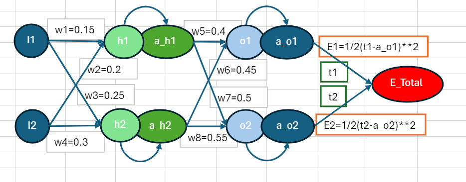
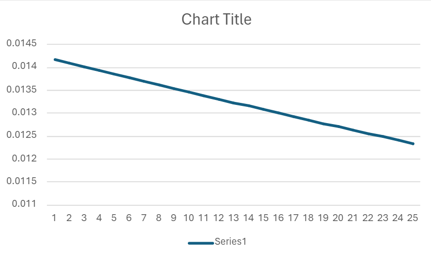
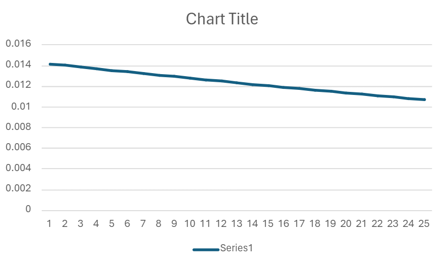
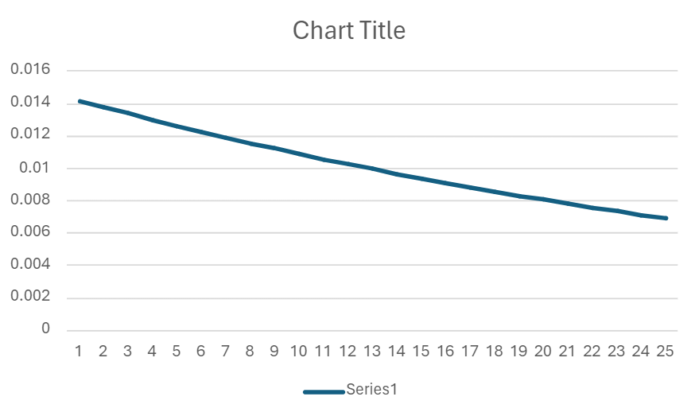
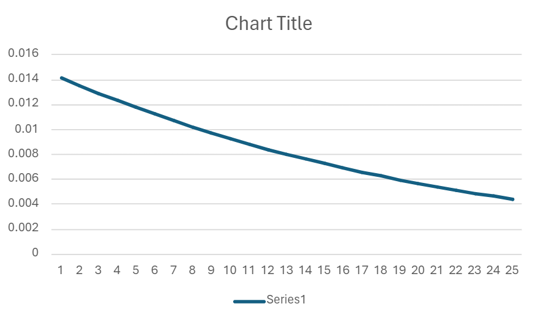
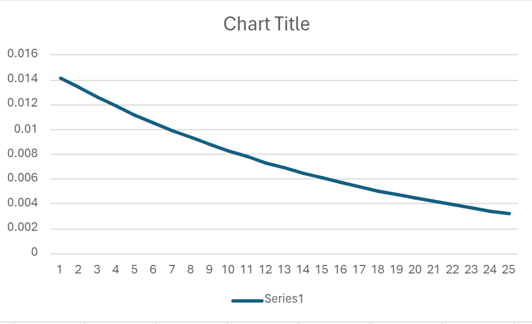
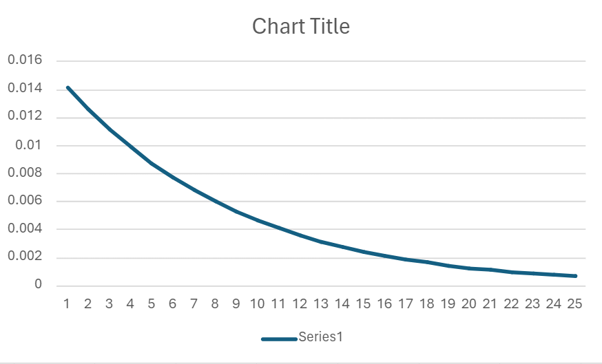

# Overview
This document outlines the implementation of the backpropagation algorithm within Microsoft Excel. It covers the algorithm's fundamental concepts, including forward and backward passes, and discusses their representation through Excel formulas. Additionally, it offers insights into training processes, results analysis, and concludes with reflections on the method's efficacy and limitations.

# Architecture

# Backpropagation Algorithm
## Forward Pass
- Forward pass is generated by performing arthemetic operations on the network.
- It includes calculating a_o1, a_o2 which are predictions of the network.

### Calculations
`h1=w1*i1+w2*i2` \
`h2=w3*i1+w4*i2` \
`a_h1=σ(h1)=1/(1+exp(-h1))` \
`a_h2=σ(h2)` \
`o1=w5*a_h1+w6*a_h2`   
`o2=w7*a_h1+w8*a_h2` \
`a_o1=σ(o1)` \
`a_o2=σ(o2)` 

## Error Calculation
`E_total=E1+E2` \
`E1=1/2(t1-a_o1)^2` \
`E2=1/2(t2-a_o2)^2`

## Backward Pass
### Partial Differentation
Partial differentiation is a mathematical concept used when dealing with functions of several variables. In the context of neural networks and backpropagation, it's often employed to find how much a function changes concerning one of its inputs while holding other inputs constant. 

In the equations you provided, `E_total` represents the total error of the neural network, and `w1` to `w8` are the weights connecting the neurons in different layers. The symbol `∂E_total/∂wi` represents the partial derivative of the total error with respect to each weight `wi`. This tells us how sensitive the total error is to changes in each weight, enabling us to adjust the weights to minimize the error during training.

### Back Propagation
These equations represent the partial derivatives of the total error (`E_total`) with respect to each weight (`w1` to `w8`) in a neural network during the backpropagation process. Here's a breakdown of each equation:

1. **`∂E_total/∂w1`** to **`∂E_total/∂w4`**:
   - These equations compute how much the total error changes with respect to each weight connecting the input layer to the hidden layer. 
   - They involve terms from the output layer (`a_o1` and `a_o2`), target values (`t1` and `t2`), weights (`w5` to `w8`), activation values of the hidden layer (`a_h1` and `a_h2`), and input values (`i1` and `i2`).
   - The chain rule is applied to propagate the error backwards through the network layers, adjusting the weights to minimize the error.

2. **`∂E_total/∂w5`** to **`∂E_total/∂w8`**:
   - These equations calculate how much the total error changes with respect to each weight connecting the hidden layer to the output layer.
   - They directly involve the output activations (`a_o1` and `a_o2`), target values (`t1` and `t2`), and activation values of the hidden layer (`a_h1` and `a_h2`).
   - Again, the chain rule is applied to adjust these weights based on the error gradient.

These equations are fundamental to the backpropagation algorithm, enabling the neural network to learn from its errors and improve its performance over successive iterations of training.

### Equations

`∂E_total/∂w1 = ((a_o1-t1)*a_o1*(1-a_o1)*w5 + (a_02-t2)*a_o2*(1-a_o2)*w7)*a_h1*(1-a_h1)*i1` \
`∂E_total/∂w2 = ((a_o1-t1)*a_o1*(1-a_o1)*w5 + (a_02-t2)*a_o2*(1-a_o2)*w7)*a_h1*(1-a_h1)*i2` \
`∂E_total/∂w3 = ((a_o1-t1)*a_o1*(1-a_o1)*w6 + (a_02-t2)*a_o2*(1-a_o2)*w8)*a_h2*(1-a_h2)*i1` \
`∂E_total/∂w4 = ((a_o1-t1)*a_o1*(1-a_o1)*w6 + (a_02-t2)*a_o2*(1-a_o2)*w8)*a_h2*(1-a_h2)*i2 `\
`∂E_total/∂w5=(a_o1-t1)*a_o1*(1-a_o1)*a_h1` \
`∂E_total/∂w6=(a_o1-t1)*a_o1*(1-a_o1)*a_h2` \
`∂E_total/∂w7=(a_o2-t2)*a_o2*(1-a_o2)*a_h1` \
`∂E_total/∂w8=(a_o2-t2)*a_o2*(1-a_o2)*a_h2`

# Implementation
Back propagation is implemented in excel sheet. Here are pictures with different learning rates

## Backpropagation on various learning rates

- Learning rate = 0.1

- Learning rate = 0.2

- Learning rate = 0.5

- Learning rate = 0.8

- Learning rate = 1.0

- Learning rate = 2.0

