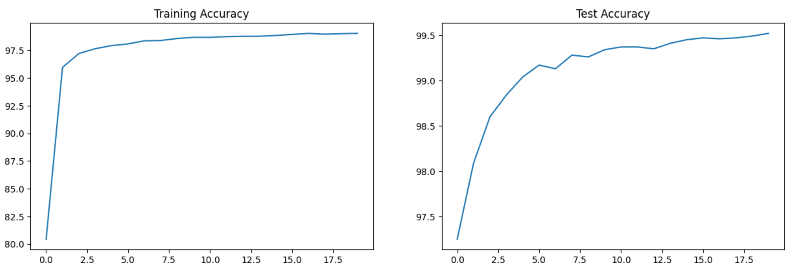

# MNIST Classification using Convolutional Neural Networks

This project implements a Convolutional Neural Network (CNN) for handwritten digit classification on the MNIST dataset using PyTorch. The CNN architecture consists of several convolutional layers followed by batch normalization, dropout, and max-pooling layers. The model achieves a high accuracy of 99.4% on the test set.

## Getting Started

To run the code, follow these steps:

1. Clone the repository
2. Install the required dependencies
  - Instead you can choose to copy the the notebook from [source](https://colab.research.google.com/drive/1kQNvzvqGzR6wTbM8rK_ZBlDgRpcErXbe?usp=sharing)
3. Execute the `Session_6_Soluiton` Ipython Notebook
  - You can use [colab](https://colab.google/), [vscode](https://code.visualstudio.com/) or [jupyter](https://jupyter.org/) notebooks to run the code

## Prerequisites

- Python 3.x
- PyTorch
- torchvision
- torchsummary
- tqdm
- matplotlib

## Data Preprocessing

- The MNIST dataset is used for training and testing the model.
- Data augmentation techniques such as random rotation, resizing, and center cropping are applied to the training images.
- The images are normalized to have a mean of `0.1307` and a standard deviation of `0.3081`.

## Model Architecture

The CNN model consists of the following layers:

| Layer                        | Description                                               | Channel Size | Receptive Field |
|------------------------------|-----------------------------------------------------------|--------------|-----------------|
| Conv1-BatchNorm-Relu         | 1st convolutional layer followed by BatchNorm and ReLU    | 26           | 2               |
| Dropout 1                    | Dropout with 10% probability                              | 26           | 2               |
| Conv2-BatchNorm-Relu         | 2nd convolutional layer followed by BatchNorm and ReLU    | 24           | 4               |
| Dropout 2                    | Dropout with 10% probability                              | 24           | 4               |
| MaxPooling                   | Max-pooling layer with a kernel size of 2x2              | 12           | 5               |
| ChanelReductionConv2_1-BN-Re | 1x1 convolutional layer followed by BatchNorm and ReLU    | 12           | 5               |
| Conv3-BatchNorm-Relu         | 3rd convolutional layer followed by BatchNorm and ReLU    | 12           | 9               |
| Conv4-BatchNorm-Relu         | 4th convolutional layer followed by BatchNorm and ReLU    | 10           | 13              |
| MaxPooling                   | Max-pooling layer with a kernel size of 2x2              | 5            | 15              |
| ChanelReductionConv4_1-BN-Re | 1x1 convolutional layer followed by BatchNorm and ReLU    | 5            | 15              |
| Conv5-BatchNorm-Relu         | 5th convolutional layer followed by BatchNorm and ReLU    | 3            | 23              |
| Conv6                        | 6th convolutional layer without activation              | 1            | 31              |
| Softmax                      | Output layer with log softmax activation                  | -            | -               |

The model architecture is summarized using the torchsummary library. It uses `19,865` training parameters

## Training and Evaluation

- The model is trained using the stochastic gradient descent (SGD) optimizer with a `learning rate of 0.01` and `momentum of 0.9`.
- Learning rate scheduling is applied with a step size of `15 epochs` and a `gamma value of 0.1`.
- Training and testing are performed for `20 epochs`.
- The training and testing losses and accuracies are recorded and plotted using matplotlib.

## Results

The model achieves a test accuracy of `99.52%` after training for `20 epochs`.
### Training and Testing Loss

Below image illustrates how well the model is learning from the training data (training loss) and how well it is performing on new, unseen data (testing loss) as training progresses. Loss is a measure of how far off the model's predictions are from the actual values. 

During training, the model adjusts its parameters to minimize the loss, effectively improving its ability to make accurate predictions. The training loss curve shows the trend of decreasing loss over epochs, indicating that the model is learning and becoming more accurate on the training data.

The testing loss curve, on the other hand, represents the model's performance on data it has not seen before. It's essential because it tells us how well the model generalizes to new samples. Ideally, we want both the training and testing loss to decrease over time, indicating that the model is learning and generalizing well. If the testing loss starts increasing while the training loss decreases, it could indicate overfitting, where the model memorizes the training data instead of learning to generalize.

### Training and Testing Accuracy

Below image displays the training and testing accuracy over epochs. Similar to the loss graph, the x-axis represents the number of epochs, and the y-axis represents the accuracy value. The training accuracy curve illustrates how the accuracy improves over epochs as the model learns. The testing accuracy curve depicts the accuracy achieved on the testing data, indicating the model's overall performance.

## Author

Y Abhilash Reddy (Machine Learning Engineer)
## License

This project is licensed under the MIT License.
