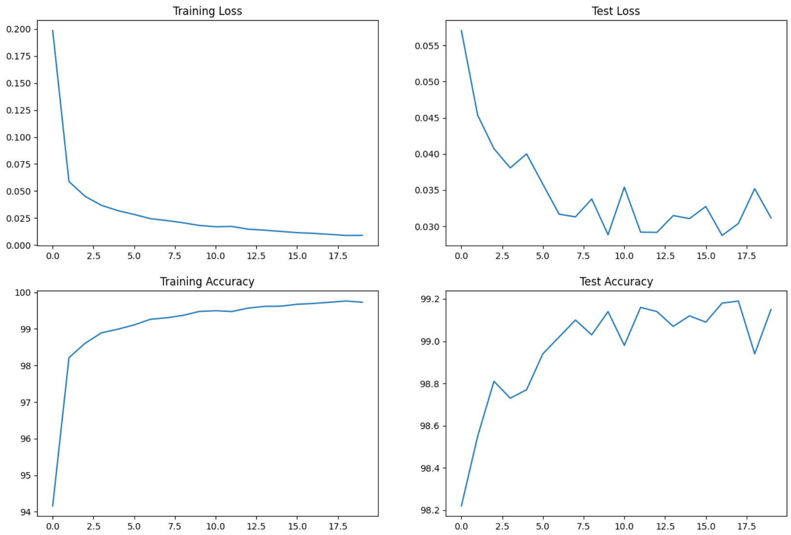
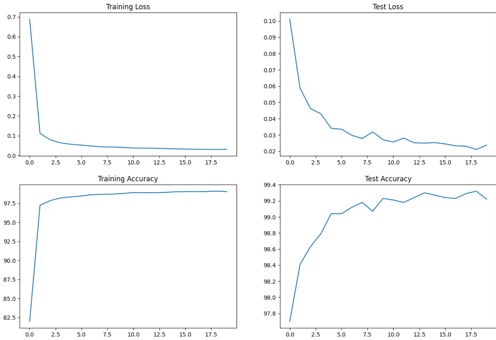
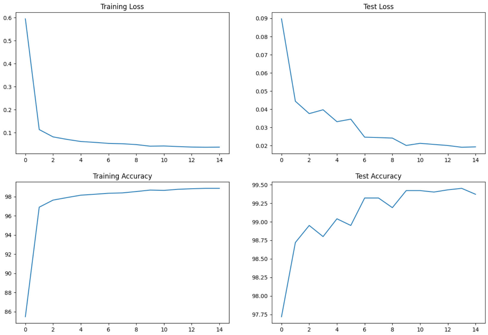
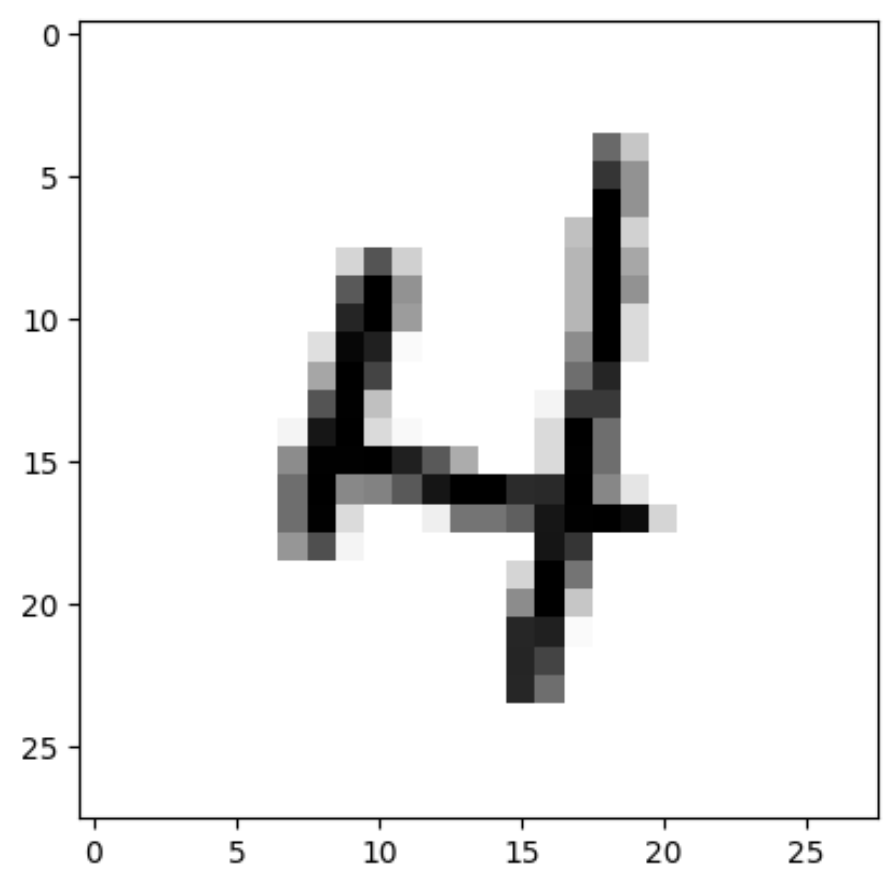

This is the training process followed to push a deep learning (Convolution Neural Network) model to reduce the parameters drastically while maintaining the accuracy. Finally I was able to achieve an accuracy of `99.45%` consistently on test dataset using just `7,892` parameters.

The following experiments are driven by 2 factors
1. Adding more effective things to a model that could potentially improve models performance as mentioned in Target section of each experiment
2. Gut feeling. (Not everything is quantifiable. Sometimes, follow your heart !!!)

### Experiment 1:

#### Target:
  - Get the set-up right
  - Set Basic Data Transforms
  - Set Data Loader
  - Set Basic Working Code
  - Set Basic Training  & Test Loop
  - Add Batch-norm to increase model efficiency.
#### Results:
  - Parameters: 8,930
  - Best Training Accuracy: 99.76
  - Best Test Accuracy: 99.18
  
#### Analysis:
  - Model is over-fitting.
  - Maybe the regularization is not sufficient. Anyway, we are changing our model in the next experiment.
  - Maybe the placement of some layers is incorrect/insufficient. 
    * Eg Scenario 1 : Too few max pooling layers. 
    * Eg Scenario 2 : Receptive field of the model is too small or too large. As a result unable to capture the image features correctly
  - Too much fluctuation in the test accuracy.
  - There is scope to improve a lot of things in the network.
#### Source
  - [Model1](Model1.ipynb)

### Experiment 2:

#### Target:
  - Add Regularization
  - Global Average Pooling
  - Increasing Capacity of Model
  - Correct MaxPooling Location
#### Result:
  - Parameters: 11,146
  - Best Training Accuracy: 99.32
  - Best Test Accuracy: 99.08
  
#### Analysis:
  - Although replacing the high dimensional kernel with Global Average Pooling is reducing the parameters drastically. We are adding a lot of parameters to the networks by increasing the number of channels in the convolution layers.
  - Model is still slightly over-fitting  but better than the previous model. Looks like regularization in the form of dropout is working.
#### Source
  - [Model2](Model2.ipynb)

### Experiment 3:

#### Target:
  - Correct MaxPooling Location
  - Image Augmentation
  - Playing naively with Learning Rates
#### Result:
  - Parameters: 7,892
  - Best Training Accuracy: 98.87
  - Best Test Accuracy: 99.45
  

#### Analysis:
  - Max pooling is applied after reaching the receptive field of 5. From the sample image we can deduce that the edges and gradients of the image are captured at a receptive field of 5. Hence moved the max pooling from receptive field 7 to 5.
    - Applying max-pooling early will help in reaching the appropriate receptive without adding too many layers. As a result depth of the model reduces and number of parameters required are reduced.
  

  - Test Accuracy stabilized over epocs because of adaptive learning rates.
  - The under-fitting in the model is reasonable since we increased the training difficulty by image augmentation

#### Source
  - [Model3](Model3.ipynb)

`NOTE:` In each experiment I have tried a lot of minute tweaks to get the model right. However most effective strategies are listed in the above experiments.

`Food for thought:` I have used `1X1` kernels in the network. Which are also called `Cross-Channel Down sampling kernels`. Read more about them [here](https://medium.com/analytics-vidhya/talented-mr-1x1-comprehensive-look-at-1x1-convolution-in-deep-learning-f6b355825578). They are very effective to reduce the number of parameters while choosing good channels in CNN. 

Finally, Although there is good amount of information in this readme file, going trough the notebooks will give deeper knowledge on details. So, Feel free to checkout the code.