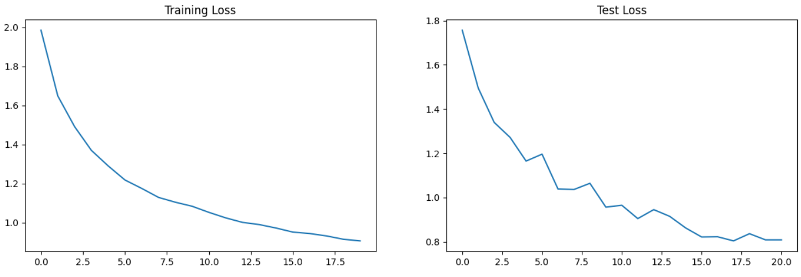

# Deep Learning Models for CIFAR-10 Dataset

## Introduction
This repository contains the code for training three different deep learning models on the CIFAR-10 dataset using three normalization techniques: Batch Normalization (BN), Layer Normalization (LN), and Group Normalization (GN). The models were trained to achieve a minimum of 70% accuracy on the test set while keeping the number of parameters under 50,000.

## Models
### Accuracy Comparison
| Model               | Best Training Accuracy | Best Test Accuracy |
|---------------------|-------------------|---------------|
| Batch Normalization | 70.94 | 75.02 |
| Layer Normalization | 69.84 | 73.11 |
| Group Normalization | 68.51 | 72.02 |

## Misclassified Images
Here are 10 sample misclassified images for each of the model. Below are the images displayed as 5x2 matrices:

### Batch Normalization (BN)

### Layer Normalization (LN)

### Group Normalization (GN)

## Findings
Based on the experimentation with different normalization techniques, the following findings were observed:
- Despite using same model and training technique. The Batch normalization performed the best then the Layer normalization and then the Group normalization
- Layer Normalization normalizes across channel of an input but not across the batch. This is very suitable in case of sequential input like text.
- Group normalization works very similar to the batch normalization. However instead of normalizing entire mini batch it normalizes smaller groups of mini batch. Suitable when we cannot fit a mini batch into the available memory of GPU and want to break the minimatch and train in parallel.

## Graphs
Below are the graphs illustrating the performance of the models during training and evaluation:

### Batch Normalization (BN)
- Training Loss and Accuracy Curves
  
  

### Layer Normalization (LN)
- Training Loss and Accuracy Curves
  
  

### Group Normalization (GN)
- Training Loss and Accuracy Curves
  
  
 

